# Advanced Visualization and Marker Analysis

## Overview

Once cells are clustered, the next step is to interpret them. OHMmy
wraps the most common figures into functions that save a
publication-ready file **and** return the ggplot/patchwork object, so
you can keep customising in R.

| Theme | Functions |
|----|----|
| Colours | [`make_cluster_palette()`](https://chomchonu.github.io/OHMmy/reference/make_cluster_palette.md) |
| Embedding overlays | [`PlotDimByFactors()`](https://chomchonu.github.io/OHMmy/reference/PlotDimByFactors.md), [`plot_combined()`](https://chomchonu.github.io/OHMmy/reference/plot_combined.md) |
| Distributions | [`plot_violin_qc_single()`](https://chomchonu.github.io/OHMmy/reference/plot_violin_qc_single.md), [`extract_binned_expression()`](https://chomchonu.github.io/OHMmy/reference/extract_binned_expression.md) |
| Clustered dot plots | [`plot_dot_dendro()`](https://chomchonu.github.io/OHMmy/reference/plot_dot_dendro.md), [`plot_dot_dendro_split()`](https://chomchonu.github.io/OHMmy/reference/plot_dot_dendro_split.md), [`plot_dot_dendro_multi()`](https://chomchonu.github.io/OHMmy/reference/plot_dot_dendro_multi.md) |
| Co-expression | [`plot_blend_nebulosa()`](https://chomchonu.github.io/OHMmy/reference/plot_blend_nebulosa.md), [`.blend_feature_plot_v5()`](https://chomchonu.github.io/OHMmy/reference/dot-blend_feature_plot_v5.md) |
| Lineage resolution | [`score_consensus()`](https://chomchonu.github.io/OHMmy/reference/score_consensus.md) |

``` r

library(Seurat)
library(OHMmy)
library(patchwork)
library(ggplot2)
source("ohmmy-vignette-helpers.R")

pbmc <- load_pbmc3k_ohmmy()   # built in "Data Processing, Integration, and Clustering"
out_dir <- file.path(tempdir(), "OHMmy-advanced-visualization")
dir.create(out_dir, recursive = TRUE, showWarnings = FALSE)

table(pbmc$cell_type)
#> 
#>       CD4 T       CD8 T          NK           B   CD14 Mono FCGR3A Mono 
#>        1168         298         141         341         478         178 
#>          DC 
#>          34
```

## 1. Colour palettes for many clusters

[`make_cluster_palette()`](https://chomchonu.github.io/OHMmy/reference/make_cluster_palette.md)
returns `n` maximally distinct colours from curated qualitative palettes
(`"kelly"`, `"alphabet"`, `"polychrome"`) or from a blend of
RColorBrewer sets (`"auto"`). When `n` is larger than the palette, it
interpolates.

``` r

pal_df <- do.call(rbind, lapply(c("auto", "kelly", "alphabet", "polychrome"), function(p) {
  data.frame(palette = p, i = 1:16, col = make_cluster_palette(16, palette = p))
}))
ggplot(pal_df, aes(i, palette, fill = col)) +
  geom_tile(colour = "white", linewidth = 0.8) +
  scale_fill_identity() +
  labs(x = NULL, y = NULL) +
  theme_minimal() +
  theme(axis.text.x = element_blank(), panel.grid = element_blank())
```

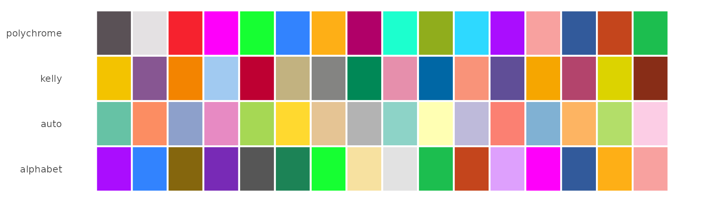

## 2. Embedding overlays

### One UMAP per metadata column

[`PlotDimByFactors()`](https://chomchonu.github.io/OHMmy/reference/PlotDimByFactors.md)
draws one `DimPlot` per metadata column, saves each to disk and returns
the plots as a named list.

``` r

dim_plots <- PlotDimByFactors(
  seurat_obj  = pbmc,
  factors     = c("cell_type", "seurat_clusters", "batch", "Phase"),
  sample_name = "pbmc3k",
  reduction   = "umap.har",
  output_dir  = file.path(out_dir, "dimplots"),
  dpi         = 100,
  verbose     = FALSE
)
```

``` r

names(dim_plots)
#> [1] "cell_type"       "seurat_clusters" "batch"           "Phase"
dim_plots$cell_type <- dim_plots$cell_type +
  scale_colour_manual(values = make_cluster_palette(nlevels(pbmc$cell_type), "kelly"))
wrap_plots(dim_plots, ncol = 2) & NoLegend()
```

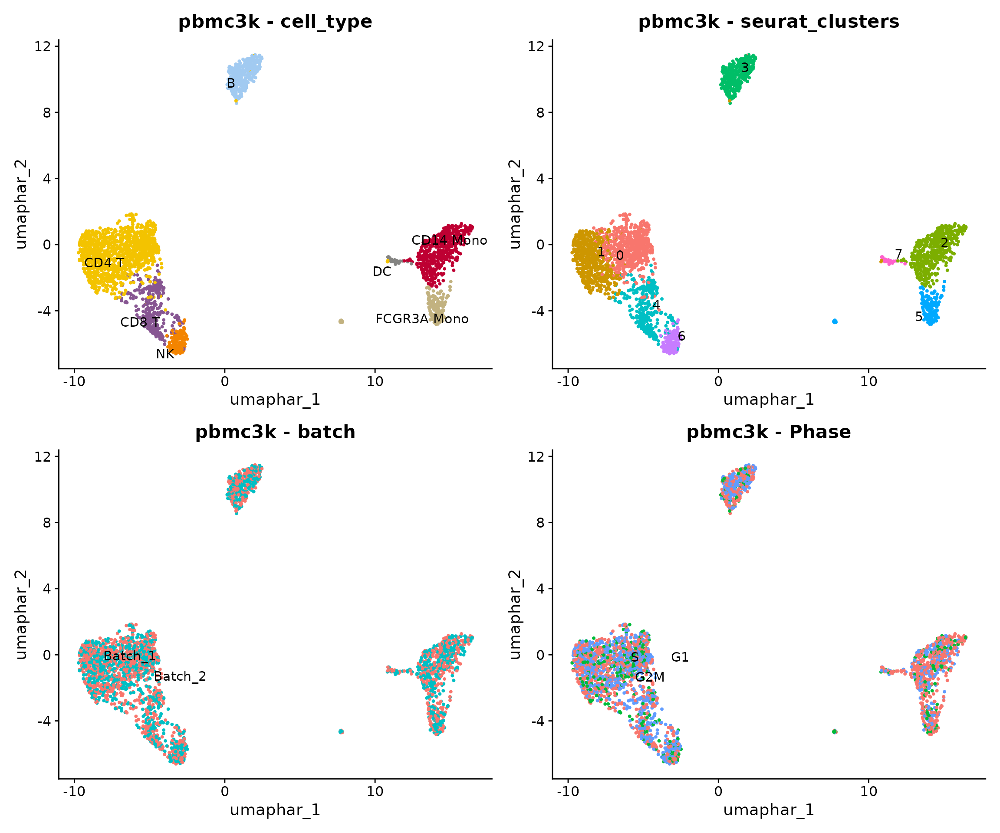

### Feature plots paired with density estimates

Sparse genes are hard to read on a standard `FeaturePlot`.
[`plot_combined()`](https://chomchonu.github.io/OHMmy/reference/plot_combined.md)
places each feature next to its kernel-density estimate (Nebulosa),
using a Seurat v5-safe implementation. Features can be **genes or
numeric metadata columns**, and each list element becomes one saved
figure.

``` r

feature_sets <- list(
  Lymphoid = c("CD3E", "MS4A1", "GNLY"),
  Myeloid  = c("CD14", "FCGR3A", "FCER1A"),
  QC       = c("nCount_RNA", "pct_counts_mt", "percent.ribo")
)

combined <- plot_combined(
  seurat_obj  = pbmc,
  cluster_col = "cell_type",
  genes_list  = feature_sets,
  sample_name = "pbmc3k",
  reduction   = "umap.har",
  output_dir  = file.path(out_dir, "combined"),
  dpi         = 72,
  verbose     = FALSE
)
```

``` r

names(combined$combined_plots)
#> [1] "Lymphoid" "Myeloid"  "QC"
combined$combined_plots$Lymphoid
```

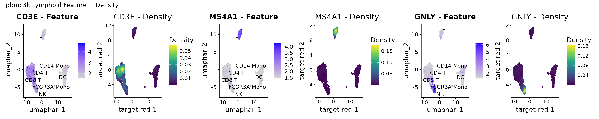

``` r

combined$combined_plots$QC
```

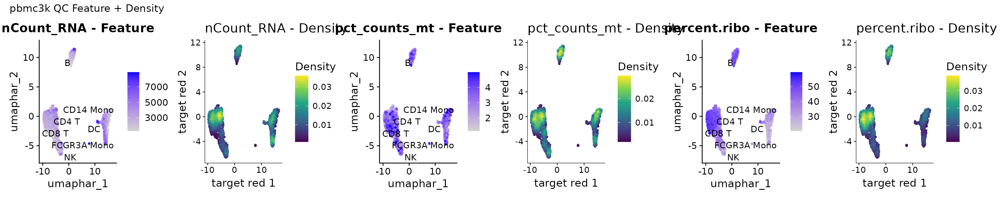

## 3. Distributions across clusters

### Violin plots for QC metrics and genes

[`plot_violin_qc_single()`](https://chomchonu.github.io/OHMmy/reference/plot_violin_qc_single.md)
saves one figure for QC metadata and one for genes, grouped by any
identity column.

``` r

plot_violin_qc_single(
  seurat_obj       = pbmc,
  sample_name      = "pbmc3k",
  qc_meta_features = c("nCount_RNA", "nFeature_RNA", "pct_counts_mt"),
  gene_features    = c("CD3E", "CD8A", "GNLY", "MS4A1", "CD14", "FCGR3A"),
  res_col          = "cell_type",
  output_dir       = file.path(out_dir, "violins"),
  dpi              = 90
)
```

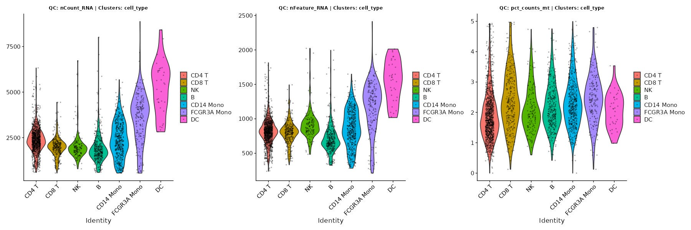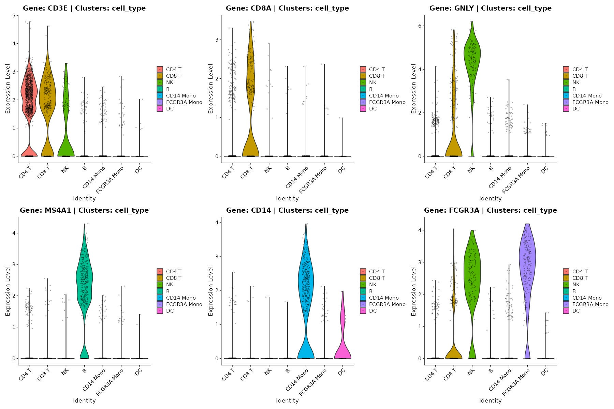

### Discretising expression into Low / Int / High

[`extract_binned_expression()`](https://chomchonu.github.io/OHMmy/reference/extract_binned_expression.md)
returns the average expression and percent expressed per group. For each
gene it then bins the groups into terciles (`Low`, `Int`, `High`). This
is useful for writing marker tables or for defining “marker-high”
populations. The terciles are relative to the groups being compared:
with eight cell types, for example, the three highest-expressing groups
of each gene are labelled `High`.

``` r

binned <- extract_binned_expression(
  seurat_obj = pbmc,
  gene_list  = c("CD3E", "CD8A", "GNLY", "MS4A1", "CD14", "FCGR3A", "FCER1A", "PPBP"),
  group_col  = "cell_type"
)
head(binned)
#> # A tibble: 6 × 5
#>   Cluster Gene   AvgExpression PctExpress Expression_Level
#>   <fct>   <fct>          <dbl>      <dbl> <fct>           
#> 1 CD4 T   CD3E          7.55        77.0  High            
#> 2 CD4 T   CD8A          0.731       11.1  High            
#> 3 CD4 T   GNLY          0.571       10.4  Int             
#> 4 CD4 T   MS4A1         0.203        4.97 Low             
#> 5 CD4 T   CD14          0.0838       1.80 Int             
#> 6 CD4 T   FCGR3A        0.207        4.54 Low
```

``` r

ggplot(binned, aes(Gene, Cluster, fill = Expression_Level)) +
  geom_tile(colour = "white") +
  geom_text(aes(label = round(PctExpress)), size = 3) +
  scale_fill_manual(values = c(Low = "#f0f0f0", Int = "#9ecae1", High = "#08519c")) +
  labs(x = NULL, y = NULL, fill = "Tercile", caption = "Numbers: % of cells expressing") +
  theme_minimal()
```

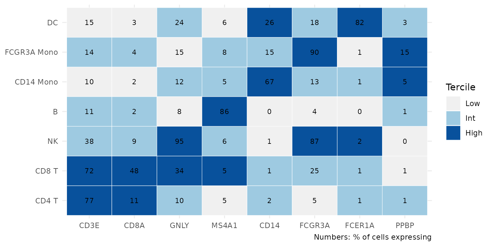

## 4. Hierarchically clustered dot plots

The dot-plot family takes a two-column data frame, `feature_df`, that
maps genes (`feature`) to panels (`group`). Groups are matched by
**prefix**: with `prefix = "PBMC"`, every group starting with `"PBMC_"`
is plotted. This lets one table hold several marker panels, for example
`PBMC_*` and `Tcell_*`.

``` r

feature_df <- data.frame(
  group   = paste0("PBMC_", rep(names(pbmc_marker_sets), lengths(pbmc_marker_sets))),
  feature = unlist(pbmc_marker_sets, use.names = FALSE)
)
head(feature_df, 8)
#>        group feature
#> 1 PBMC_CD4 T    IL7R
#> 2 PBMC_CD4 T    CCR7
#> 3 PBMC_CD4 T    LDHB
#> 4 PBMC_CD4 T    CD3E
#> 5 PBMC_CD4 T     MAL
#> 6 PBMC_CD8 T    CD8A
#> 7 PBMC_CD8 T    CD8B
#> 8 PBMC_CD8 T    CD3D
```

### `plot_dot_dendro()`: genes and clusters clustered together

Genes expressed in fewer than `pct_threshold` % of cells in every group
are dropped. Rows and columns are then ordered by hierarchical
clustering, and both dendrograms are drawn. The function also saves
standalone dendrograms and a text file of the clustered gene order.

``` r

p_dot <- plot_dot_dendro(
  seurat_obj    = pbmc,
  meta_col      = "cell_type",
  feature_df    = feature_df,
  prefix        = "PBMC",
  pct_threshold = 10,
  output_dir    = file.path(out_dir, "dot_dendro")
)
```

``` r

p_dot
```

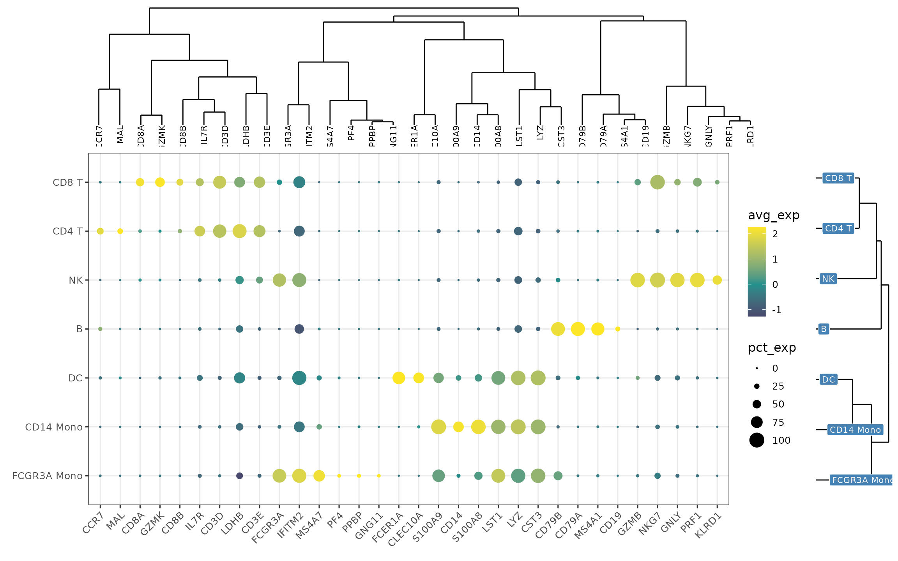

### `plot_dot_dendro_split()`: large panels in chunks

With long marker lists,
[`plot_dot_dendro_split()`](https://chomchonu.github.io/OHMmy/reference/plot_dot_dendro_split.md)
keeps the **global** clustering but splits the gene axis into chunks of
`max_genes_per_plot`. The same cluster dendrogram is attached to every
chunk.

``` r

extended_markers <- list(
  T_cell   = c("CD3D", "CD3E", "CD2", "IL7R", "CCR7", "SELL", "LEF1", "TCF7", "CD8A", "CD8B", "GZMK"),
  NK       = c("GNLY", "NKG7", "KLRD1", "KLRF1", "PRF1", "GZMB", "GZMH", "FCGR3A"),
  B        = c("MS4A1", "CD79A", "CD79B", "BANK1", "TCL1A", "HLA-DQA1"),
  Myeloid  = c("CD14", "LYZ", "S100A8", "S100A9", "VCAN", "MS4A7", "LST1", "CDKN1C", "FCER1A", "CST3"),
  Platelet = c("PPBP", "PF4", "GNG11")
)
feature_df_ext <- data.frame(
  group   = paste0("PBMCext_", rep(names(extended_markers), lengths(extended_markers))),
  feature = unlist(extended_markers, use.names = FALSE)
)

split_plots <- plot_dot_dendro_split(
  seurat_obj         = pbmc,
  meta_col           = "cell_type",
  feature_df         = feature_df_ext,
  prefix             = "PBMCext",
  pct_threshold      = 10,
  max_genes_per_plot = 20,
  output_dir         = file.path(out_dir, "dot_split")
)
```

``` r

length(split_plots)
#> [1] 2
split_plots[[1]]
```

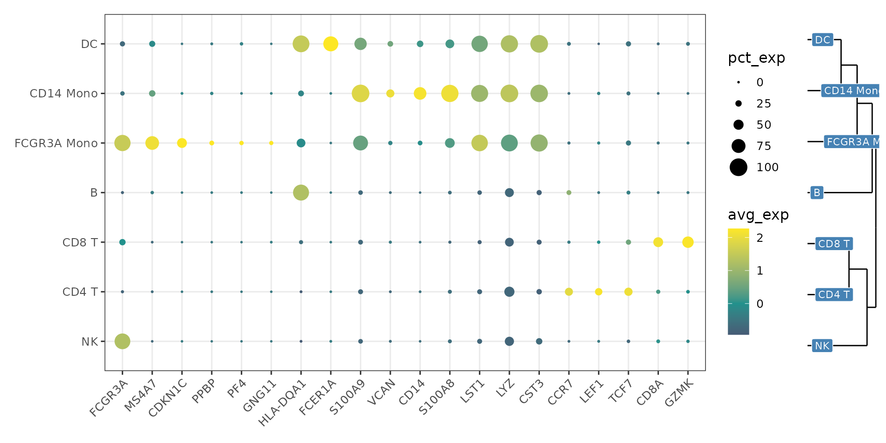

``` r

split_plots[[2]]
```

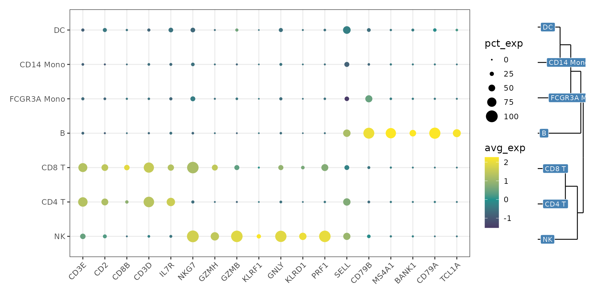

### `plot_dot_dendro_multi()`: several groupings in one clustering

[`plot_dot_dendro_multi()`](https://chomchonu.github.io/OHMmy/reference/plot_dot_dendro_multi.md)
stacks the dot-plot summaries of **several metadata columns** into one
matrix before clustering. Here, plotting the marker-based `cell_type`
labels next to the unsupervised `seurat_clusters` shows directly which
clusters each label absorbed. Rows are named `<group>_<column>`.

``` r

multi_df <- plot_dot_dendro_multi(
  seurat_obj    = pbmc,
  meta_cols     = c("cell_type", "seurat_clusters"),
  feature_df    = feature_df,
  prefix        = "PBMC",
  pct_threshold = 10,
  output_dir    = file.path(out_dir, "dot_multi"),
  save_options  = c("combined", "gene_list")
)
```

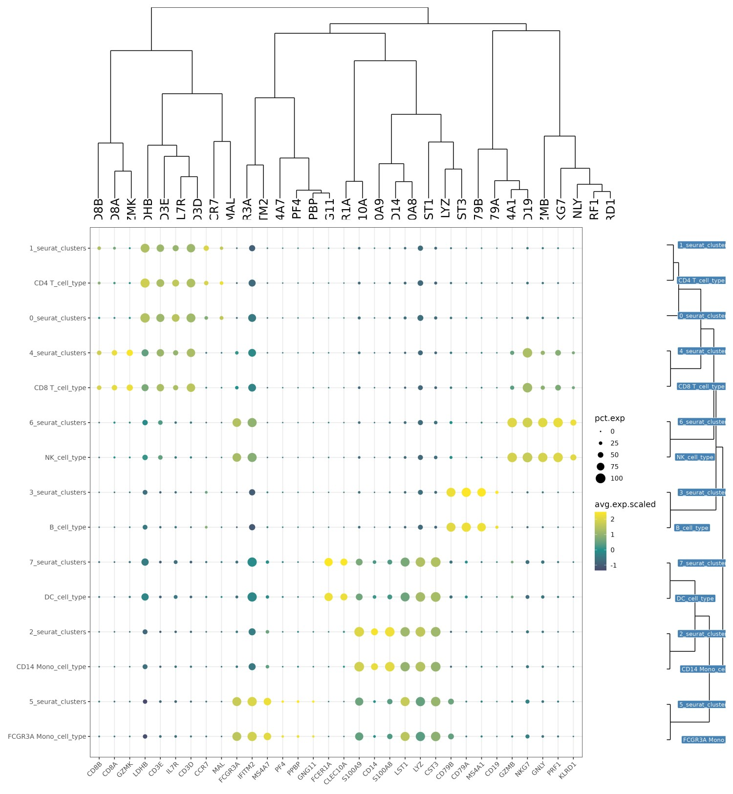

``` r

head(multi_df[, c("cluster_var", "feature", "avg.exp.scaled", "pct.exp")])
#>              cluster_var feature avg.exp.scaled  pct.exp
#> IL7R...1 CD4 T_cell_type    IL7R      1.6004838 66.43836
#> CCR7...2 CD4 T_cell_type    CCR7      1.9228209 36.38699
#> LDHB...3 CD4 T_cell_type    LDHB      1.7808176 92.72260
#> CD3E...4 CD4 T_cell_type    CD3E      1.3155181 76.96918
#> MAL...5  CD4 T_cell_type     MAL      2.2501354 27.31164
#> CD8A...6 CD4 T_cell_type    CD8A      0.2059775 11.13014
```

## 5. Co-expression: blend and density plots

[`plot_blend_nebulosa()`](https://chomchonu.github.io/OHMmy/reference/plot_blend_nebulosa.md)
produces one row per gene pair with the two single-gene panels, their
colour blend, a 2-D colour key, and a Nebulosa density estimate for each
gene. Cells below `blend_threshold` (after scaling to 0 to 1) are shown
as background, which keeps sparse genes readable. All pairs are stacked
into one saved figure.

``` r

blend <- plot_blend_nebulosa(
  seurat_obj      = pbmc,
  cluster_col     = "cell_type",
  gene_pairs      = list(c("CD3E", "GNLY"), c("CD14", "FCGR3A")),
  sample_name     = "pbmc3k",
  reduction       = "umap.har",
  blend_threshold = 0.1,
  width           = 24,
  dpi             = 72,
  output_dir      = file.path(out_dir, "blend"),
  verbose         = FALSE
)
```

``` r

blend$dimensions
#> $width
#> [1] 24
#> 
#> $height
#> [1] 7.2
blend$plot
```

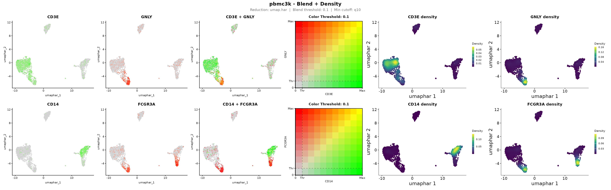

The *CD3E*/*GNLY* row separates T cells (green), NK cells (red) and the
cytotoxic CD8 T cells that express both (yellow). The *CD14*/*FCGR3A*
row shows the two monocyte subsets and the intermediate cells between
them.

The four-panel blend is also available on its own as
[`.blend_feature_plot_v5()`](https://chomchonu.github.io/OHMmy/reference/dot-blend_feature_plot_v5.md),
a Seurat v5-compatible replacement for `FeaturePlot(blend = TRUE)`.

``` r

.blend_feature_plot_v5(
  pbmc, gene1 = "CD8A", gene2 = "GZMK", reduction = "umap.har",
  cols = c("lightgrey", "#1b9e77", "#d95f02"), blend_threshold = 0.15, pt_size = 0.6
)
```

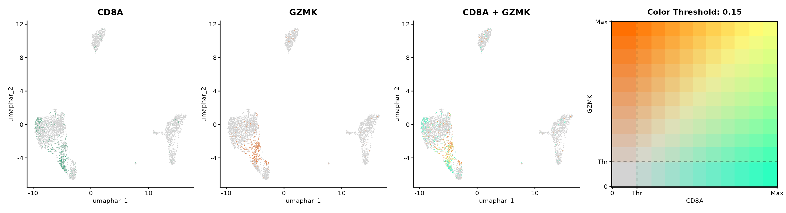

## 6. Resolving CD8 T cells from NK cells with `score_consensus()`

Cytotoxic CD8 T cells and NK cells share much of their effector
programme and are often mixed in clustering.
[`score_consensus()`](https://chomchonu.github.io/OHMmy/reference/score_consensus.md)
compares one or more **CD8 signature scores** with an **NK signature
score** for each cell. It labels a cell CD8 when `z(CD8) - z(NK)`
exceeds a cutoff, which can be fixed (`"fixed"`), the density valley
(`"trough"`), or the decision boundary of a two-component Gaussian
mixture (`"gmm"`). Two CD8 signatures act as `primary` and `confirm`
scores, and disagreements are flagged as ambiguous. Bootstrapping
reports how stable the cutoff is.

Any per-cell score can be used, such as
[`AddModuleScore()`](https://satijalab.org/seurat/reference/AddModuleScore.html)
or UCell. Here we score the CD8 T and NK cells with
[`AddModuleScore()`](https://satijalab.org/seurat/reference/AddModuleScore.html).

``` r

cyto <- subset(pbmc, subset = cell_type %in% c("CD8 T", "NK"))

score_sets <- list(
  CD8_core = c("CD8A", "CD8B"),
  CD8_TCR  = c("CD3D", "CD3E", "CD3G", "CD8A", "CD8B", "LCK"),
  NK_score = c("GNLY", "KLRD1", "KLRF1", "FCGR3A", "NCAM1", "TYROBP", "FCER1G")
)
for (s in names(score_sets)) {
  cyto <- AddModuleScore(cyto, features = list(score_sets[[s]]), name = s, seed = 1)
  names(cyto@meta.data)[names(cyto@meta.data) == paste0(s, "1")] <- s
}
```

With `method = "gmm"`, the cutoff is the decision boundary of a
two-component Gaussian mixture fitted with **mclust**, which only needs
to be installed. If no cutoff can be estimated, `fixed_cut` is used
instead, and the `fallback` column of `cons$cutoffs` reports this.

``` r

cons <- score_consensus(
  obj         = cyto,
  cd8_cols    = c("CD8_TCR", "CD8_core"),
  nk_col      = "NK_score",
  method      = "gmm",
  n_boot      = 100,
  boot_target = "cutoff",
  make_plots  = TRUE,
  plot_n      = 300,
  out_dir     = file.path(out_dir, "cd8_vs_nk")
)

cons$cutoffs
#>    variant     cutoff fallback   med_diff q05_diff q95_diff  frac_cd8
#> 1  CD8_TCR -0.8432246    FALSE 0.60889522 -2.88979 2.367464 0.6514806
#> 2 CD8_core -1.2859800    FALSE 0.07507069 -2.44122 2.751788 0.6924829
cons$agreement
#>            CD8_TCR  CD8_core
#> CD8_TCR  1.0000000 0.9453303
#> CD8_core 0.9453303 1.0000000
cons$bootstrap$summary
#>    variant target   observed       mean        sd     ci_lo      ci_hi fb_rate
#> 1  CD8_TCR cutoff -0.8432246 -0.7863805 0.1892429 -1.111310 -0.4723863       0
#> 2 CD8_core cutoff -1.2859800 -1.2765134 0.1086915 -1.497219 -1.0857047       0
```

Both variants get a data-driven cutoff (`fallback = FALSE`), and the
bootstrap confidence intervals show how stable it is. The consensus
agrees with the cluster-level annotation for the large majority of
cells. Most of the remaining cells are flagged as *Ambiguous*, because
the primary and confirmatory CD8 signatures disagree on them. These
cells are good candidates for closer inspection:

``` r

table(consensus = cons$consensus, annotation = cyto$cell_type)
#>                        annotation
#> consensus               CD4 T CD8 T  NK   B CD14 Mono FCGR3A Mono  DC
#>   Ambiguous_CD8_confirm     0     7  14   0         0           0   0
#>   Ambiguous_CD8_primary     0     2   1   0         0           0   0
#>   CD8                       0   274   9   0         0           0   0
#>   NK                        0    15 117   0         0           0   0
```

``` r

(cons$plots$Violin_CD8_TCR) /
  (cons$plots$Primary_vs_Confirm | cons$plots$Bootstrap_ForestPlot)
```

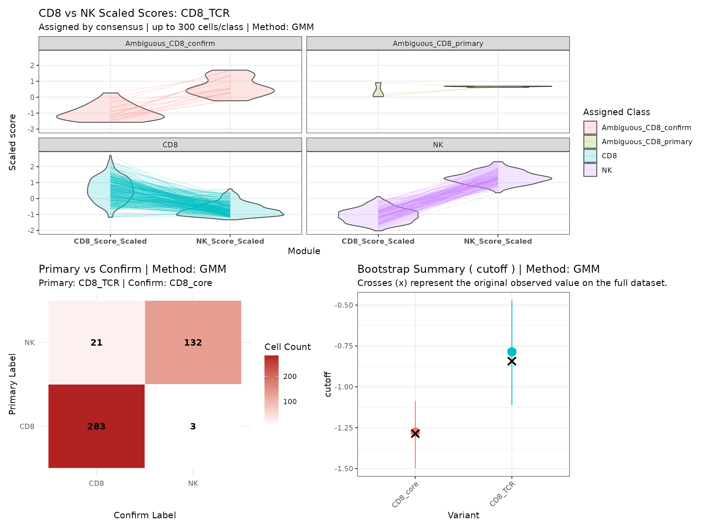

The labels are also written to the object’s metadata (prefix `CD8vNK_`),
ready for plotting:

``` r

grep("^CD8vNK_", colnames(cons$obj@meta.data), value = TRUE)
#> [1] "CD8vNK_diff_CD8_TCR"      "CD8vNK_label_CD8_TCR"    
#> [3] "CD8vNK_cd8scale_CD8_TCR"  "CD8vNK_diff_CD8_core"    
#> [5] "CD8vNK_label_CD8_core"    "CD8vNK_cd8scale_CD8_core"
#> [7] "CD8vNK_nkscale"           "CD8vNK_consensus"
DimPlot(cons$obj, reduction = "umap.har", group.by = "CD8vNK_consensus") +
  FeaturePlot(cons$obj, reduction = "umap.har", features = "CD8vNK_diff_CD8_TCR") +
  scale_colour_gradient2(low = "#b2182b", mid = "grey90", high = "#2166ac")
```

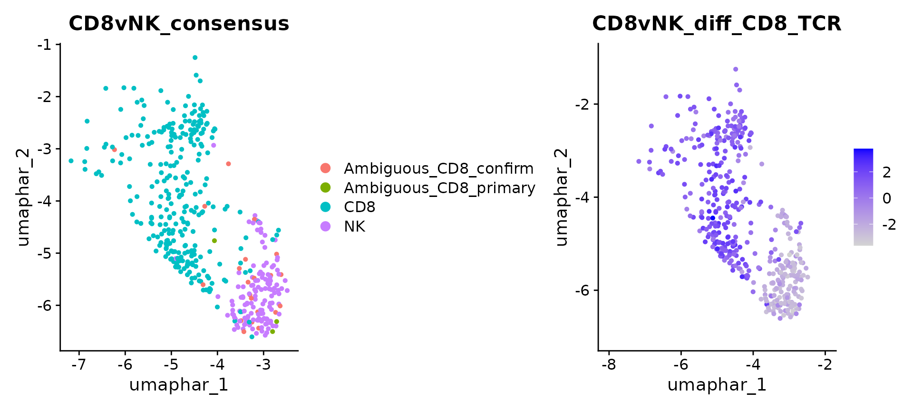

## Session information

``` r

sessionInfo()
#> R version 4.6.1 (2026-06-24)
#> Platform: x86_64-pc-linux-gnu
#> Running under: Ubuntu 22.04.5 LTS
#> 
#> Matrix products: default
#> BLAS:   /usr/lib/x86_64-linux-gnu/openblas-pthread/libblas.so.3 
#> LAPACK: /usr/lib/x86_64-linux-gnu/openblas-pthread/libopenblasp-r0.3.20.so;  LAPACK version 3.10.0
#> 
#> locale:
#>  [1] LC_CTYPE=C.UTF-8       LC_NUMERIC=C           LC_TIME=C.UTF-8       
#>  [4] LC_COLLATE=C.UTF-8     LC_MONETARY=C.UTF-8    LC_MESSAGES=C.UTF-8   
#>  [7] LC_PAPER=C.UTF-8       LC_NAME=C              LC_ADDRESS=C          
#> [10] LC_TELEPHONE=C         LC_MEASUREMENT=C.UTF-8 LC_IDENTIFICATION=C   
#> 
#> time zone: UTC
#> tzcode source: system (glibc)
#> 
#> attached base packages:
#> [1] stats     graphics  grDevices utils     datasets  methods   base     
#> 
#> other attached packages:
#> [1] ggraph_2.2.2       ggplot2_4.0.3      patchwork_1.3.2    OHMmy_1.0.2       
#> [5] Seurat_5.6.0       SeuratObject_5.4.0 sp_2.2-3          
#> 
#> loaded via a namespace (and not attached):
#>   [1] RcppAnnoy_0.0.23            splines_4.6.1              
#>   [3] later_1.4.8                 tibble_3.3.1               
#>   [5] R.oo_1.27.1                 polyclip_1.10-7            
#>   [7] fastDummies_1.7.6           lifecycle_1.0.5            
#>   [9] rstatix_1.1.0               globals_0.19.1             
#>  [11] lattice_0.22-9              MASS_7.3-65                
#>  [13] backports_1.5.1             magrittr_2.0.5             
#>  [15] plotly_4.12.1               sass_0.4.10                
#>  [17] rmarkdown_2.32              jquerylib_0.1.4            
#>  [19] yaml_2.3.12                 httpuv_1.6.17              
#>  [21] otel_0.2.0                  sctransform_0.4.3          
#>  [23] spam_2.11-4                 spatstat.sparse_3.2-0      
#>  [25] reticulate_1.47.0           cowplot_1.2.0              
#>  [27] pbapply_1.7-5               RColorBrewer_1.1-3         
#>  [29] abind_1.4-8                 GenomicRanges_1.64.0       
#>  [31] Rtsne_0.17                  purrr_1.2.2                
#>  [33] R.utils_2.13.0              BiocGenerics_0.58.1        
#>  [35] pracma_2.4.6                tweenr_2.0.3               
#>  [37] IRanges_2.46.0              S4Vectors_0.50.3           
#>  [39] ggrepel_0.9.8               irlba_2.4.1                
#>  [41] listenv_1.1.0               spatstat.utils_3.2-5       
#>  [43] goftest_1.2-3               RSpectra_0.16-2            
#>  [45] spatstat.random_3.5-2       fitdistrplus_1.2-6         
#>  [47] parallelly_1.48.0           pkgdown_2.2.1              
#>  [49] DelayedArray_0.38.2         codetools_0.2-20           
#>  [51] ggforce_0.5.0               tidyselect_1.2.1           
#>  [53] farver_2.1.2                SoupX_1.6.2                
#>  [55] viridis_0.6.5               matrixStats_1.5.0          
#>  [57] stats4_4.6.1                spatstat.explore_3.8-3     
#>  [59] Seqinfo_1.2.0               jsonlite_2.0.0             
#>  [61] ks_1.15.3                   tidygraph_1.3.1            
#>  [63] progressr_1.0.0             Formula_1.2-6              
#>  [65] ggridges_0.5.7              survival_3.8-6             
#>  [67] systemfonts_1.3.2           tools_4.6.1                
#>  [69] ragg_1.5.2                  ica_1.0-3                  
#>  [71] Rcpp_1.1.2                  glue_1.8.1                 
#>  [73] SparseArray_1.12.3          gridExtra_2.3.1            
#>  [75] xfun_0.61                   MatrixGenerics_1.24.0      
#>  [77] dplyr_1.2.1                 withr_3.0.3                
#>  [79] fastmap_1.2.0               clustree_0.5.1             
#>  [81] digest_0.6.39               R6_2.6.1                   
#>  [83] mime_0.13                   textshaping_1.0.5          
#>  [85] Cairo_1.7-0                 scattermore_1.2            
#>  [87] tensor_1.5.1                jpeg_0.1-11                
#>  [89] spatstat.data_3.1-9         R.methodsS3_1.8.2          
#>  [91] RhpcBLASctl_0.23-42         utf8_1.2.6                 
#>  [93] Nebulosa_1.22.0             tidyr_1.3.2                
#>  [95] generics_0.1.4              data.table_1.18.6.1        
#>  [97] S4Arrays_1.12.1             graphlayouts_1.2.5         
#>  [99] httr_1.4.9                  htmlwidgets_1.6.4          
#> [101] uwot_0.2.5                  pkgconfig_2.0.3            
#> [103] gtable_0.3.6                lmtest_0.9-40              
#> [105] S7_0.2.2                    XVector_0.52.0             
#> [107] SingleCellExperiment_1.34.0 htmltools_0.5.9            
#> [109] carData_3.0-6               dotCall64_1.2              
#> [111] Biobase_2.72.0              scales_1.4.0               
#> [113] png_0.1-9                   harmony_2.0.5              
#> [115] spatstat.univar_3.2-0       ggdendro_0.2.0             
#> [117] knitr_1.52                  reshape2_1.4.5             
#> [119] checkmate_2.3.4             nlme_3.1-169               
#> [121] cachem_1.1.0                zoo_1.9-1                  
#> [123] stringr_1.6.0               KernSmooth_2.23-26         
#> [125] vipor_0.4.7                 parallel_4.6.1             
#> [127] miniUI_0.1.2                ggrastr_1.0.2              
#> [129] desc_1.4.3                  pillar_1.11.1              
#> [131] grid_4.6.1                  vctrs_0.7.3                
#> [133] RANN_2.6.3                  promises_1.5.0             
#> [135] ggpubr_1.0.0                car_3.1-5                  
#> [137] xtable_1.8-8                cluster_2.1.8.2            
#> [139] beeswarm_0.4.0              evaluate_1.0.5             
#> [141] mvtnorm_1.4-2               cli_3.6.6                  
#> [143] compiler_4.6.1              rlang_1.3.0                
#> [145] leidenbase_0.1.37           future.apply_1.20.2        
#> [147] ggsignif_0.6.4              labeling_0.4.3             
#> [149] mclust_6.1.3                ggbeeswarm_0.7.3           
#> [151] plyr_1.8.9                  fs_2.1.0                   
#> [153] stringi_1.8.9               viridisLite_0.4.3          
#> [155] deldir_2.0-4                spatstat.geom_3.8-3        
#> [157] Matrix_1.7-5                RcppHNSW_0.7.0             
#> [159] future_1.76.0               shiny_1.14.0               
#> [161] SummarizedExperiment_1.42.0 ROCR_1.0-12                
#> [163] igraph_2.3.4                broom_1.0.13               
#> [165] memoise_2.0.1               bslib_0.12.0
```
