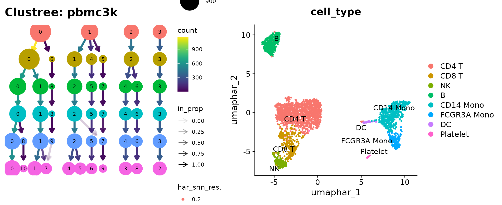
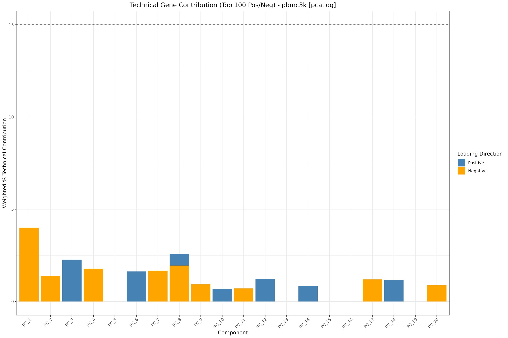
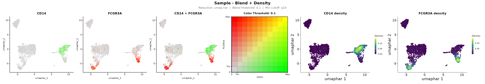
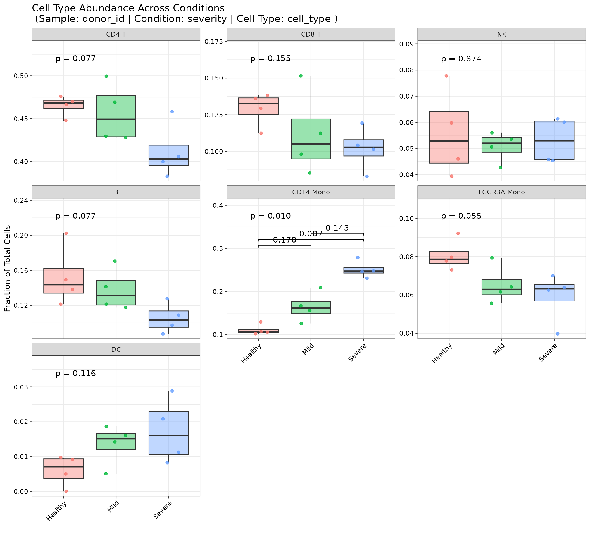
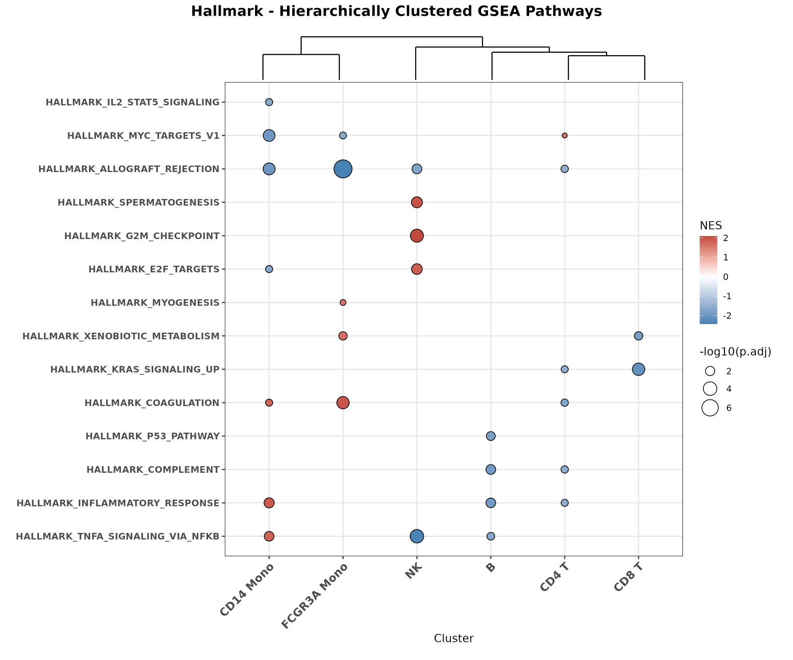

# Comprehensive single-cell workflow with OHMmy

## Introduction

**OHMmy** provides reproducible wrappers for a complete Seurat v5
scRNA-seq analysis: ambient-RNA removal with SoupX, normalisation and
batch integration, diagnostics of technical noise, publication-ready
visualisation, donor-aware statistics, and pathway enrichment. Every
plotting function saves a timestamped, high-resolution file **and**
returns the underlying ggplot or data, so OHMmy fits both batch scripts
on an HPC cluster and interactive analysis.

This article gives a short, runnable tour of the main steps on one
dataset. The other articles cover each module in depth:

| Article | Covers |
|----|----|
| [Ambient RNA Decontamination with SoupX](https://chomchonu.github.io/OHMmy/articles/OHMmy-soupx-workflow.md) | Reading Cell Ranger output, estimating and removing ambient RNA |
| [Data Processing, Integration, and Clustering](https://chomchonu.github.io/OHMmy/articles/OHMmy-processing-clustering.md) | LogNormalize / SCTransform pipelines, integration, resolution sweeps |
| [Diagnostic and Variable Evaluation](https://chomchonu.github.io/OHMmy/articles/OHMmy-diagnostics-evaluation.md) | PC heatmaps and loadings, technical-gene contribution, PC-covariate correlation |
| [Advanced Visualization and Marker Analysis](https://chomchonu.github.io/OHMmy/articles/OHMmy-advanced-visualization.md) | UMAP overlays, density plots, clustered dot plots, blend plots, CD8/NK resolution |
| [Statistical Analysis](https://chomchonu.github.io/OHMmy/articles/OHMmy-statistical-analysis.md) | Confounder checks, differential abundance, compositions, gene-pair correlations |
| [Differential Expression and Pathway Enrichment](https://chomchonu.github.io/OHMmy/articles/OHMmy-differential-expression.md) | Markers, GSEA, ORA, pseudo-bulk DESeq2 visualisation |

## Function index

| Module | Function | Article |
|:---|:---|:---|
| Ambient RNA (SoupX) | [`get_sample_names()`](https://chomchonu.github.io/OHMmy/reference/get_sample_names.md) | SoupX |
| Ambient RNA (SoupX) | [`load_counts()`](https://chomchonu.github.io/OHMmy/reference/load_counts.md) | SoupX |
| Ambient RNA (SoupX) | [`create_soup_channels()`](https://chomchonu.github.io/OHMmy/reference/create_soup_channels.md) | SoupX |
| Ambient RNA (SoupX) | [`create_seurat_for_clustering()`](https://chomchonu.github.io/OHMmy/reference/create_seurat_for_clustering.md) | SoupX |
| Ambient RNA (SoupX) | [`estimate_contamination()`](https://chomchonu.github.io/OHMmy/reference/estimate_contamination.md) | SoupX |
| Ambient RNA (SoupX) | [`create_final_seurat()`](https://chomchonu.github.io/OHMmy/reference/create_final_seurat.md) | SoupX |
| Ambient RNA (SoupX) | [`prepare_soupx_inputs()`](https://chomchonu.github.io/OHMmy/reference/prepare_soupx_inputs.md) | SoupX |
| Ambient RNA (SoupX) | [`run_soupx_post_clustering()`](https://chomchonu.github.io/OHMmy/reference/run_soupx_post_clustering.md) | SoupX |
| Ambient RNA (SoupX) | [`process_soupx_samples()`](https://chomchonu.github.io/OHMmy/reference/process_soupx_samples.md) | SoupX |
| Ambient RNA (SoupX) | [`addSoupXMetaToSeurat()`](https://chomchonu.github.io/OHMmy/reference/addSoupXMetaToSeurat.md) | SoupX |
| Processing | [`ProcessSeuratLOG()`](https://chomchonu.github.io/OHMmy/reference/ProcessSeuratLOG.md) | Processing |
| Processing | [`ProcessSeuratSCT()`](https://chomchonu.github.io/OHMmy/reference/ProcessSeuratSCT.md) | Processing |
| Processing | [`ClusterAndUMAP()`](https://chomchonu.github.io/OHMmy/reference/ClusterAndUMAP.md) | Processing |
| Processing | [`CleanSeuratReductions()`](https://chomchonu.github.io/OHMmy/reference/CleanSeuratReductions.md) | Processing |
| Diagnostics | [`generate_dimheatmaps()`](https://chomchonu.github.io/OHMmy/reference/generate_dimheatmaps.md) | Diagnostics |
| Diagnostics | [`plot_vizdimloadings()`](https://chomchonu.github.io/OHMmy/reference/plot_vizdimloadings.md) | Diagnostics |
| Diagnostics | [`plot_technical_contribution()`](https://chomchonu.github.io/OHMmy/reference/plot_technical_contribution.md) | Diagnostics |
| Diagnostics | [`plot_stacked_technical_contribution()`](https://chomchonu.github.io/OHMmy/reference/plot_stacked_technical_contribution.md) | Diagnostics |
| Diagnostics | [`plot_pc_metadata_correlation()`](https://chomchonu.github.io/OHMmy/reference/plot_pc_metadata_correlation.md) | Diagnostics |
| Visualization | [`make_cluster_palette()`](https://chomchonu.github.io/OHMmy/reference/make_cluster_palette.md) | Advanced visualization |
| Visualization | [`PlotDimByFactors()`](https://chomchonu.github.io/OHMmy/reference/PlotDimByFactors.md) | Advanced visualization |
| Visualization | [`plot_combined()`](https://chomchonu.github.io/OHMmy/reference/plot_combined.md) | Advanced visualization |
| Visualization | [`plot_violin_qc_single()`](https://chomchonu.github.io/OHMmy/reference/plot_violin_qc_single.md) | Advanced visualization |
| Visualization | [`extract_binned_expression()`](https://chomchonu.github.io/OHMmy/reference/extract_binned_expression.md) | Advanced visualization |
| Visualization | [`plot_dot_dendro()`](https://chomchonu.github.io/OHMmy/reference/plot_dot_dendro.md) | Advanced visualization |
| Visualization | [`plot_dot_dendro_split()`](https://chomchonu.github.io/OHMmy/reference/plot_dot_dendro_split.md) | Advanced visualization |
| Visualization | [`plot_dot_dendro_multi()`](https://chomchonu.github.io/OHMmy/reference/plot_dot_dendro_multi.md) | Advanced visualization |
| Visualization | [`plot_blend_nebulosa()`](https://chomchonu.github.io/OHMmy/reference/plot_blend_nebulosa.md) | Advanced visualization |
| Visualization | [`.blend_feature_plot_v5()`](https://chomchonu.github.io/OHMmy/reference/dot-blend_feature_plot_v5.md) | Advanced visualization |
| Visualization | [`plot_gene_markers_with_dendro()`](https://chomchonu.github.io/OHMmy/reference/plot_gene_markers_with_dendro.md) | Differential expression |
| Visualization | [`plot_split_dotplots_by_gene_cluster()`](https://chomchonu.github.io/OHMmy/reference/plot_split_dotplots_by_gene_cluster.md) | Differential expression |
| Lineage resolution | [`score_consensus()`](https://chomchonu.github.io/OHMmy/reference/score_consensus.md) | Advanced visualization |
| Statistics | [`plot_metadata_stats()`](https://chomchonu.github.io/OHMmy/reference/plot_metadata_stats.md) | Statistics |
| Statistics | [`plot_cell_abundance()`](https://chomchonu.github.io/OHMmy/reference/plot_cell_abundance.md) | Statistics |
| Statistics | [`plot_cluster_distributions()`](https://chomchonu.github.io/OHMmy/reference/plot_cluster_distributions.md) | Statistics |
| Statistics | [`plot_gene_pair_correlations()`](https://chomchonu.github.io/OHMmy/reference/plot_gene_pair_correlations.md) | Statistics |
| Markers & DE | [`FindTopMarkersAndHeatmap()`](https://chomchonu.github.io/OHMmy/reference/FindTopMarkersAndHeatmap.md) | Differential expression |
| Markers & DE | [`run_global_gsea()`](https://chomchonu.github.io/OHMmy/reference/run_global_gsea.md) | Differential expression |
| Markers & DE | [`run_global_ora()`](https://chomchonu.github.io/OHMmy/reference/run_global_ora.md) | Differential expression |
| Markers & DE | [`generate_volcano_trio()`](https://chomchonu.github.io/OHMmy/reference/generate_volcano_trio.md) | Differential expression |
| Markers & DE | [`get_top_mixed_genes()`](https://chomchonu.github.io/OHMmy/reference/get_top_mixed_genes.md) | Differential expression |
| Markers & DE | [`generate_and_save_heatmap()`](https://chomchonu.github.io/OHMmy/reference/generate_and_save_heatmap.md) | Differential expression |

## The example dataset

All articles use the 10x Genomics **3k PBMC** dataset (pbmc3k). It is
downloaded once and cached. The helper file `ohmmy-vignette-helpers.R`
also spreads the cells across a **simulated cohort of 12 donors**
(Healthy, Mild and Severe, in two sequencing batches), so that the
cohort-level functions can be demonstrated. Monocyte-like cells were
deliberately over-assigned to Mild and Severe donors. *The donor,
severity, batch, age and sex columns are synthetic.*

``` r

library(Seurat)
library(OHMmy)
library(patchwork)
source("ohmmy-vignette-helpers.R")

out_dir <- file.path(tempdir(), "OHMmy-comprehensive")
dir.create(out_dir, recursive = TRUE, showWarnings = FALSE)
```

## 1. Load, QC and annotate the cohort

Ambient-RNA removal with SoupX would normally come first. It needs the
raw droplet matrices, so it is demonstrated separately in the SoupX
article.

``` r

pbmc <- CreateSeuratObject(pbmc3k_counts(), project = "pbmc3k", min.cells = 3, min.features = 200)
pbmc[["pct_counts_mt"]] <- PercentageFeatureSet(pbmc, pattern = "^MT-")
pbmc[["percent.ribo"]]  <- PercentageFeatureSet(pbmc, pattern = "^RP[SL]")
pbmc <- subset(pbmc, subset = nFeature_RNA > 200 & nFeature_RNA < 2500 & pct_counts_mt < 5)
pbmc <- add_mock_cohort(pbmc)
table(pbmc$severity)
#> 
#> Healthy    Mild  Severe 
#>     802     810    1026
```

## 2. Normalise, integrate and cluster

``` r

pbmc <- ProcessSeuratLOG(
  pbmc,
  batch_col             = "batch",
  vars_to_regress       = "pct_counts_mt",
  tcr_bcr_patterns      = "^TR[ABDG]V|^IG[HKL]V",
  reduction_name        = "pca.log",
  integration_method    = "HarmonyIntegration",
  integration_reduction = "harmony.log",
  verbose               = FALSE
)

clus <- ClusterAndUMAP(
  pbmc,
  sample_name         = "pbmc3k",
  reduction           = "harmony.log",
  dims                = 1:20,
  umap_name           = "umap.har",
  graph_name          = "har_snn",
  cluster_prefix      = "har_snn_res.",
  cluster_resolutions = seq(0.2, 1.2, by = 0.2),
  final_resolution    = 0.6,
  plot_dir            = out_dir,
  dpi                 = 100
)
pbmc <- clus$seurat
pbmc$seurat_clusters <- pbmc$har_snn_res.0.6
pbmc <- annotate_pbmc(pbmc, cluster_col = "seurat_clusters")
```

``` r

clus$clustree + DimPlot(pbmc, reduction = "umap.har", group.by = "cell_type",
                        label = TRUE, repel = TRUE) + NoLegend()
```



## 3. Check the principal components for technical noise

``` r

plot_technical_contribution(
  pbmc, sample_name = "pbmc3k", reduction = "pca.log",
  max_pcs = 20, n_top_genes = 200, output_dir = out_dir
)
```



## 4. Visualise markers

``` r

feature_df <- data.frame(
  group   = paste0("PBMC_", rep(names(pbmc_marker_sets), lengths(pbmc_marker_sets))),
  feature = unlist(pbmc_marker_sets, use.names = FALSE)
)
p_dot <- plot_dot_dendro(pbmc, meta_col = "cell_type", feature_df = feature_df,
                         prefix = "PBMC", pct_threshold = 10, output_dir = out_dir)
```

``` r

p_dot
```


``` r

blend <- plot_blend_nebulosa(pbmc, cluster_col = "cell_type",
                             gene_pairs = list(c("CD14", "FCGR3A")),
                             reduction = "umap.har", width = 24, dpi = 72,
                             output_dir = out_dir, verbose = FALSE)
```

``` r

blend$plot
```



## 5. Test for differences in cell-type abundance

``` r

p_abund <- plot_cell_abundance(
  pbmc,
  sample_col     = "donor_id",
  condition_col  = "severity",
  celltype_col   = "cell_type",
  pairwise_label = "p.adj",
  y_expand       = 0.35,
  output_dir     = out_dir
)
```

``` r

p_abund
```



The test recovers the simulated effect: CD14 monocytes increase with
severity.

## 6. Markers and pathways

``` r

Idents(pbmc) <- "cell_type"
mk <- FindTopMarkersAndHeatmap(pbmc, sample_name = "pbmc3k", top_n = 5, onlyPos = FALSE,
                               output_dir_base = out_dir, height = 10, dpi = 72)

hallmark <- msigdbr::msigdbr(species = "Homo sapiens", collection = "H")[, c("gs_name", "gene_symbol")]
gsea <- run_global_gsea(
  GSEA_df      = dplyr::mutate(mk$markers, cluster = as.character(cluster)),
  m_t2g        = hallmark,
  output_dir   = file.path(out_dir, "gsea"),
  title_prefix = "Hallmark"
)
```



## Where to go next

- Clean your raw Cell Ranger output first: see the SoupX article.
- Validate your PC choice before clustering: see the Diagnostics
  article.
- For donor-aware differential expression, pseudo-bulk DESeq2 and its
  visualisations are covered in the Differential Expression article.

## Session information

``` r

sessionInfo()
#> R version 4.6.1 (2026-06-24)
#> Platform: x86_64-pc-linux-gnu
#> Running under: Ubuntu 22.04.5 LTS
#> 
#> Matrix products: default
#> BLAS:   /usr/lib/x86_64-linux-gnu/openblas-pthread/libblas.so.3 
#> LAPACK: /usr/lib/x86_64-linux-gnu/openblas-pthread/libopenblasp-r0.3.20.so;  LAPACK version 3.10.0
#> 
#> locale:
#>  [1] LC_CTYPE=C.UTF-8       LC_NUMERIC=C           LC_TIME=C.UTF-8       
#>  [4] LC_COLLATE=C.UTF-8     LC_MONETARY=C.UTF-8    LC_MESSAGES=C.UTF-8   
#>  [7] LC_PAPER=C.UTF-8       LC_NAME=C              LC_ADDRESS=C          
#> [10] LC_TELEPHONE=C         LC_MEASUREMENT=C.UTF-8 LC_IDENTIFICATION=C   
#> 
#> time zone: UTC
#> tzcode source: system (glibc)
#> 
#> attached base packages:
#> [1] stats     graphics  grDevices utils     datasets  methods   base     
#> 
#> other attached packages:
#> [1] ggraph_2.2.2       patchwork_1.3.2    OHMmy_1.0.2        Seurat_5.6.0      
#> [5] SeuratObject_5.4.0 sp_2.2-3          
#> 
#> loaded via a namespace (and not attached):
#>   [1] fs_2.1.0                    matrixStats_1.5.0          
#>   [3] spatstat.sparse_3.2-0       enrichplot_1.32.1          
#>   [5] httr_1.4.9                  RColorBrewer_1.1-3         
#>   [7] tools_4.6.1                 sctransform_0.4.3          
#>   [9] backports_1.5.1             R6_2.6.1                   
#>  [11] lazyeval_0.2.3              uwot_0.2.5                 
#>  [13] withr_3.0.3                 gridExtra_2.3.1            
#>  [15] progressr_1.0.0             cli_3.6.6                  
#>  [17] Biobase_2.72.0              textshaping_1.0.5          
#>  [19] Cairo_1.7-0                 spatstat.explore_3.8-3     
#>  [21] fastDummies_1.7.6           scatterpie_0.2.6           
#>  [23] labeling_0.4.3              sass_0.4.10                
#>  [25] mvtnorm_1.4-2               S7_0.2.2                   
#>  [27] spatstat.data_3.1-9         ggridges_0.5.7             
#>  [29] pbapply_1.7-5               pkgdown_2.2.1              
#>  [31] yulab.utils_0.2.5           systemfonts_1.3.2          
#>  [33] gson_0.2.1                  DOSE_4.6.0                 
#>  [35] R.utils_2.13.0              harmony_2.0.5              
#>  [37] parallelly_1.48.0           RSQLite_3.53.3             
#>  [39] gridGraphics_0.5-1          generics_0.1.4             
#>  [41] ica_1.0-3                   spatstat.random_3.5-2      
#>  [43] car_3.1-5                   dplyr_1.2.1                
#>  [45] GO.db_3.23.1                Matrix_1.7-5               
#>  [47] ggbeeswarm_0.7.3            S4Vectors_0.50.3           
#>  [49] abind_1.4-8                 R.methodsS3_1.8.2          
#>  [51] lifecycle_1.0.5             SoupX_1.6.2                
#>  [53] yaml_2.3.12                 carData_3.0-6              
#>  [55] SummarizedExperiment_1.42.0 qvalue_2.44.0              
#>  [57] SparseArray_1.12.3          Rtsne_0.17                 
#>  [59] grid_4.6.1                  blob_1.3.0                 
#>  [61] promises_1.5.0              crayon_1.5.3               
#>  [63] ggtangle_0.1.3              miniUI_0.1.2               
#>  [65] lattice_0.22-9              msigdbr_26.1.1             
#>  [67] cowplot_1.2.0               KEGGREST_1.52.2            
#>  [69] pillar_1.11.1               knitr_1.52                 
#>  [71] GenomicRanges_1.64.0        future.apply_1.20.2        
#>  [73] codetools_0.2-20            glue_1.8.1                 
#>  [75] ggiraph_0.9.6               leidenbase_0.1.37          
#>  [77] fontLiberation_0.1.0        ggfun_0.2.1                
#>  [79] spatstat.univar_3.2-0       data.table_1.18.6.1        
#>  [81] treeio_1.36.1               vctrs_0.7.3                
#>  [83] png_0.1-9                   spam_2.11-4                
#>  [85] gtable_0.3.6                assertthat_0.2.1           
#>  [87] cachem_1.1.0                ks_1.15.3                  
#>  [89] xfun_0.61                   S4Arrays_1.12.1            
#>  [91] mime_0.13                   tidygraph_1.3.1            
#>  [93] Seqinfo_1.2.0               pracma_2.4.6               
#>  [95] survival_3.8-6              aisdk_1.4.12               
#>  [97] SingleCellExperiment_1.34.0 fitdistrplus_1.2-6         
#>  [99] ROCR_1.0-12                 nlme_3.1-169               
#> [101] ggtree_4.2.0                fontquiver_0.2.1           
#> [103] bit64_4.8.6                 RcppAnnoy_0.0.23           
#> [105] bslib_0.12.0                irlba_2.4.1                
#> [107] vipor_0.4.7                 KernSmooth_2.23-26         
#> [109] otel_0.2.0                  BiocGenerics_0.58.1        
#> [111] DBI_1.3.0                   processx_3.9.0             
#> [113] ggrastr_1.0.2               tidyselect_1.2.1           
#> [115] bit_4.6.0                   compiler_4.6.1             
#> [117] curl_8.0.0                  httr2_1.3.0                
#> [119] fontBitstreamVera_0.1.1     desc_1.4.3                 
#> [121] ggdendro_0.2.0              DelayedArray_0.38.2        
#> [123] plotly_4.12.1               checkmate_2.3.4            
#> [125] scales_1.4.0                lmtest_0.9-40              
#> [127] callr_3.8.0                 rappdirs_0.3.4             
#> [129] stringr_1.6.0               digest_0.6.39              
#> [131] goftest_1.2-3               spatstat.utils_3.2-5       
#> [133] rmarkdown_2.32              XVector_0.52.0             
#> [135] RhpcBLASctl_0.23-42         htmltools_0.5.9            
#> [137] pkgconfig_2.0.3             jpeg_0.1-11                
#> [139] MatrixGenerics_1.24.0       fastmap_1.2.0              
#> [141] rlang_1.3.0                 htmlwidgets_1.6.4          
#> [143] shiny_1.14.0                farver_2.1.2               
#> [145] jquerylib_0.1.4             zoo_1.9-1                  
#> [147] jsonlite_2.0.0              BiocParallel_1.46.0        
#> [149] mclust_6.1.3                GOSemSim_2.38.3            
#> [151] R.oo_1.27.1                 magrittr_2.0.5             
#> [153] ggplotify_0.1.3             Formula_1.2-6              
#> [155] dotCall64_1.2               Rcpp_1.1.2                 
#> [157] gdtools_0.5.1               ape_5.8-1                  
#> [159] ggnewscale_0.5.2            viridis_0.6.5              
#> [161] reticulate_1.47.0           stringi_1.8.9              
#> [163] MASS_7.3-65                 plyr_1.8.9                 
#> [165] parallel_4.6.1              listenv_1.1.0              
#> [167] ggrepel_0.9.8               deldir_2.0-4               
#> [169] Biostrings_2.80.2           graphlayouts_1.2.5         
#> [171] splines_4.6.1               tensor_1.5.1               
#> [173] ps_1.9.3                    clustree_0.5.1             
#> [175] igraph_2.3.4                ggpubr_1.0.0               
#> [177] spatstat.geom_3.8-3         enrichit_0.2.5             
#> [179] ggsignif_0.6.4              RcppHNSW_0.7.0             
#> [181] reshape2_1.4.5              stats4_4.6.1               
#> [183] evaluate_1.0.5              Nebulosa_1.22.0            
#> [185] tweenr_2.0.3                httpuv_1.6.17              
#> [187] RANN_2.6.3                  tidyr_1.3.2                
#> [189] purrr_1.2.2                 polyclip_1.10-7            
#> [191] future_1.76.0               scattermore_1.2            
#> [193] ggplot2_4.0.3               ggforce_0.5.0              
#> [195] broom_1.0.13                xtable_1.8-8               
#> [197] tidytree_0.4.8              RSpectra_0.16-2            
#> [199] tidydr_0.0.6                rstatix_1.1.0              
#> [201] later_1.4.8                 viridisLite_0.4.3          
#> [203] ragg_1.5.2                  tibble_3.3.1               
#> [205] aplot_0.3.2                 clusterProfiler_4.20.0     
#> [207] memoise_2.0.1               beeswarm_0.4.0             
#> [209] AnnotationDbi_1.74.0        IRanges_2.46.0             
#> [211] cluster_2.1.8.2             globals_0.19.1
```
