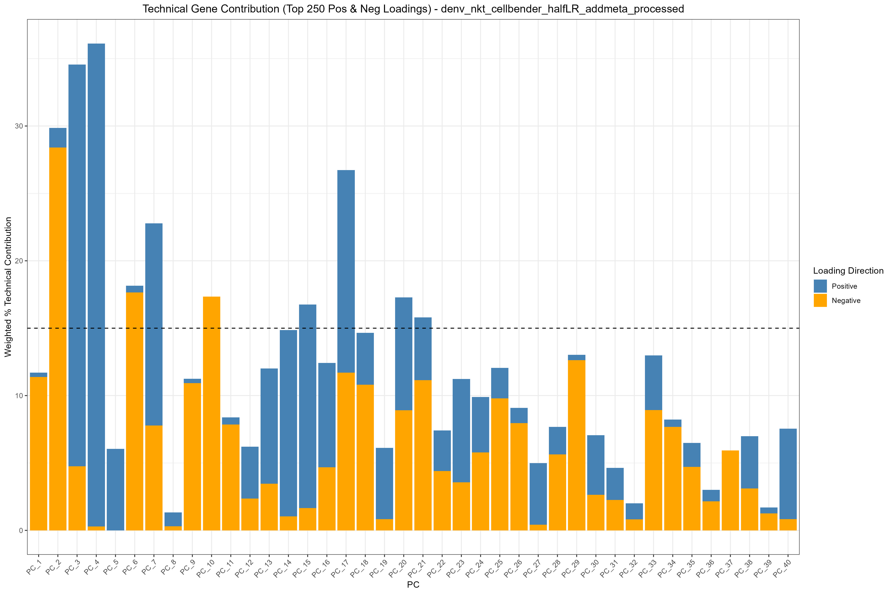
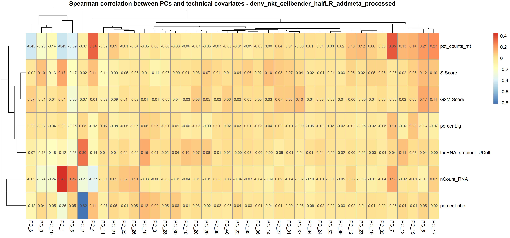

# Diagnostic and Variable Evaluation

## Introduction

Before clustering your single-cell data, it is critical to evaluate your
Principal Components (PCs). You need to determine two things:

1.  **How many PCs to use:** Where does the biological variance drop
    off?

2.  **What is driving the PCs:** Are your top components driven by true
    biological cell states, or are they being hijacked by technical
    artifacts (like mitochondrial genes, ribosomal genes, or cell cycle
    phases)?

`OHMmy` provides a suite of automated diagnostic tools to help you
visualize and quantify technical noise within your dimensionality
reduction.

## Part 1: Visualizing Component Variance and Loadings

First, we load our processed Seurat object (which has already undergone
Normalization and PCA) and generate the standard visualizations to
inspect the top genes driving each PC.

``` r


library(Seurat)
library(OHMmy)

seurat_obj <- readRDS("data/seurat_processed.rds")
out_dir <- "results/pca_diagnostics/"

# 1. Standard Elbow Plot to assess variance drop-off
ElbowPlot(seurat_obj, reduction = "pca.log", ndims = 40)

# 2. Generate Heatmaps for the top PCs
# This saves heatmaps of the top genes driving PCs 1-20 and 21-40
generate_dimheatmaps(
  seurat_obj = seurat_obj,
  sample_name = "MySample",
  reduction = "pca.log",
  pc_windows = list(1:20, 21:40),
  output_dir = out_dir
)
```


``` r


# 3. Generate PC Loading Plots
# This plots the actual weight of the top genes for each PC
plot_vizdimloadings(
  seurat_obj = seurat_obj,
  sample_name = "MySample",
  reduction = "pca.log",
  pc_windows = list(1:20, 21:40),
  output_dir = out_dir
)
```


## Part 2: Quantifying Technical Gene Contributions

Often, PCs can be artificially driven by stress responses or ambient
contamination. We can define a list of “technical keywords” (e.g.,
mitochondrial `MT-`, ribosomal `RPS`/`RPL`, or lncRNAs like `MALAT1`)
and let `OHMmy` calculate exactly how much of each PC is driven by these
gene families.

``` r


# Define standard technical and stress-related gene prefixes
tech_keys <- c("^MT-", "^RPL", "^RPS", "^IG[HKL]", "MALAT1", "NEAT1", "XIST")

# 1. Line Plot: Technical contribution across the top 40 PCs
plot_technical_contribution(
  seurat_obj = seurat_obj,
  sample_name = "MySample",
  technical_keywords = tech_keys,
  max_pcs = 40,
  n_top_genes = 500,
  cutoff = 15,          # Highlight PCs where technical genes make up >15% of the weight
  output_dir = out_dir
)
```



``` r


# 2. Stacked Bar Chart: Deeper look at technical distribution at varying gene depths
plot_stacked_technical_contribution(
  seurat_obj = seurat_obj, 
  sample_name = "MySample",
  reduction = "pca.log", 
  technical_keywords = tech_keys,
  gene_depths = seq(0, 500, by = 20), 
  max_pcs = 40, 
  cutoff = 15, 
  output_dir = out_dir
)
```


*Note: If these plots reveal that PC1 or PC2 is overwhelmingly driven by
ribosomal or mitochondrial genes, you may need to go back to the
normalization step and actively regress those variables out.*

## Part 3: Correlating PCs with Quality Control Metadata

Finally, we want to ensure our clustering won’t be driven by sequencing
depth (`nCount_RNA`) or cell cycle states (`S.Score`, `G2M.Score`).
`OHMmy` can automatically correlate your metadata columns against the PC
scores.

``` r


# Define the metadata columns you want to test
qc_metrics <- c("nCount_RNA", "pct_counts_mt", "percent.ribo", "S.Score", "G2M.Score")

# Generate correlation heatmaps between QC metrics and PCs
plot_pc_metadata_correlation(
  seurat_obj = seurat_obj,
  sample_name = "MySample",
  reduction = "pca.log",
  n_pcs = 40,
  vars_to_test = qc_metrics,
  output_dir = out_dir
)
```



If a PC shows a correlation close to `1.0` or `-1.0` with `nCount_RNA`,
it means that component is separating cells based purely on sequencing
depth rather than biology, indicating that further regression or a
different normalization strategy (like SCTransform) may be required.
