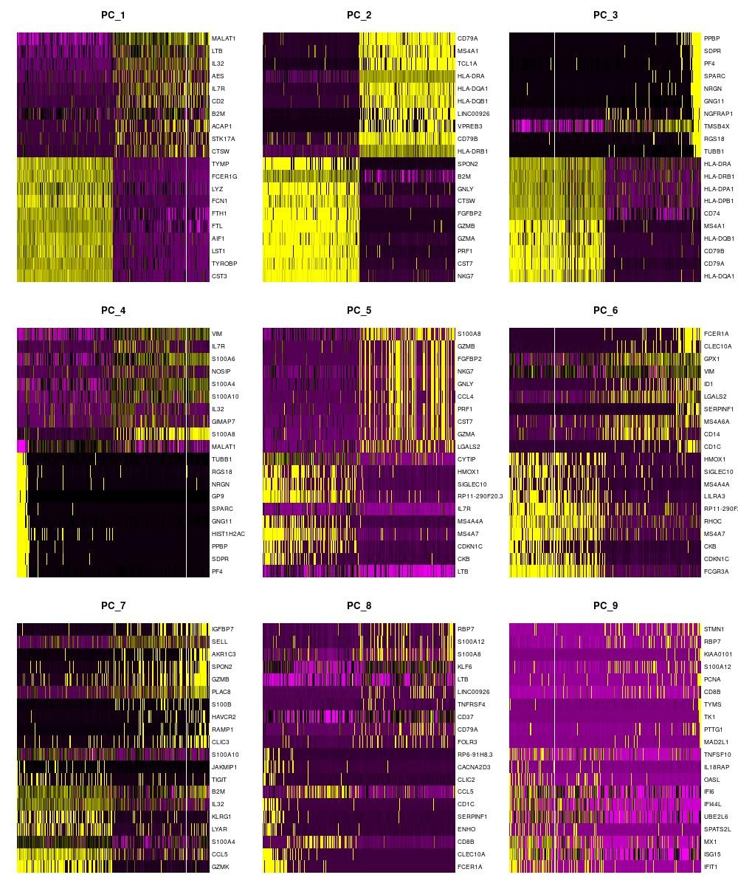
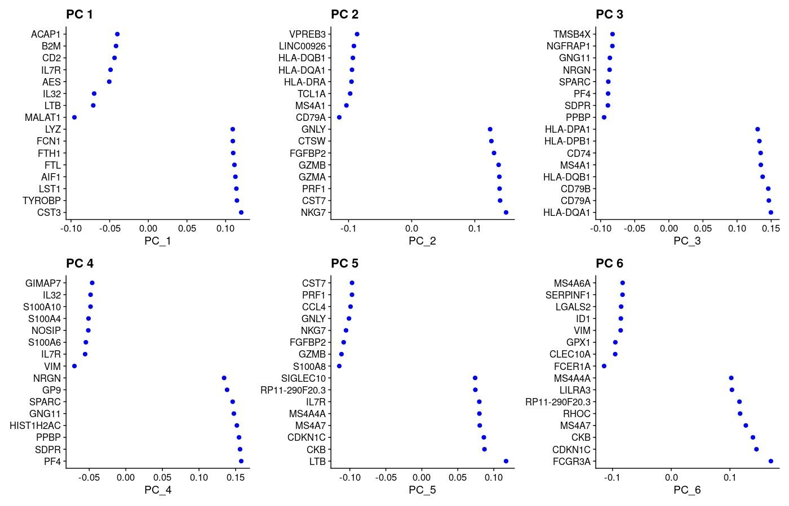
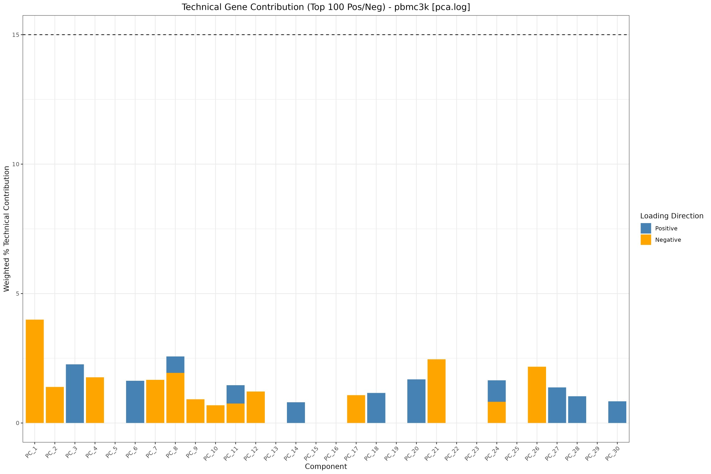
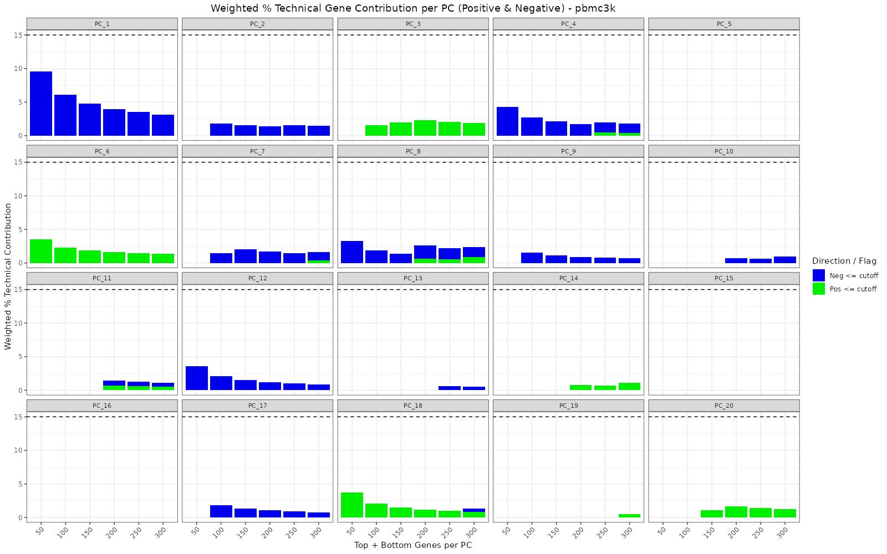
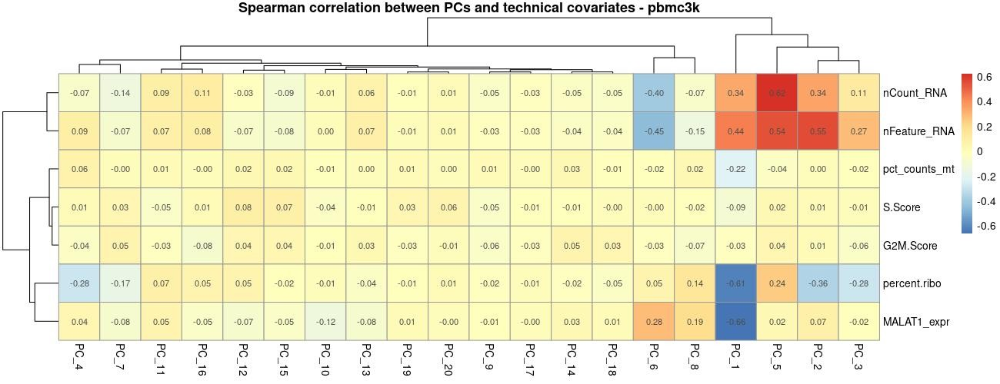

# Diagnostic and Variable Evaluation

## Overview

Before trusting a clustering, check what the principal components
actually capture. Two questions matter:

1.  **How many PCs carry biological signal?**
2.  **Are any PCs driven by technical artefacts** such as mitochondrial
    or ribosomal transcripts, nuclear lncRNAs, sequencing depth or cell
    cycle?

OHMmy provides five diagnostic functions. Each saves its figures to disk
so the same checks can run unattended on an HPC node.

| Function | Question it answers |
|----|----|
| [`generate_dimheatmaps()`](https://chomchonu.github.io/OHMmy/reference/generate_dimheatmaps.md) | Which genes and cells drive each PC? |
| [`plot_vizdimloadings()`](https://chomchonu.github.io/OHMmy/reference/plot_vizdimloadings.md) | What are the gene loadings of each PC? |
| [`plot_technical_contribution()`](https://chomchonu.github.io/OHMmy/reference/plot_technical_contribution.md) | What fraction of each PC’s top loadings is technical? |
| [`plot_stacked_technical_contribution()`](https://chomchonu.github.io/OHMmy/reference/plot_stacked_technical_contribution.md) | Does that fraction change with loading depth? |
| [`plot_pc_metadata_correlation()`](https://chomchonu.github.io/OHMmy/reference/plot_pc_metadata_correlation.md) | Do PC scores correlate with QC covariates? |

``` r

library(Seurat)
library(OHMmy)
source("ohmmy-vignette-helpers.R")

pbmc <- load_pbmc3k_ohmmy()   # built in "Data Processing, Integration, and Clustering"
out_dir <- file.path(tempdir(), "OHMmy-diagnostics")
dir.create(out_dir, recursive = TRUE, showWarnings = FALSE)
```

The diagnostics use the **pre-integration PCA** (`pca.log`), which still
carries gene loadings.

## 1. Variance and loadings

### Elbow plot

``` r

ElbowPlot(pbmc, reduction = "pca.log", ndims = 40)
```


The standard deviation drops steeply over the first 7 PCs and is
essentially flat after PC 10. The 20 PCs used downstream in the
processing article are a conservative choice for pbmc3k.

### Dimension heatmaps

[`generate_dimheatmaps()`](https://chomchonu.github.io/OHMmy/reference/generate_dimheatmaps.md)
splits the PCs into windows (`pc_windows`) and saves one balanced
`DimHeatmap` per window. Each window is wrapped in error handling, so
one failed plot does not stop a batch run.

``` r

generate_dimheatmaps(
  seurat_obj  = pbmc,
  sample_name = "pbmc3k",
  reduction   = "pca.log",
  pc_windows  = list(1:9, 10:18),
  output_dir  = out_dir,
  nfeatures   = 20,
  cells       = 300,
  width_in    = 10,
  height_in   = 12,
  res         = 100
)
```



PC 1 separates myeloid genes (*LYZ*, *FCN1*, *CST3*) from lymphoid genes
(*IL7R*, *LTB*). Note that *MALAT1* is among its top lymphoid loadings,
which the technical-contribution checks below quantify. PC 2 captures
the cytotoxic NK/CD8 programme against B-cell genes, PCs 3 and 4
platelets, and PC 9 a mixture of interferon-stimulated and S-phase
genes.

### Loading plots

[`plot_vizdimloadings()`](https://chomchonu.github.io/OHMmy/reference/plot_vizdimloadings.md)
stitches one `VizDimLoadings` panel per PC into a grid and returns the
names of any windows that failed. An empty vector means everything was
plotted.

``` r

failed <- plot_vizdimloadings(
  seurat_obj  = pbmc,
  sample_name = "pbmc3k",
  reduction   = "pca.log",
  pc_windows  = list(1:6),
  output_dir  = out_dir,
  nfeatures   = 15,
  width_in    = 14,
  height_in   = 9,
  res         = 100,
  ncol        = 3
)
```

``` r

failed
#> character(0)
```



## 2. Quantifying technical gene contributions

[`plot_technical_contribution()`](https://chomchonu.github.io/OHMmy/reference/plot_technical_contribution.md)
takes the top `n_top_genes / 2` positive and negative loadings of each
PC and computes the **loading-weighted percentage** that comes from
genes matching `technical_keywords`. A dashed line marks the `cutoff`
above which a PC deserves a closer look.

``` r

tech_keys <- c("^MT-", "^RPL", "^RPS", "^IG[HKL]", "MALAT1", "NEAT1", "XIST")
```

``` r

plot_technical_contribution(
  seurat_obj         = pbmc,
  sample_name        = "pbmc3k",
  reduction          = "pca.log",
  technical_keywords = tech_keys,
  max_pcs            = 30,
  n_top_genes        = 200,
  cutoff             = 15,
  output_dir         = out_dir
)
```



In pbmc3k every PC stays well below the 15 % cutoff. The largest value
is a few percent on the negative side of PC 1. This is expected, because
PCA loadings only exist for the variable features, and mitochondrial and
ribosomal genes rarely pass HVG selection after QC filtering. In noisier
data, such as stressed tissue, low-quality droplets or nuclei, a PC far
above the line is a strong hint to regress the corresponding covariate.

The percentage can change sharply with the number of genes considered.
[`plot_stacked_technical_contribution()`](https://chomchonu.github.io/OHMmy/reference/plot_stacked_technical_contribution.md)
repeats the calculation over a sequence of depths (`gene_depths`) and
facets the result by PC. Bars above the cutoff are highlighted, so a PC
that is “clean” at the top but technical deeper down is easy to spot.

``` r

plot_stacked_technical_contribution(
  seurat_obj         = pbmc,
  sample_name        = "pbmc3k",
  reduction          = "pca.log",
  technical_keywords = tech_keys,
  gene_depths        = seq(0, 300, by = 50),
  max_pcs            = 20,
  cutoff             = 15,
  output_dir         = out_dir,
  plot_width         = 16,
  plot_height        = 10,
  dpi                = 100
)
```



## 3. Correlating PCs with QC covariates

[`plot_pc_metadata_correlation()`](https://chomchonu.github.io/OHMmy/reference/plot_pc_metadata_correlation.md)
computes Spearman correlations between each PC’s cell embeddings and the
metadata columns in `vars_to_test`, then draws a clustered `pheatmap`
with the coefficients printed in each cell. Expression of single nuclear
transcripts, such as *MALAT1*, can be tested by first copying it into
the metadata.

``` r

pbmc$MALAT1_expr <- FetchData(pbmc, vars = "MALAT1", layer = "data")[, 1]
```

``` r

plot_pc_metadata_correlation(
  seurat_obj     = pbmc,
  sample_name    = "pbmc3k",
  vars_to_test   = c("nCount_RNA", "nFeature_RNA", "pct_counts_mt", "percent.ribo",
                     "S.Score", "G2M.Score", "MALAT1_expr"),
  reduction      = "pca.log",
  n_pcs          = 20,
  output_dir     = out_dir,
  plot_width_in  = 13,
  plot_height_in = 5,
  res_dpi        = 100
)
```



## Interpreting the diagnostics

- A PC whose top loadings are dominated by `MT-`, `RPL`/`RPS` or lncRNA
  genes, and whose scores correlate strongly (\|rho\| \> 0.5) with
  `pct_counts_mt`, `percent.ribo` or `nCount_RNA`, is technical. Regress
  that covariate in `ProcessSeuratLOG(vars_to_regress = ...)`, switch to
  [`ProcessSeuratSCT()`](https://chomchonu.github.io/OHMmy/reference/ProcessSeuratSCT.md),
  or leave the PC out of `dims`.
- Ribosomal genes often load on lymphocyte-versus-myeloid PCs in PBMCs
  simply because naive T cells are ribosome-rich. Before removing such a
  PC, check whether it also separates known cell types, for example with
  the dimension heatmaps above.
- Correlation with `S.Score` or `G2M.Score` indicates a cycling
  compartment. Regress the cell-cycle difference only when proliferation
  is not of interest.

## Session information

``` r

sessionInfo()
#> R version 4.6.1 (2026-06-24)
#> Platform: x86_64-pc-linux-gnu
#> Running under: Ubuntu 22.04.5 LTS
#> 
#> Matrix products: default
#> BLAS:   /usr/lib/x86_64-linux-gnu/openblas-pthread/libblas.so.3 
#> LAPACK: /usr/lib/x86_64-linux-gnu/openblas-pthread/libopenblasp-r0.3.20.so;  LAPACK version 3.10.0
#> 
#> locale:
#>  [1] LC_CTYPE=C.UTF-8       LC_NUMERIC=C           LC_TIME=C.UTF-8       
#>  [4] LC_COLLATE=C.UTF-8     LC_MONETARY=C.UTF-8    LC_MESSAGES=C.UTF-8   
#>  [7] LC_PAPER=C.UTF-8       LC_NAME=C              LC_ADDRESS=C          
#> [10] LC_TELEPHONE=C         LC_MEASUREMENT=C.UTF-8 LC_IDENTIFICATION=C   
#> 
#> time zone: UTC
#> tzcode source: system (glibc)
#> 
#> attached base packages:
#> [1] stats     graphics  grDevices utils     datasets  methods   base     
#> 
#> other attached packages:
#> [1] OHMmy_1.0.2.9000   Seurat_5.6.0       SeuratObject_5.4.0 sp_2.2-3          
#> 
#> loaded via a namespace (and not attached):
#>   [1] RColorBrewer_1.1-3     jsonlite_2.0.0         magrittr_2.0.5        
#>   [4] spatstat.utils_3.2-5   farver_2.1.2           rmarkdown_2.32        
#>   [7] fs_2.1.0               ragg_1.5.2             vctrs_0.7.3           
#>  [10] ROCR_1.0-12            memoise_2.0.1          spatstat.explore_3.8-3
#>  [13] rstatix_1.1.0          progress_1.2.3         htmltools_0.5.9       
#>  [16] broom_1.0.13           Formula_1.2-6          sass_0.4.10           
#>  [19] sctransform_0.4.3      parallelly_1.48.0      KernSmooth_2.23-26    
#>  [22] bslib_0.12.0           htmlwidgets_1.6.4      desc_1.4.3            
#>  [25] ica_1.0-3              plyr_1.8.9             plotly_4.12.1         
#>  [28] zoo_1.9-1              cachem_1.1.0           igraph_2.3.4          
#>  [31] mime_0.13              lifecycle_1.0.5        pkgconfig_2.0.3       
#>  [34] Matrix_1.7-5           R6_2.6.1               fastmap_1.2.0         
#>  [37] fitdistrplus_1.2-6     future_1.76.0          shiny_1.14.0          
#>  [40] digest_0.6.39          patchwork_1.3.2        tensor_1.5.1          
#>  [43] RSpectra_0.16-2        irlba_2.4.1            textshaping_1.0.5     
#>  [46] ggpubr_1.0.0           labeling_0.4.3         progressr_1.0.0       
#>  [49] spatstat.sparse_3.2-0  httr_1.4.9             polyclip_1.10-7       
#>  [52] abind_1.4-8            compiler_4.6.1         withr_3.0.3           
#>  [55] S7_0.2.2               backports_1.5.1        viridis_0.6.5         
#>  [58] carData_3.0-6          fastDummies_1.7.6      ggforce_0.5.0         
#>  [61] ggsignif_0.6.4         MASS_7.3-65            tools_4.6.1           
#>  [64] lmtest_0.9-40          otel_0.2.0             httpuv_1.6.17         
#>  [67] future.apply_1.20.2    goftest_1.2-3          glue_1.8.1            
#>  [70] nlme_3.1-169           promises_1.5.0         grid_4.6.1            
#>  [73] Rtsne_0.17             cluster_2.1.8.2        reshape2_1.4.5        
#>  [76] generics_0.1.4         gtable_0.3.6           spatstat.data_3.1-9   
#>  [79] tidyr_1.3.2            hms_1.1.4              data.table_1.18.6.1   
#>  [82] tidygraph_1.3.1        car_3.1-5              spatstat.geom_3.8-3   
#>  [85] RcppAnnoy_0.0.23       ggrepel_0.9.8          RANN_2.6.3            
#>  [88] pillar_1.11.1          stringr_1.6.0          spam_2.11-4           
#>  [91] RcppHNSW_0.7.0         later_1.4.8            splines_4.6.1         
#>  [94] tweenr_2.0.3           dplyr_1.2.1            lattice_0.22-9        
#>  [97] survival_3.8-6         deldir_2.0-4           tidyselect_1.2.1      
#> [100] miniUI_0.1.2           pbapply_1.7-5          knitr_1.52            
#> [103] gridExtra_2.3.1        SoupX_1.6.2            scattermore_1.2       
#> [106] xfun_0.61              graphlayouts_1.2.5     matrixStats_1.5.0     
#> [109] pheatmap_1.0.13        leidenbase_0.1.37      stringi_1.8.9         
#> [112] yaml_2.3.12            evaluate_1.0.5         codetools_0.2-20      
#> [115] ggraph_2.2.2           tibble_3.3.1           cli_3.6.6             
#> [118] uwot_0.2.5             xtable_1.8-8           reticulate_1.47.0     
#> [121] systemfonts_1.3.2      jquerylib_0.1.4        Rcpp_1.1.2            
#> [124] globals_0.19.1         spatstat.random_3.5-2  png_0.1-9             
#> [127] spatstat.univar_3.2-0  parallel_4.6.1         pkgdown_2.2.1         
#> [130] ggplot2_4.0.3          prettyunits_1.2.0      dotCall64_1.2         
#> [133] jpeg_0.1-11            listenv_1.1.0          viridisLite_0.4.3     
#> [136] scales_1.4.0           ggridges_0.5.7         crayon_1.5.3          
#> [139] purrr_1.2.2            rlang_1.3.0            cowplot_1.2.0
```
