# Differential Expression and Pathway Enrichment

## Overview

This article goes from cluster markers to pathways and pseudo-bulk
differential expression.

| Step | Functions |
|----|----|
| Cluster markers | [`FindTopMarkersAndHeatmap()`](https://chomchonu.github.io/OHMmy/reference/FindTopMarkersAndHeatmap.md) |
| Marker tables across conditions | [`plot_gene_markers_with_dendro()`](https://chomchonu.github.io/OHMmy/reference/plot_gene_markers_with_dendro.md), [`plot_split_dotplots_by_gene_cluster()`](https://chomchonu.github.io/OHMmy/reference/plot_split_dotplots_by_gene_cluster.md) |
| Pathway enrichment | [`run_global_gsea()`](https://chomchonu.github.io/OHMmy/reference/run_global_gsea.md), [`run_global_ora()`](https://chomchonu.github.io/OHMmy/reference/run_global_ora.md) |
| Pseudo-bulk DESeq2 visualisation | [`generate_volcano_trio()`](https://chomchonu.github.io/OHMmy/reference/generate_volcano_trio.md), [`get_top_mixed_genes()`](https://chomchonu.github.io/OHMmy/reference/get_top_mixed_genes.md), [`generate_and_save_heatmap()`](https://chomchonu.github.io/OHMmy/reference/generate_and_save_heatmap.md) |

``` r

library(Seurat)
library(OHMmy)
library(dplyr)
library(ggplot2)
source("ohmmy-vignette-helpers.R")

library(msigdbr)   # MSigDB gene sets
library(DESeq2)    # pseudo-bulk differential expression

pbmc <- load_pbmc3k_ohmmy()   # built in "Data Processing, Integration, and Clustering"
out_dir <- file.path(tempdir(), "OHMmy-differential-expression")
dir.create(out_dir, recursive = TRUE, showWarnings = FALSE)
```

The classic GSEA enrichment plots and the volcano plots additionally use
the suggested packages **enrichplot** and **EnhancedVolcano**. OHMmy
calls them internally, so they only need to be installed.

## 1. Cluster markers with `FindTopMarkersAndHeatmap()`

[`FindTopMarkersAndHeatmap()`](https://chomchonu.github.io/OHMmy/reference/FindTopMarkersAndHeatmap.md)
runs
[`FindAllMarkers()`](https://satijalab.org/seurat/reference/FindAllMarkers.html)
on the active identities, or
[`FindMarkers()`](https://satijalab.org/seurat/reference/FindMarkers.html)
for a single pairwise comparison when `compare` is given. It uses
`logfc.threshold = 0` and `min.pct = 0`, so the complete ranked table
needed for GSEA is kept. Markers are then ranked by a combined relevance
score, `|log2FC| x |pct.1 - pct.2| / p_adj`, filtered by the three
`marker_*` thresholds, and the top `top_n` per cluster are drawn in a
`DoHeatmap`. Three CSV files are written: all markers, a GSEA/ORA-ready
copy, and the filtered top markers.

``` r

Idents(pbmc) <- "cell_type"

mk <- FindTopMarkersAndHeatmap(
  seurat_obj      = pbmc,
  sample_name     = "pbmc3k_celltype",
  top_n           = 6,
  onlyPos         = TRUE,
  output_dir_base = file.path(out_dir, "markers"),
  height          = 11,
  dpi             = 100
)
```

``` r

names(mk)
#> [1] "top_markers" "heatmap"     "markers"     "output_dir"
mk$top_markers %>%
  group_by(cluster) %>%
  slice_head(n = 3) %>%
  dplyr::select(cluster, gene, avg_log2FC, pct.1, pct.2, p_val_adj, score)
#> # A tibble: 24 × 7
#> # Groups:   cluster [8]
#>    cluster gene   avg_log2FC pct.1 pct.2 p_val_adj        score
#>    <fct>   <chr>       <dbl> <dbl> <dbl>     <dbl>        <dbl>
#>  1 CD4 T   CD3D         1.86 0.876 0.239         0 11832733243.
#>  2 CD4 T   MAL          4.18 0.273 0.024         0 10408717439.
#>  3 CD4 T   IL7R         2.07 0.662 0.198         0  9627326382.
#>  4 CD8 T   CCL5         3.31 0.986 0.235         0 24860743868.
#>  5 CD8 T   GZMK         4.28 0.568 0.058         0 21819033699.
#>  6 CD8 T   NKG7         2.47 0.968 0.218         0 18515415364.
#>  7 NK      GZMB         5.93 0.943 0.069         0 51839175856.
#>  8 NK      GNLY         6.10 0.949 0.131         0 49870973178.
#>  9 NK      FGFBP2       5.31 0.866 0.062         0 42699888960.
#> 10 B       CD79A        6.85 0.938 0.042         0 61335103114.
#> # ℹ 14 more rows
mk$heatmap
```

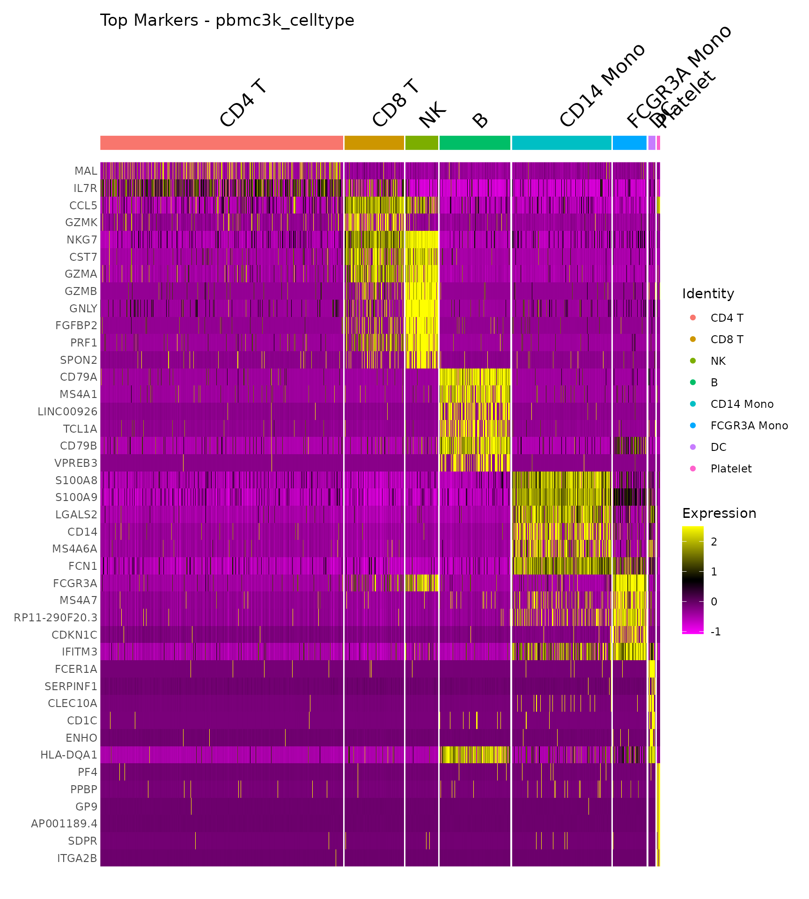

### Pairwise comparison

With `compare = c(ident.1, ident.2)`, the function runs a single
[`FindMarkers()`](https://satijalab.org/seurat/reference/FindMarkers.html)
test. It adds the `gene` and `cluster` columns (each gene is assigned to
the identity in which it is higher), so the output has the same format
as the all-cluster version. With `onlyPos = FALSE`, genes enriched on
both sides are kept.

``` r

mk_mono <- FindTopMarkersAndHeatmap(
  seurat_obj      = subset(pbmc, subset = cell_type %in% c("CD14 Mono", "FCGR3A Mono")),
  sample_name     = "pbmc3k_monocytes",
  compare         = c("FCGR3A Mono", "CD14 Mono"),
  onlyPos         = FALSE,
  top_n           = 10,
  output_dir_base = file.path(out_dir, "markers"),
  height          = 7,
  dpi             = 100
)
```

``` r

table(mk_mono$top_markers$cluster)
#> 
#>   CD14 Mono FCGR3A Mono 
#>          10          10
mk_mono$heatmap
```

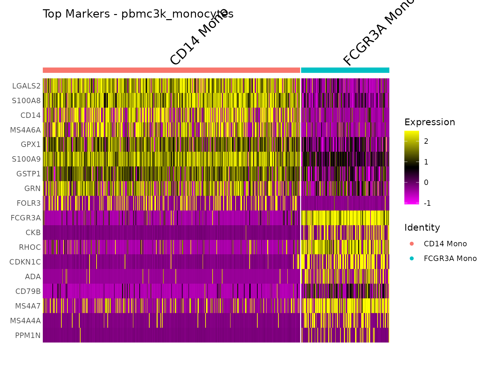

## 2. Comparing marker tables across conditions

When markers are computed separately for each condition, batch or
integration method, the question becomes how the marker profiles differ
between those runs. Two functions take such a combined table. It needs
the columns `gene`, `cluster`, `avg_log2FC`, `diff` (= `pct.1 - pct.2`)
and an identifier column.

Here we compute cluster markers separately for each of the six
severity-by-batch groups of the simulated cohort.

``` r

pbmc$group <- paste(pbmc$severity, pbmc$batch, sep = "_")

marker_tbl <- bind_rows(lapply(sort(unique(pbmc$group)), function(g) {
  sub <- subset(pbmc, subset = group == g)
  Idents(sub) <- "seurat_clusters"
  FindAllMarkers(sub, only.pos = TRUE, logfc.threshold = 0.25, min.pct = 0.1, verbose = FALSE) %>%
    mutate(diff = pct.1 - pct.2, group = g)
}))

marker_tbl %>% dplyr::count(group)
#>             group    n
#> 1 Healthy_Batch_1 3953
#> 2 Healthy_Batch_2 3178
#> 3    Mild_Batch_1 4264
#> 4    Mild_Batch_2 3723
#> 5  Severe_Batch_1 4589
#> 6  Severe_Batch_2 4170
```

### `plot_gene_markers_with_dendro()`

Averages the marker statistics per gene and group, clusters the groups
(Ward.D2) and draws a dot plot. Dot size shows log2FC and colour shows
the difference in detection rate. The clusters in which each gene was a
marker are written above the dots, and the dendrogram is attached beside
the plot. `genes` accepts a vector or a single regular expression.

``` r

gm <- plot_gene_markers_with_dendro(
  df         = marker_tbl,
  genes      = c("CD14", "LYZ", "S100A8", "S100A9", "FCGR3A", "MS4A7",
                 "GNLY", "NKG7", "MS4A1", "CD79A", "IL7R", "CCR7", "PPBP"),
  id_col     = "group",
  plot_title = "Canonical markers across cohort groups",
  output_dir = file.path(out_dir, "marker_dendro")
)
```

``` r

gm$combined
```

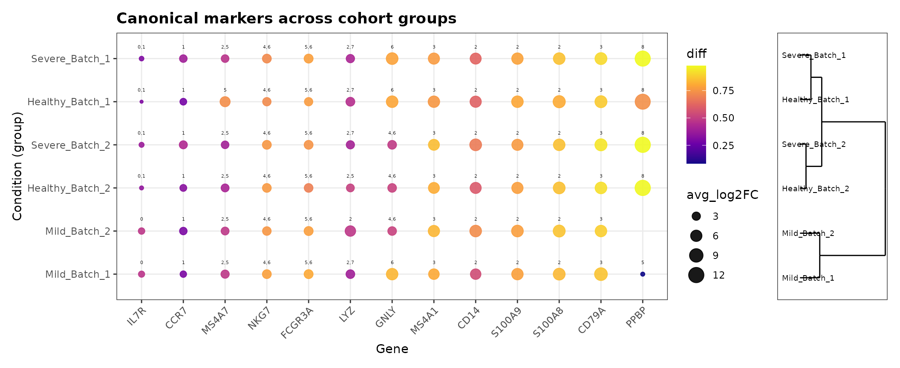

### `plot_split_dotplots_by_gene_cluster()`

For gene families with many members, this function plots every *gene x
cluster* combination. It splits the x-axis into `n_splits` dot plots and
saves a global dendrogram of the groups. Here we use a regular
expression to select all HLA class II genes.

``` r

plot_split_dotplots_by_gene_cluster(
  df                = marker_tbl,
  gene_regex        = "^HLA-D",
  id_col            = "group",
  n_splits          = 2,
  plot_title_prefix = "HLA class II markers",
  output_dir        = file.path(out_dir, "split_dot")
)
```

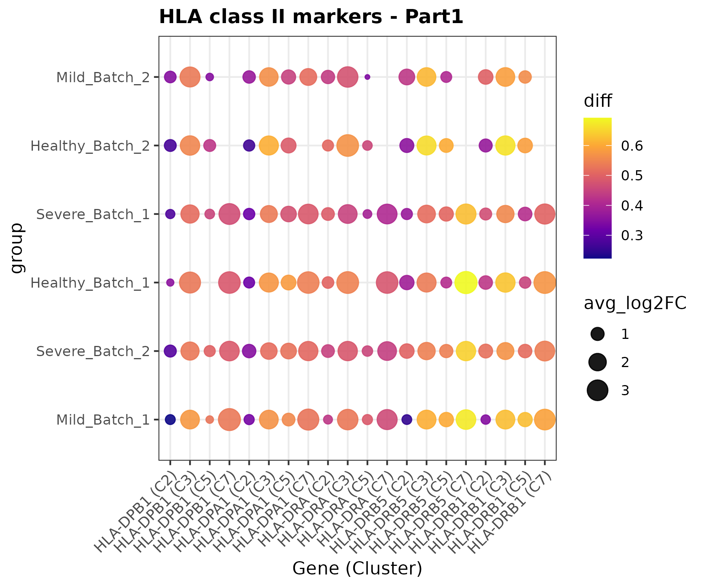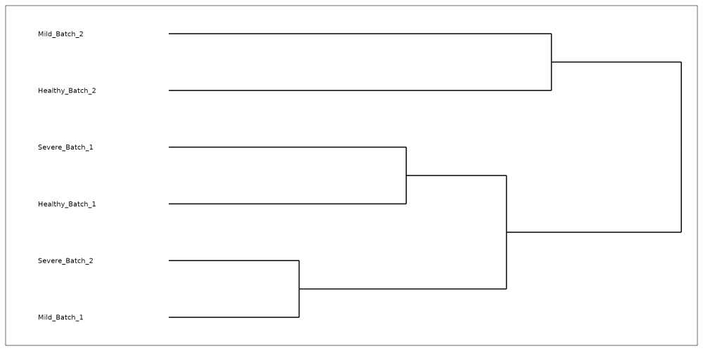

## 3. Pathway enrichment

Both enrichment pipelines take a marker table with one block of genes
per `cluster` and a two-column **TERM2GENE** table, here the MSigDB
Hallmark collection. If the table also has a column whose name contains
`cell_type`, results are additionally summarised per cell type. We
therefore compute markers for the nine `seurat_clusters` (two of which
are CD4 T) and attach their cell type.

``` r

hallmark <- msigdbr(species = "Homo sapiens", collection = "H")[, c("gs_name", "gene_symbol")]

Idents(pbmc) <- "seurat_clusters"
mk_clusters <- FindTopMarkersAndHeatmap(
  seurat_obj      = pbmc,
  sample_name     = "pbmc3k_clusters",
  onlyPos         = FALSE,             # GSEA needs both tails of the ranking
  output_dir_base = file.path(out_dir, "markers"),
  dpi             = 72
)

enrich_df <- mk_clusters$markers %>%
  mutate(cluster   = as.character(cluster),
         cell_type = as.character(pbmc$cell_type[match(cluster, pbmc$seurat_clusters)]))
```

``` r

dim(enrich_df)
#> [1] 19618     8
dplyr::as_tibble(dplyr::distinct(enrich_df, cluster, cell_type))
#> # A tibble: 9 × 2
#>   cluster cell_type  
#>   <chr>   <chr>      
#> 1 0       CD4 T      
#> 2 1       CD4 T      
#> 3 2       CD14 Mono  
#> 4 3       B          
#> 5 4       CD8 T      
#> 6 5       FCGR3A Mono
#> 7 6       NK         
#> 8 7       DC         
#> 9 8       Platelet
```

### Gene Set Enrichment Analysis: `run_global_gsea()`

For every cluster, genes are ranked by `avg_log2FC` and tested with
[`clusterProfiler::GSEA()`](https://rdrr.io/pkg/clusterProfiler/man/GSEA.html).
A first pass collects the NES range of all clusters, so every
per-cluster dot plot shares the same x-axis and can be compared
directly. The function saves per-cluster NES dot plots, a classic
enrichment plot for the top pathway of each cluster, alphabetical and
hierarchically clustered overview dot plots, signed-significance plots
(global and per cell type), and CSV summaries.

``` r

gsea_dir <- file.path(out_dir, "gsea")

gsea_res <- run_global_gsea(
  GSEA_df             = enrich_df,
  m_t2g               = hallmark,
  output_dir          = gsea_dir,
  title_prefix        = "Hallmark",
  top_n_per_direction = 8,
  top_n_overall       = 4
)
```

``` r

gsea_res %>%
  group_by(cluster) %>%
  slice_min(p.adjust, n = 2, with_ties = FALSE) %>%
  dplyr::select(cluster, cell_type, Description, NES, p.adjust) %>%
  arrange(as.numeric(cluster))
#> # A tibble: 15 × 5
#> # Groups:   cluster [8]
#>    cluster cell_type   Description                        NES     p.adjust
#>    <chr>   <chr>       <chr>                            <dbl>        <dbl>
#>  1 1       CD4 T       HALLMARK_KRAS_SIGNALING_UP       -1.88 0.000473    
#>  2 1       CD4 T       HALLMARK_ALLOGRAFT_REJECTION     -1.69 0.000877    
#>  3 2       CD14 Mono   HALLMARK_ALLOGRAFT_REJECTION     -2.01 0.000413    
#>  4 2       CD14 Mono   HALLMARK_MYC_TARGETS_V1          -1.97 0.00137     
#>  5 3       B           HALLMARK_COMPLEMENT              -1.94 0.00388     
#>  6 3       B           HALLMARK_INFLAMMATORY_RESPONSE   -1.93 0.00388     
#>  7 4       CD8 T       HALLMARK_KRAS_SIGNALING_UP       -2.08 0.00196     
#>  8 4       CD8 T       HALLMARK_XENOBIOTIC_METABOLISM   -1.79 0.0482      
#>  9 5       FCGR3A Mono HALLMARK_ALLOGRAFT_REJECTION     -2.48 0.0000000191
#> 10 5       FCGR3A Mono HALLMARK_XENOBIOTIC_METABOLISM    1.74 0.0121      
#> 11 6       NK          HALLMARK_TNFA_SIGNALING_VIA_NFKB -2.37 0.000136    
#> 12 6       NK          HALLMARK_G2M_CHECKPOINT           2.19 0.000136    
#> 13 7       DC          HALLMARK_DNA_REPAIR              -1.83 0.0408      
#> 14 8       Platelet    HALLMARK_COAGULATION              2.14 0.000489    
#> 15 8       Platelet    HALLMARK_MYC_TARGETS_V1          -2.36 0.00146
```

The clustered overview groups clusters with similar pathway activity.
The two CD4 T clusters (0 and 1) are neighbours, while CD14 monocytes
(cluster 2) and platelets (cluster 8) stand apart. Cluster 2 has
activated inflammatory and TNF-alpha signalling, and cluster 8 has
activated coagulation. Clusters without significant pathways, here the
small DC cluster 7, are left out.

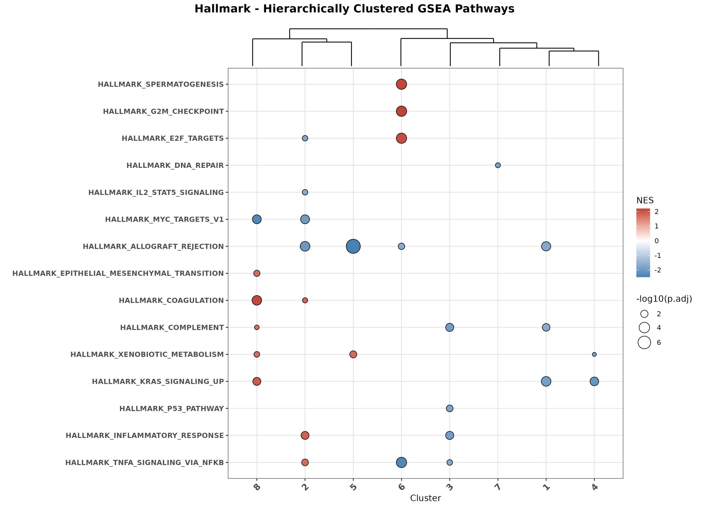

The signed-significance view puts direction and significance on one
axis:

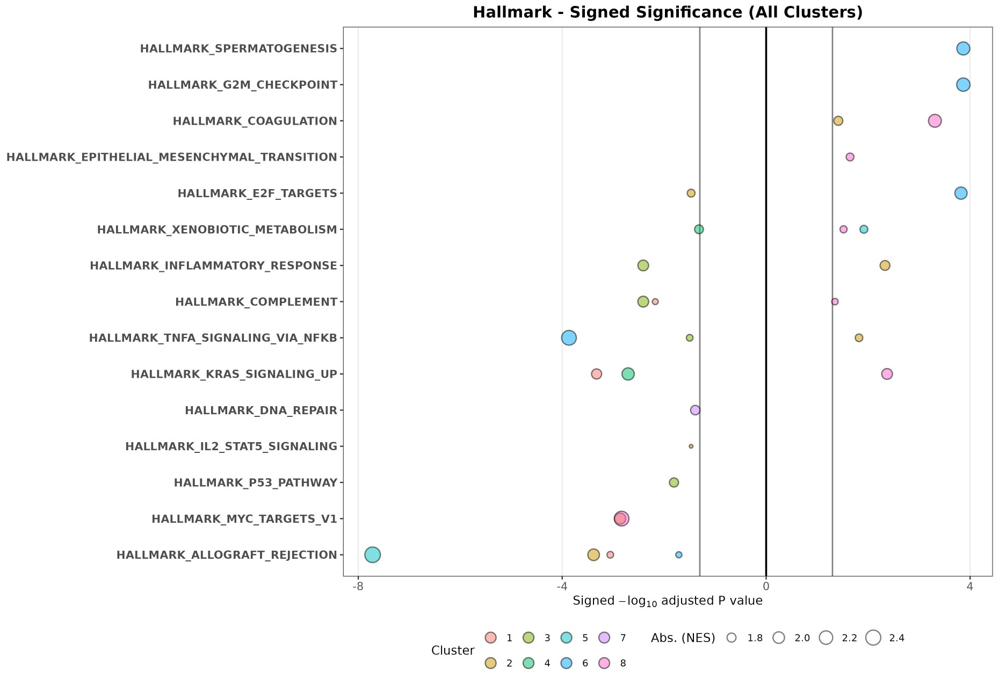

Per-cluster outputs for cluster 2 (CD14 monocytes): the NES dot plot and
the running enrichment score of its top pathway.

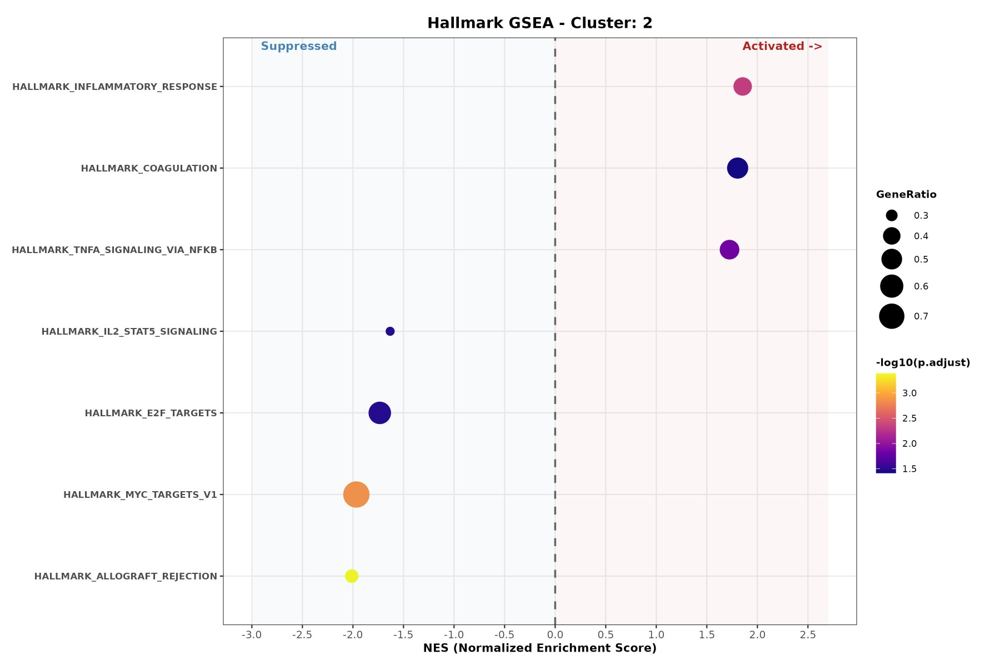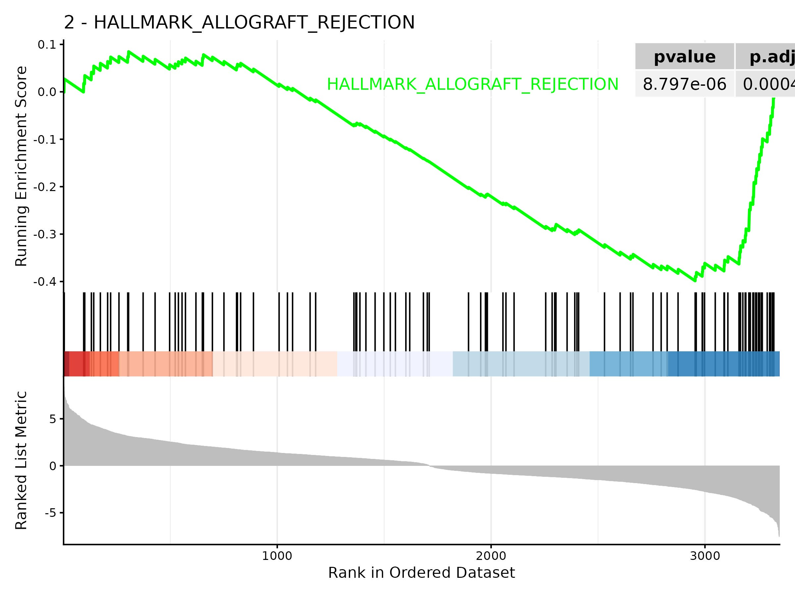

### Over-Representation Analysis: `run_global_ora()`

ORA splits each cluster’s genes into **Activated**
(`avg_log2FC > log2fc_cutoff`) and **Suppressed**
(`avg_log2FC < -log2fc_cutoff`) sets at `p_val_adj < padj_cutoff`, and
tests each set with
[`clusterProfiler::enricher()`](https://rdrr.io/pkg/clusterProfiler/man/enricher.html)
against the universe of all tested genes. With
`variable_per_clus = TRUE`, the function also draws a
signed-significance plot for every cell type.

``` r

ora_dir <- file.path(out_dir, "ora")

ora_res <- run_global_ora(
  ORA_df            = enrich_df,
  m_t2g             = hallmark,
  output_dir        = ora_dir,
  title_prefix      = "Hallmark",
  top_n_global      = 20,
  top_n_per_cluster = 8,
  log2fc_cutoff     = 0.25,
  padj_cutoff       = 0.05,
  global_width      = 11,
  global_height     = 8,
  variable_per_clus = TRUE
)
```

``` r

ora_res %>%
  dplyr::count(cluster, cell_type, Direction) %>%
  arrange(as.numeric(cluster))
#>    cluster   cell_type  Direction n
#> 1        0       CD4 T  Activated 5
#> 2        0       CD4 T Suppressed 3
#> 3        1       CD4 T  Activated 1
#> 4        1       CD4 T Suppressed 4
#> 5        2   CD14 Mono  Activated 7
#> 6        2   CD14 Mono Suppressed 2
#> 7        3           B  Activated 2
#> 8        3           B Suppressed 8
#> 9        4       CD8 T  Activated 2
#> 10       4       CD8 T Suppressed 6
#> 11       5 FCGR3A Mono  Activated 3
#> 12       5 FCGR3A Mono Suppressed 2
#> 13       6          NK  Activated 1
#> 14       6          NK Suppressed 2
#> 15       7          DC Suppressed 1
#> 16       8    Platelet  Activated 4
#> 17       8    Platelet Suppressed 1
```

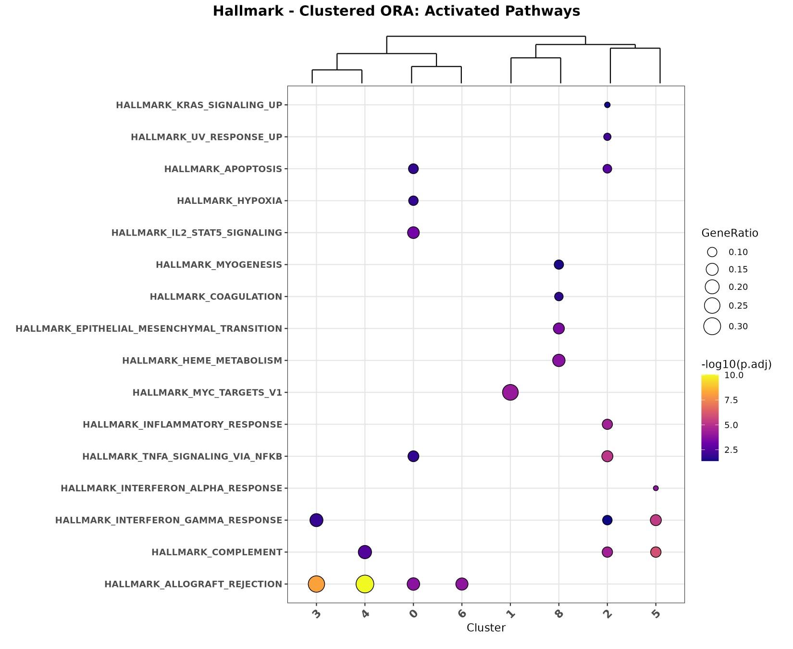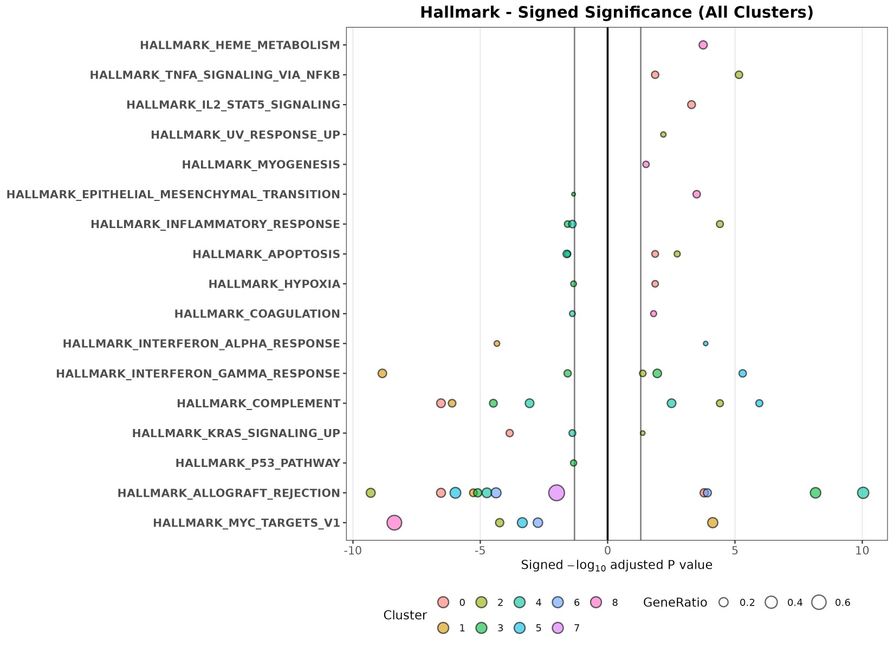

Per-cluster ORA outputs (cluster 2, CD14 monocytes):

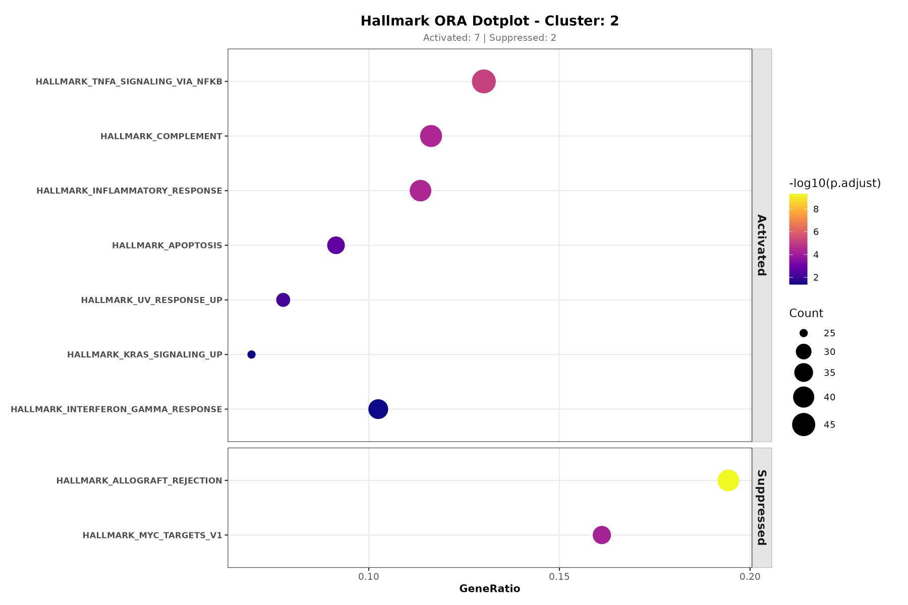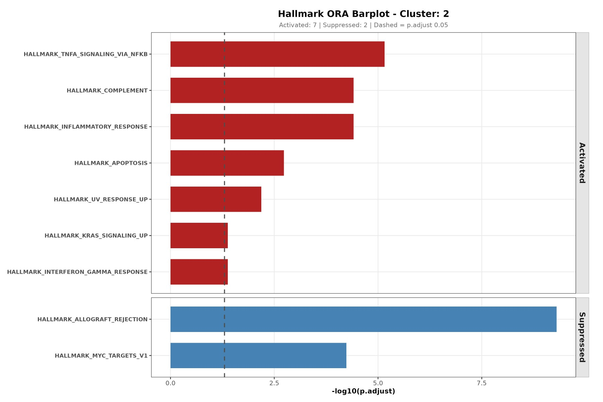

## 4. Pseudo-bulk differential expression with DESeq2

Cluster markers compare cells. A pseudo-bulk analysis compares
**samples**: the counts of each donor x population are summed and
analysed with DESeq2, which correctly models donor-to-donor variability.
Here we compare FCGR3A+ with CD14+ monocytes within the same donors,
using a paired design (`~ donor + subset`).

``` r

mono <- subset(pbmc, subset = cell_type %in% c("CD14 Mono", "FCGR3A Mono"))
mono$subset <- ifelse(mono$cell_type == "CD14 Mono", "CD14", "FCGR3A")

pb <- AggregateExpression(mono, assays = "RNA", group.by = c("donor_id", "subset"),
                          return.seurat = FALSE)$RNA
coldata <- data.frame(
  row.names = colnames(pb),
  donor     = sub("_.*$", "", colnames(pb)),
  subset    = factor(sub("^.*_", "", colnames(pb)), levels = c("CD14", "FCGR3A"))
)
coldata$severity <- pbmc$severity[match(coldata$donor, pbmc$donor_id)]

dds <- DESeqDataSetFromMatrix(round(pb), colData = coldata, design = ~ donor + subset)
dds <- dds[rowSums(counts(dds) >= 10) >= 3, ]
dds <- DESeq(dds, quiet = TRUE)

res_df <- as.data.frame(results(dds, contrast = c("subset", "FCGR3A", "CD14")))
head(res_df[order(res_df$padj), c("baseMean", "log2FoldChange", "padj")])
#>         baseMean log2FoldChange          padj
#> LYZ    710.62555      -2.711858 3.888894e-293
#> S100A9 459.50829      -3.408762 1.039931e-238
#> S100A8 236.02676      -4.137252  4.311980e-94
#> IFITM2 127.90055       2.087865  4.086997e-67
#> RPS19  420.64363       1.041063  7.382850e-61
#> FCGR3A  72.51636       4.780340  3.927394e-55
```

### Volcano trio: `generate_volcano_trio()`

The function expects a data frame with gene symbols as row names and the
DESeq2 columns `log2FoldChange` and `padj`. Seurat results can be used
after renaming `avg_log2FC` and `p_val_adj`. It returns three volcano
plots (made with EnhancedVolcano) that label, in turn, the top 10 up-
and down-regulated genes, the significant genes from your own
`target_genes` list, and both together. Genes are labelled only if they
pass `padj < 0.05` and `|log2FC| >= 1`.

``` r

volcano <- generate_volcano_trio(
  res          = res_df,
  main_title   = "FCGR3A+ vs CD14+ monocytes (pseudo-bulk, paired by donor)",
  target_genes = c("FCGR3A", "MS4A7", "CDKN1C", "LST1", "CSF1R",
                   "CD14", "LYZ", "S100A8", "VCAN", "CCR2")
)
volcano
```

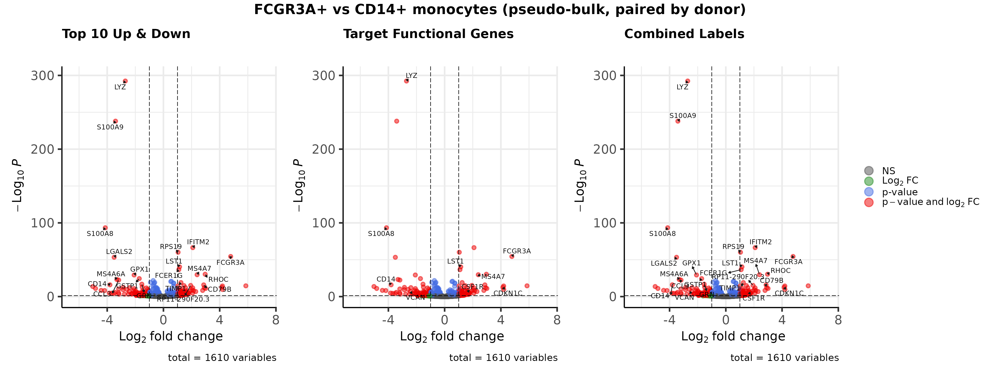

### Heatmap of the top genes: `get_top_mixed_genes()` and `generate_and_save_heatmap()`

[`get_top_mixed_genes()`](https://chomchonu.github.io/OHMmy/reference/get_top_mixed_genes.md)
returns the union of the `n_padj` most significant genes and the `n_lfc`
genes with the largest effect, chosen among the strictly significant
ones. This way neither highly significant small changes nor large
effects in lowly expressed genes are missed.

``` r

top_genes <- get_top_mixed_genes(res_df, n_padj = 25, n_lfc = 25)
length(top_genes)
#> [1] 39
head(top_genes, 15)
#>  [1] "LYZ"    "S100A9" "S100A8" "IFITM2" "RPS19"  "FCGR3A" "LGALS2" "LST1"  
#>  [9] "FCER1G" "RHOC"   "MS4A7"  "GPX1"   "GSTP1"  "MS4A6A" "CCL3"
```

[`generate_and_save_heatmap()`](https://chomchonu.github.io/OHMmy/reference/generate_and_save_heatmap.md)
uses these genes to draw two row-scaled heatmaps of the
variance-stabilised counts. The left heatmap keeps your sample order
(`ordered_samps`) and the right one clusters the samples freely.

``` r

vsd <- vst(dds, blind = FALSE)

anno_col <- as.data.frame(colData(vsd)[, c("subset", "severity")])
ordered_samples <- rownames(anno_col)[order(anno_col$subset, anno_col$severity)]

heatmap_dir <- file.path(out_dir, "deseq2")

generate_and_save_heatmap(
  res_obj       = res_df,
  comp_name     = "FCGR3A_vs_CD14",
  comp_title    = "FCGR3A+ vs CD14+ monocytes",
  vsd_data      = vsd,
  anno_col      = anno_col,
  ordered_samps = ordered_samples,
  n_padj        = 25,
  n_lfc         = 25,
  out_dir       = heatmap_dir,
  ts            = format(Sys.time(), "%Y%m%d_%H%M%S"),
  clus          = "Monocytes"
)
```

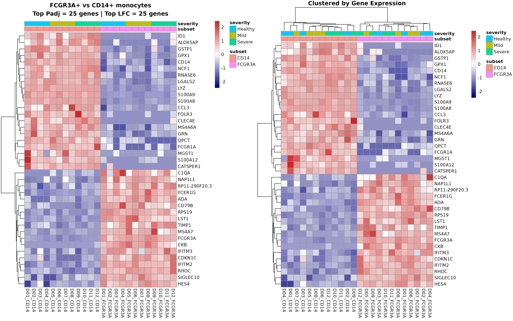

In the unordered (right) heatmap the samples split by monocyte subset,
not by the simulated severity. This is expected, because severity was
simulated and has no transcriptional effect.

## Session information

``` r

sessionInfo()
#> R version 4.6.1 (2026-06-24)
#> Platform: x86_64-pc-linux-gnu
#> Running under: Ubuntu 22.04.5 LTS
#> 
#> Matrix products: default
#> BLAS:   /usr/lib/x86_64-linux-gnu/openblas-pthread/libblas.so.3 
#> LAPACK: /usr/lib/x86_64-linux-gnu/openblas-pthread/libopenblasp-r0.3.20.so;  LAPACK version 3.10.0
#> 
#> locale:
#>  [1] LC_CTYPE=C.UTF-8       LC_NUMERIC=C           LC_TIME=C.UTF-8       
#>  [4] LC_COLLATE=C.UTF-8     LC_MONETARY=C.UTF-8    LC_MESSAGES=C.UTF-8   
#>  [7] LC_PAPER=C.UTF-8       LC_NAME=C              LC_ADDRESS=C          
#> [10] LC_TELEPHONE=C         LC_MEASUREMENT=C.UTF-8 LC_IDENTIFICATION=C   
#> 
#> time zone: UTC
#> tzcode source: system (glibc)
#> 
#> attached base packages:
#> [1] stats4    stats     graphics  grDevices utils     datasets  methods  
#> [8] base     
#> 
#> other attached packages:
#>  [1] future_1.76.0               DESeq2_1.52.0              
#>  [3] SummarizedExperiment_1.42.0 Biobase_2.72.0             
#>  [5] MatrixGenerics_1.24.0       matrixStats_1.5.0          
#>  [7] GenomicRanges_1.64.0        Seqinfo_1.2.0              
#>  [9] IRanges_2.46.0              S4Vectors_0.50.3           
#> [11] BiocGenerics_0.58.1         generics_0.1.4             
#> [13] msigdbr_26.1.1              ggplot2_4.0.3              
#> [15] dplyr_1.2.1                 OHMmy_1.0.2.9000           
#> [17] Seurat_5.6.0                SeuratObject_5.4.0         
#> [19] sp_2.2-3                   
#> 
#> loaded via a namespace (and not attached):
#>   [1] fs_2.1.0                spatstat.sparse_3.2-0   enrichplot_1.32.1      
#>   [4] httr_1.4.9              RColorBrewer_1.1-3      tools_4.6.1            
#>   [7] sctransform_0.4.3       backports_1.5.1         utf8_1.2.6             
#>  [10] R6_2.6.1                lazyeval_0.2.3          uwot_0.2.5             
#>  [13] withr_3.0.3             gridExtra_2.3.1         progressr_1.0.0        
#>  [16] cli_3.6.6               textshaping_1.0.5       spatstat.explore_3.8-3 
#>  [19] fastDummies_1.7.6       scatterpie_0.2.6        labeling_0.4.3         
#>  [22] sass_0.4.10             S7_0.2.2                spatstat.data_3.1-9    
#>  [25] ggridges_0.5.7          pbapply_1.7-5           pkgdown_2.2.1          
#>  [28] systemfonts_1.3.2       yulab.utils_0.2.5       gson_0.2.2             
#>  [31] DOSE_4.6.0              parallelly_1.48.0       RSQLite_3.53.3         
#>  [34] gridGraphics_0.5-1      ica_1.0-3               spatstat.random_3.5-2  
#>  [37] car_3.1-5               GO.db_3.23.1            Matrix_1.7-5           
#>  [40] abind_1.4-8             lifecycle_1.0.5         SoupX_1.6.2            
#>  [43] yaml_2.3.12             carData_3.0-6           qvalue_2.44.0          
#>  [46] SparseArray_1.12.3      Rtsne_0.17              grid_4.6.1             
#>  [49] blob_1.3.0              promises_1.5.0          crayon_1.5.3           
#>  [52] miniUI_0.1.2            ggtangle_0.1.3          lattice_0.22-9         
#>  [55] cowplot_1.2.0           KEGGREST_1.52.2         pillar_1.11.1          
#>  [58] knitr_1.52              future.apply_1.20.2     codetools_0.2-20       
#>  [61] glue_1.8.1              ggiraph_0.9.6           leidenbase_0.1.37      
#>  [64] fontLiberation_0.1.0    ggfun_0.2.2             spatstat.univar_3.2-0  
#>  [67] data.table_1.18.6.1     EnhancedVolcano_1.30.0  treeio_1.36.1          
#>  [70] vctrs_0.7.3             png_0.1-9               spam_2.11-4            
#>  [73] gtable_0.3.6            assertthat_0.2.1        cachem_1.1.0           
#>  [76] xfun_0.61               S4Arrays_1.12.1         mime_0.13              
#>  [79] tidygraph_1.3.1         survival_3.8-6          aisdk_1.4.12           
#>  [82] pheatmap_1.0.13         fitdistrplus_1.2-6      ROCR_1.0-12            
#>  [85] nlme_3.1-169            ggtree_4.2.0            fontquiver_0.2.1       
#>  [88] bit64_4.8.6             RcppAnnoy_0.0.23        bslib_0.12.0           
#>  [91] irlba_2.4.1             KernSmooth_2.23-26      otel_0.2.0             
#>  [94] DBI_1.3.0               tidyselect_1.2.1        processx_3.9.0         
#>  [97] bit_4.6.0               compiler_4.6.1          httr2_1.3.0            
#> [100] fontBitstreamVera_0.1.1 desc_1.4.3              ggdendro_0.2.0         
#> [103] DelayedArray_0.38.2     plotly_4.12.1           scales_1.4.0           
#> [106] lmtest_0.9-40           callr_3.8.0             rappdirs_0.3.4         
#> [109] stringr_1.6.0           digest_0.6.39           goftest_1.2-3          
#> [112] spatstat.utils_3.2-5    rmarkdown_2.32          XVector_0.52.0         
#> [115] jpeg_0.1-11             htmltools_0.5.9         pkgconfig_2.0.3        
#> [118] fastmap_1.2.0           rlang_1.3.0             htmlwidgets_1.6.4      
#> [121] shiny_1.14.0            farver_2.1.2            jquerylib_0.1.4        
#> [124] zoo_1.9-1               jsonlite_2.0.0          BiocParallel_1.46.0    
#> [127] GOSemSim_2.38.3         magrittr_2.0.5          Formula_1.2-6          
#> [130] ggplotify_0.1.3         dotCall64_1.2           patchwork_1.3.2        
#> [133] Rcpp_1.1.2              gdtools_0.5.1           ape_5.8-1              
#> [136] ggnewscale_0.5.2        viridis_0.6.5           reticulate_1.47.0      
#> [139] stringi_1.8.9           ggraph_2.2.2            MASS_7.3-65            
#> [142] plyr_1.8.9              parallel_4.6.1          listenv_1.1.0          
#> [145] ggrepel_0.9.8           deldir_2.0-4            Biostrings_2.80.2      
#> [148] graphlayouts_1.2.5      splines_4.6.1           tensor_1.5.1           
#> [151] locfit_1.5-9.12         ps_1.9.3                igraph_2.3.4           
#> [154] ggpubr_1.0.0            spatstat.geom_3.8-3     ggsignif_0.6.4         
#> [157] enrichit_0.2.6          RcppHNSW_0.7.0          reshape2_1.4.5         
#> [160] evaluate_1.0.5          tweenr_2.0.3            httpuv_1.6.17          
#> [163] RANN_2.6.3              tidyr_1.3.2             purrr_1.2.2            
#> [166] polyclip_1.10-7         scattermore_1.2         ggforce_0.5.0          
#> [169] broom_1.0.13            xtable_1.8-8            tidytree_0.4.8         
#> [172] RSpectra_0.16-2         tidydr_0.0.7            rstatix_1.1.0          
#> [175] later_1.4.8             viridisLite_0.4.3       ragg_1.5.2             
#> [178] tibble_3.3.1            clusterProfiler_4.20.2  aplot_0.3.2            
#> [181] memoise_2.0.1           AnnotationDbi_1.74.0    cluster_2.1.8.2        
#> [184] globals_0.19.1
```
