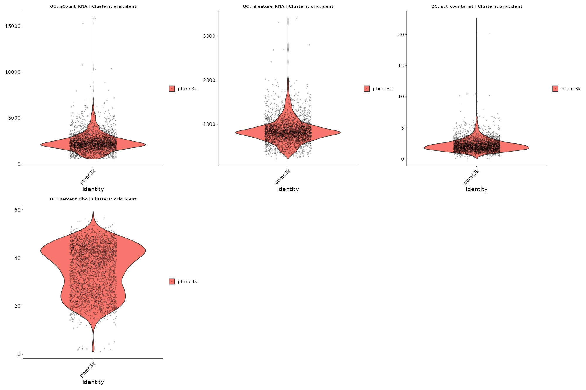
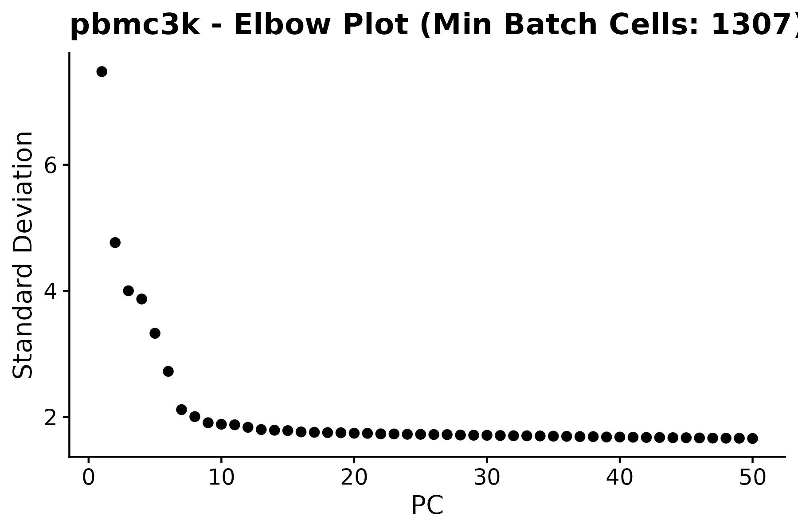
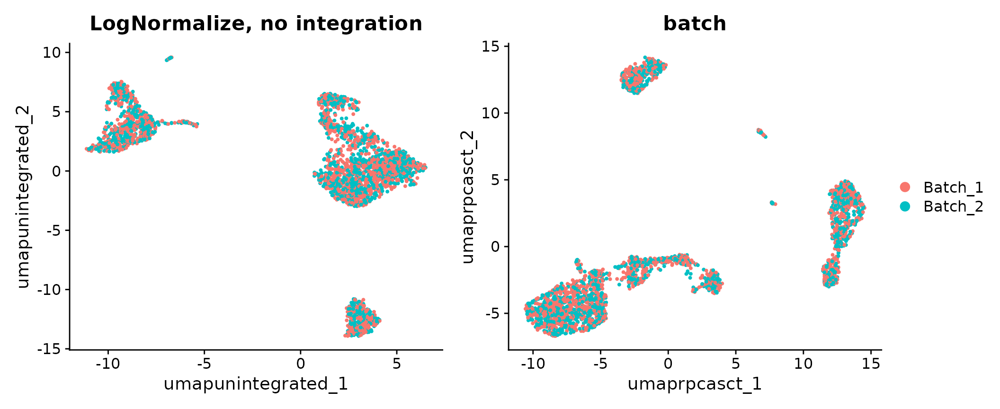
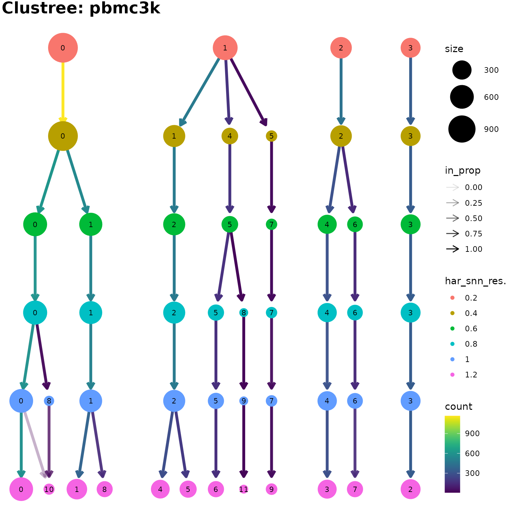
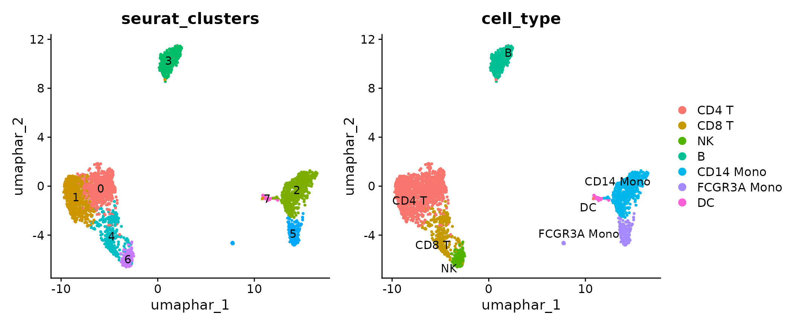

# Data Processing, Integration, and Clustering

## Overview

This article takes the public **10x Genomics 3k PBMC** dataset from a
raw count matrix to an integrated, clustered and annotated Seurat v5
object using the OHMmy processing wrappers:

| Step | OHMmy function | What it automates |
|----|----|----|
| QC inspection | [`plot_violin_qc_single()`](https://chomchonu.github.io/OHMmy/reference/plot_violin_qc_single.md) | Jittered violin plots of QC metrics, saved to disk |
| Normalisation + integration | [`ProcessSeuratLOG()`](https://chomchonu.github.io/OHMmy/reference/ProcessSeuratLOG.md) / [`ProcessSeuratSCT()`](https://chomchonu.github.io/OHMmy/reference/ProcessSeuratSCT.md) | Layer splitting, HVG selection, TCR/BCR exclusion, regression, PCA, [`IntegrateLayers()`](https://satijalab.org/seurat/reference/IntegrateLayers.html) with batch-size-aware `k` parameters, elbow plot |
| Clustering + UMAP | [`ClusterAndUMAP()`](https://chomchonu.github.io/OHMmy/reference/ClusterAndUMAP.md) | Neighbour graph, resolution sweep, `clustree` stability plot, final clustering and UMAP |
| Housekeeping | [`CleanSeuratReductions()`](https://chomchonu.github.io/OHMmy/reference/CleanSeuratReductions.md) | Renames reductions such as `pca.log` to Seurat-safe camelCase keys |

The object produced here is the one used by all other OHMmy articles.

## 1. Load the data and compute QC metrics

``` r

library(Seurat)
library(OHMmy)
library(patchwork)

# Shared helpers: data download/caching, the simulated cohort and figure display
source("ohmmy-vignette-helpers.R")

# SCTransform + anchor-based integration ship large objects to future workers
options(future.globals.maxSize = 4 * 1024^3)

out_dir <- file.path(tempdir(), "OHMmy-processing-clustering")
dir.create(out_dir, recursive = TRUE, showWarnings = FALSE)
```

`pbmc3k_counts()` reads the filtered feature-barcode matrix, downloading
it once from 10x Genomics if it is not already available locally.

``` r

pbmc <- CreateSeuratObject(pbmc3k_counts(), project = "pbmc3k", min.cells = 3, min.features = 200)

pbmc[["pct_counts_mt"]] <- PercentageFeatureSet(pbmc, pattern = "^MT-")
pbmc[["percent.ribo"]]  <- PercentageFeatureSet(pbmc, pattern = "^RP[SL]")
pbmc
#> An object of class Seurat 
#> 13714 features across 2700 samples within 1 assay 
#> Active assay: RNA (13714 features, 0 variable features)
#>  1 layer present: counts
```

### Inspect QC distributions

[`plot_violin_qc_single()`](https://chomchonu.github.io/OHMmy/reference/plot_violin_qc_single.md)
overlays faded single-cell points on Seurat violins so that outliers
stay visible. Any metadata column can be used for grouping; before
clustering we simply group by `orig.ident`.

``` r

plot_violin_qc_single(
  seurat_obj       = pbmc,
  sample_name      = "pbmc3k_preQC",
  qc_meta_features = c("nCount_RNA", "nFeature_RNA", "pct_counts_mt", "percent.ribo"),
  res_col          = "orig.ident",
  output_dir       = out_dir,
  dpi              = 100
)
```



Based on these distributions we apply the standard pbmc3k thresholds.

``` r

pbmc <- subset(pbmc, subset = nFeature_RNA > 200 & nFeature_RNA < 2500 & pct_counts_mt < 5)
ncol(pbmc)
#> [1] 2638
```

### A simulated cohort

pbmc3k comes from one donor. So that the batch-integration, abundance
and pseudo-bulk functions have something to work with,
`add_mock_cohort()` spreads the cells across **12 simulated donors**
(Healthy / Mild / Severe, 4 each) that were sequenced in **two
batches**. Monocyte-like cells are deliberately over-assigned to Mild
and Severe donors, which gives the statistics articles a known effect to
recover. *All cohort columns are synthetic.*

``` r

pbmc <- add_mock_cohort(pbmc)

table(pbmc$severity, pbmc$batch)
#>          
#>           Batch_1 Batch_2
#>   Healthy     423     379
#>   Mild        425     385
#>   Severe      483     543
head(pbmc@meta.data[, c("donor_id", "severity", "batch", "age", "sex", "infection_status")])
#>                  donor_id severity   batch age sex infection_status
#> AAACATACAACCAC-1      D03  Healthy Batch_1  28   M          Healthy
#> AAACATTGAGCTAC-1      D02  Healthy Batch_2  51   M          Healthy
#> AAACATTGATCAGC-1      D10   Severe Batch_2  41   F         Infected
#> AAACCGTGCTTCCG-1      D02  Healthy Batch_2  51   M          Healthy
#> AAACCGTGTATGCG-1      D01  Healthy Batch_1  34   F          Healthy
#> AAACGCACTGGTAC-1      D08     Mild Batch_2  30   M         Infected
```

## 2. Normalisation and batch integration

[`ProcessSeuratLOG()`](https://chomchonu.github.io/OHMmy/reference/ProcessSeuratLOG.md)
runs the complete Seurat v5 LogNormalize workflow. It:

1.  splits the RNA assay into one layer per batch (`batch_col`);
2.  log-normalises the data and selects 2,000 variable features;
3.  removes TCR/BCR V(D)J genes (`tcr_bcr_patterns`) from the variable
    features, so clustering reflects cell phenotype rather than
    clonotype;
4.  scales the data while regressing `vars_to_regress`;
5.  optionally boosts the variance of lineage markers (`boost_genes`,
    `boost_multiplier`), which helps separate look-alike populations
    such as CD8 T and NK cells;
6.  runs PCA, saves an elbow plot and suggests a number of PCs;
7.  integrates the layers with Harmony, RPCA, CCA or FastMNN, shrinking
    `k.weight`, `k.anchor`, `k.filter` and `k.score` automatically when
    a batch is small;
8.  re-joins the layers.

``` r

pbmc <- ProcessSeuratLOG(
  pbmc,
  batch_col             = "batch",
  vars_to_regress       = "pct_counts_mt",
  tcr_bcr_patterns      = "^TR[ABDG]V|^IG[HKL]V",
  reduction_name        = "pca.log",
  integration_method    = "HarmonyIntegration",
  integration_reduction = "harmony.log",
  dims                  = 1:30,
  elbow_plot_dir        = out_dir,
  sample_name           = "pbmc3k",
  verbose               = FALSE
)
```



``` r

pbmc
#> An object of class Seurat 
#> 13714 features across 2638 samples within 1 assay 
#> Active assay: RNA (13714 features, 2000 variable features)
#>  3 layers present: data, counts, scale.data
#>  2 dimensional reductions calculated: pca.log, harmony.log
Reductions(pbmc)
#> [1] "pca.log"     "harmony.log"
```

> **Interactive use.** With `interactive_mode = TRUE` in an interactive
> R session, the function pauses after the PCA step so you can choose
> the number of PCs and the integration `k` parameters from the elbow
> plot.

### Cell-cycle scores

Cell-cycle scores are useful covariates for the PC diagnostics in the
*Diagnostic and Variable Evaluation* article.

``` r

pbmc <- CellCycleScoring(
  pbmc,
  s.features   = cc.genes.updated.2019$s.genes,
  g2m.features = cc.genes.updated.2019$g2m.genes
)
table(pbmc$Phase)
#> 
#>   G1  G2M    S 
#> 1168  424 1046
```

### Alternative: SCTransform workflow

[`ProcessSeuratSCT()`](https://chomchonu.github.io/OHMmy/reference/ProcessSeuratSCT.md)
has the same interface but normalises with `SCTransform`. Here it is
combined with reciprocal-PCA integration to show a second integration
back-end. It runs on a copy, so the LogNormalize object is unchanged.

``` r

pbmc_sct <- ProcessSeuratSCT(
  pbmc,
  batch_col             = "batch",
  vars_to_regress       = "pct_counts_mt",
  reduction_name        = "pca.sct",
  integration_method    = "RPCAIntegration",
  integration_reduction = "rpca.sct",
  dims                  = 1:30,
  verbose               = FALSE
)
pbmc_sct <- RunUMAP(pbmc_sct, reduction = "rpca.sct", dims = 1:20,
                    reduction.name = "umap.rpca.sct", verbose = FALSE)
```

``` r

pbmc_tmp <- RunUMAP(pbmc, reduction = "pca.log", dims = 1:20,
                    reduction.name = "umap.unintegrated", verbose = FALSE)

DimPlot(pbmc_tmp, reduction = "umap.unintegrated", group.by = "batch") +
  ggplot2::ggtitle("LogNormalize, no integration") +
  DimPlot(pbmc_sct, reduction = "umap.rpca.sct", group.by = "batch") +
  ggplot2::ggtitle("SCTransform + RPCA") +
  plot_layout(guides = "collect")
```



Because the batches in this example are simulated, both embeddings mix
the batches. In real data the integrated embedding should mix batches
while keeping cell types separate.

## 3. Clustering across resolutions

[`ClusterAndUMAP()`](https://chomchonu.github.io/OHMmy/reference/ClusterAndUMAP.md)
builds the shared-nearest-neighbour graph, clusters across a range of
resolutions, draws a `clustree` plot to show how clusters split as the
resolution increases, then runs the final clustering and UMAP. Graphs
and resolutions that already exist are reused unless `force_neighbors`
or `force_clustering` is `TRUE`.

``` r

clus <- ClusterAndUMAP(
  seurat_obj          = pbmc,
  sample_name         = "pbmc3k",
  reduction           = "harmony.log",
  dims                = 1:20,
  k.param             = 20,
  umap_name           = "umap.har",
  graph_name          = "har_snn",
  cluster_prefix      = "har_snn_res.",
  cluster_resolutions = seq(0.2, 1.2, by = 0.2),
  final_resolution    = 0.6,
  plot_dir            = out_dir,
  dpi                 = 100
)
pbmc <- clus$seurat
```

The function returns the updated object, the `clustree` ggplot and the
path of the saved figure:

``` r

names(clus)
#> [1] "seurat"    "clustree"  "plot_file"
clus$clustree
```



Between resolutions 0.6 and 1.0 almost every cluster has a single
parent, so the partition is stable. Further splits appear only at 1.2.
We use 0.6, where the major PBMC lineages are already resolved, as the
working resolution.

``` r

pbmc$seurat_clusters <- pbmc$har_snn_res.0.6
table(pbmc$seurat_clusters)
#> 
#>   0   1   2   3   4   5   6   7 
#> 614 554 478 341 298 178 141  34
```

## 4. Annotation

For a self-contained tutorial, clusters are labelled from canonical PBMC
markers: each cluster receives the cell type whose module score
([`Seurat::AddModuleScore()`](https://satijalab.org/seurat/reference/AddModuleScore.html))
is highest. The helper `annotate_pbmc()` is defined in
`ohmmy-vignette-helpers.R`. In your own data, replace this step with
your preferred annotation strategy, such as reference mapping or manual
curation.

``` r

str(pbmc_marker_sets)
#> List of 8
#>  $ CD4 T      : chr [1:5] "IL7R" "CCR7" "LDHB" "CD3E" ...
#>  $ CD8 T      : chr [1:4] "CD8A" "CD8B" "CD3D" "GZMK"
#>  $ NK         : chr [1:6] "GNLY" "NKG7" "GZMB" "PRF1" ...
#>  $ B          : chr [1:4] "MS4A1" "CD79A" "CD79B" "CD19"
#>  $ CD14 Mono  : chr [1:4] "CD14" "LYZ" "S100A8" "S100A9"
#>  $ FCGR3A Mono: chr [1:4] "FCGR3A" "MS4A7" "LST1" "IFITM2"
#>  $ DC         : chr [1:3] "FCER1A" "CST3" "CLEC10A"
#>  $ Platelet   : chr [1:3] "PPBP" "PF4" "GNG11"
pbmc <- annotate_pbmc(pbmc, cluster_col = "seurat_clusters")
table(pbmc$seurat_clusters, pbmc$cell_type)
#>    
#>     CD4 T CD8 T  NK   B CD14 Mono FCGR3A Mono  DC
#>   0   614     0   0   0         0           0   0
#>   1   554     0   0   0         0           0   0
#>   2     0     0   0   0       478           0   0
#>   3     0     0   0 341         0           0   0
#>   4     0   298   0   0         0           0   0
#>   5     0     0   0   0         0         178   0
#>   6     0     0 141   0         0           0   0
#>   7     0     0   0   0         0           0  34
```

``` r

DimPlot(pbmc, reduction = "umap.har", group.by = "seurat_clusters", label = TRUE) + NoLegend() +
  DimPlot(pbmc, reduction = "umap.har", group.by = "cell_type", label = TRUE, repel = TRUE) + NoLegend()
```



## 5. Standardising reduction names

Reductions named with dots or underscores (such as `pca.log`) are valid
in Seurat v5, but some tools expect keys that match the reduction name
exactly.
[`CleanSeuratReductions()`](https://chomchonu.github.io/OHMmy/reference/CleanSeuratReductions.md)
rebuilds every reduction under a camelCase name with a matching key. It
is shown on a copy, because the remaining articles use the original
names.

``` r

pbmc_clean <- CleanSeuratReductions(pbmc)
data.frame(
  before = Reductions(pbmc),
  after  = Reductions(pbmc_clean)[match(c("pcaLog", "harmonyLog", "umapHar"), Reductions(pbmc_clean))]
)
#>        before      after
#> 1     pca.log     pcaLog
#> 2 harmony.log harmonyLog
#> 3    umap.har    umapHar
Key(pbmc_clean[["umapHar"]])
#> [1] "umapHar_"
```

## 6. Saving the object

Every other OHMmy article reuses this object. `load_pbmc3k_ohmmy()` (in
`ohmmy-vignette-helpers.R`) runs exactly the steps above and caches the
result, so later articles start immediately. To save your own object,
use [`saveRDS()`](https://rdrr.io/r/base/readRDS.html) or the
`save_path` argument of
[`ClusterAndUMAP()`](https://chomchonu.github.io/OHMmy/reference/ClusterAndUMAP.md).

``` r

saveRDS(pbmc, "pbmc3k_processed.rds")
```

## Session information

``` r

sessionInfo()
#> R version 4.6.1 (2026-06-24)
#> Platform: x86_64-pc-linux-gnu
#> Running under: Ubuntu 22.04.5 LTS
#> 
#> Matrix products: default
#> BLAS:   /usr/lib/x86_64-linux-gnu/openblas-pthread/libblas.so.3 
#> LAPACK: /usr/lib/x86_64-linux-gnu/openblas-pthread/libopenblasp-r0.3.20.so;  LAPACK version 3.10.0
#> 
#> locale:
#>  [1] LC_CTYPE=C.UTF-8       LC_NUMERIC=C           LC_TIME=C.UTF-8       
#>  [4] LC_COLLATE=C.UTF-8     LC_MONETARY=C.UTF-8    LC_MESSAGES=C.UTF-8   
#>  [7] LC_PAPER=C.UTF-8       LC_NAME=C              LC_ADDRESS=C          
#> [10] LC_TELEPHONE=C         LC_MEASUREMENT=C.UTF-8 LC_IDENTIFICATION=C   
#> 
#> time zone: UTC
#> tzcode source: system (glibc)
#> 
#> attached base packages:
#> [1] stats     graphics  grDevices utils     datasets  methods   base     
#> 
#> other attached packages:
#> [1] ggraph_2.2.2       future_1.76.0      patchwork_1.3.2    OHMmy_1.0.2       
#> [5] Seurat_5.6.0       SeuratObject_5.4.0 sp_2.2-3          
#> 
#> loaded via a namespace (and not attached):
#>   [1] RColorBrewer_1.1-3     jsonlite_2.0.0         magrittr_2.0.5        
#>   [4] ggbeeswarm_0.7.3       spatstat.utils_3.2-5   farver_2.1.2          
#>   [7] rmarkdown_2.32         fs_2.1.0               ragg_1.5.2            
#>  [10] vctrs_0.7.3            ROCR_1.0-12            memoise_2.0.1         
#>  [13] spatstat.explore_3.8-3 rstatix_1.1.0          htmltools_0.5.9       
#>  [16] broom_1.0.13           Formula_1.2-6          sass_0.4.10           
#>  [19] sctransform_0.4.3      parallelly_1.48.0      KernSmooth_2.23-26    
#>  [22] bslib_0.12.0           htmlwidgets_1.6.4      desc_1.4.3            
#>  [25] ica_1.0-3              plyr_1.8.9             plotly_4.12.1         
#>  [28] zoo_1.9-1              cachem_1.1.0           igraph_2.3.4          
#>  [31] mime_0.13              lifecycle_1.0.5        pkgconfig_2.0.3       
#>  [34] Matrix_1.7-5           R6_2.6.1               fastmap_1.2.0         
#>  [37] fitdistrplus_1.2-6     shiny_1.14.0           digest_0.6.39         
#>  [40] tensor_1.5.1           RSpectra_0.16-2        irlba_2.4.1           
#>  [43] textshaping_1.0.5      ggpubr_1.0.0           labeling_0.4.3        
#>  [46] progressr_1.0.0        spatstat.sparse_3.2-0  httr_1.4.9            
#>  [49] polyclip_1.10-7        abind_1.4-8            compiler_4.6.1        
#>  [52] withr_3.0.3            S7_0.2.2               backports_1.5.1       
#>  [55] viridis_0.6.5          carData_3.0-6          fastDummies_1.7.6     
#>  [58] R.utils_2.13.0         ggforce_0.5.0          ggsignif_0.6.4        
#>  [61] MASS_7.3-65            tools_4.6.1            vipor_0.4.7           
#>  [64] lmtest_0.9-40          otel_0.2.0             beeswarm_0.4.0        
#>  [67] httpuv_1.6.17          future.apply_1.20.2    goftest_1.2-3         
#>  [70] R.oo_1.27.1            glue_1.8.1             nlme_3.1-169          
#>  [73] promises_1.5.0         grid_4.6.1             checkmate_2.3.4       
#>  [76] Rtsne_0.17             cluster_2.1.8.2        reshape2_1.4.5        
#>  [79] generics_0.1.4         clustree_0.5.1         gtable_0.3.6          
#>  [82] spatstat.data_3.1-9    R.methodsS3_1.8.2      tidyr_1.3.2           
#>  [85] data.table_1.18.6.1    tidygraph_1.3.1        car_3.1-5             
#>  [88] spatstat.geom_3.8-3    RcppAnnoy_0.0.23       ggrepel_0.9.8         
#>  [91] RANN_2.6.3             pillar_1.11.1          stringr_1.6.0         
#>  [94] spam_2.11-4            RcppHNSW_0.7.0         later_1.4.8           
#>  [97] splines_4.6.1          tweenr_2.0.3           dplyr_1.2.1           
#> [100] lattice_0.22-9         survival_3.8-6         deldir_2.0-4          
#> [103] tidyselect_1.2.1       miniUI_0.1.2           pbapply_1.7-5         
#> [106] knitr_1.52             gridExtra_2.3.1        SoupX_1.6.2           
#> [109] scattermore_1.2        RhpcBLASctl_0.23-42    xfun_0.61             
#> [112] graphlayouts_1.2.5     matrixStats_1.5.0      leidenbase_0.1.37     
#> [115] stringi_1.8.9          yaml_2.3.12            evaluate_1.0.5        
#> [118] codetools_0.2-20       tibble_3.3.1           cli_3.6.6             
#> [121] uwot_0.2.5             xtable_1.8-8           reticulate_1.47.0     
#> [124] systemfonts_1.3.2      jquerylib_0.1.4        harmony_2.0.5         
#> [127] Rcpp_1.1.2             globals_0.19.1         spatstat.random_3.5-2 
#> [130] png_0.1-9              ggrastr_1.0.2          spatstat.univar_3.2-0 
#> [133] parallel_4.6.1         pkgdown_2.2.1          ggplot2_4.0.3         
#> [136] dotCall64_1.2          jpeg_0.1-11            listenv_1.1.0         
#> [139] viridisLite_0.4.3      scales_1.4.0           ggridges_0.5.7        
#> [142] purrr_1.2.2            rlang_1.3.0            cowplot_1.2.0
```
