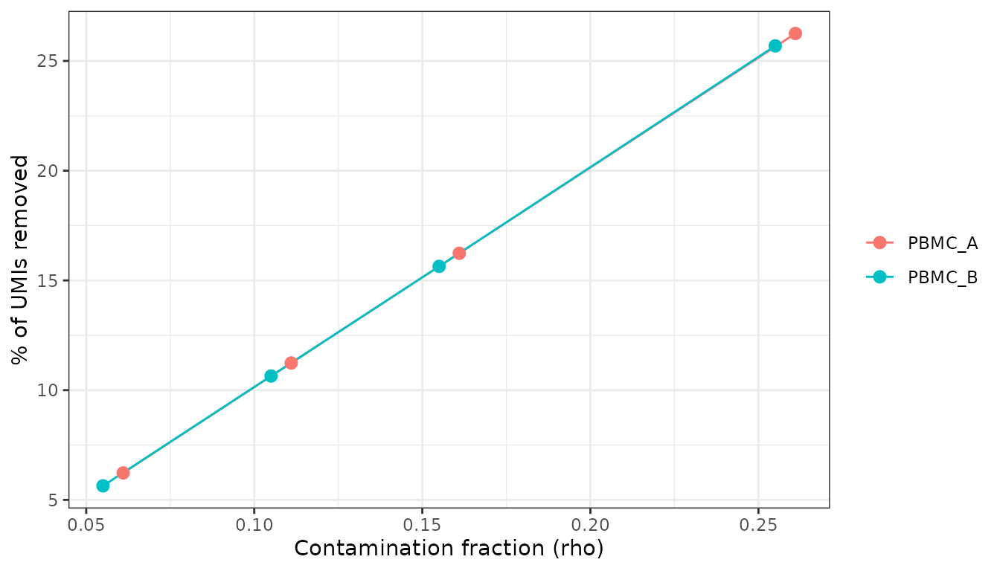
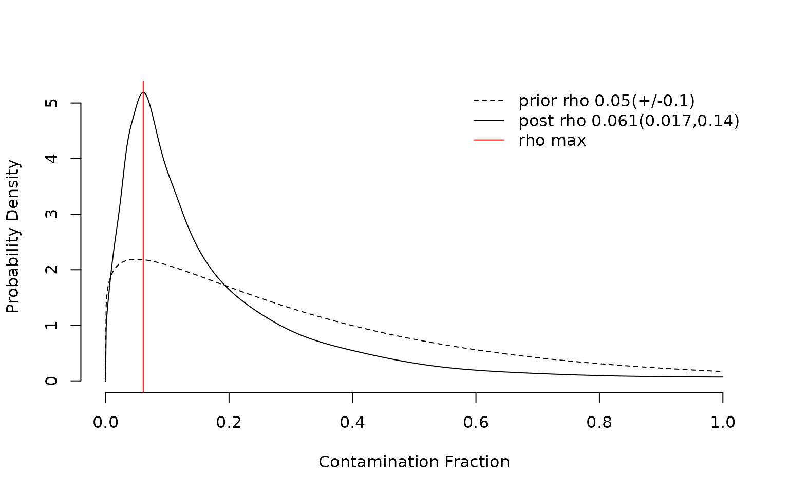
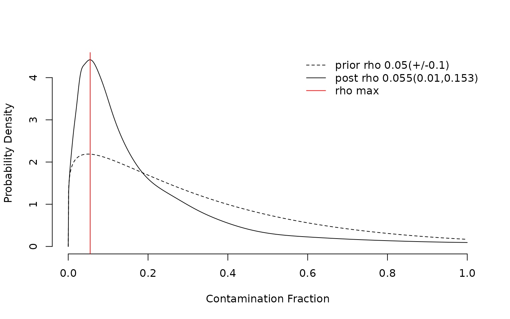
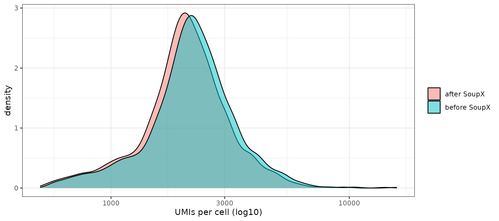

# Ambient RNA Decontamination with SoupX

## Overview

In droplet-based scRNA-seq, transcripts released by lysed cells form a
“soup” that is captured in every droplet. This ambient RNA makes highly
expressed genes, such as monocyte *LYZ* and *S100A8/9* or haemoglobin,
appear in unrelated cell types.
[SoupX](https://github.com/constantAmateur/SoupX) estimates the soup
profile from empty droplets, estimates the contamination fraction
(*rho*) per sample, and subtracts the soup from each cell.

OHMmy wraps SoupX into a multi-sample pipeline that reads Cell Ranger
output directories directly:

| Level | Functions |
|----|----|
| Building blocks | [`get_sample_names()`](https://chomchonu.github.io/OHMmy/reference/get_sample_names.md), [`load_counts()`](https://chomchonu.github.io/OHMmy/reference/load_counts.md), [`create_soup_channels()`](https://chomchonu.github.io/OHMmy/reference/create_soup_channels.md), [`create_seurat_for_clustering()`](https://chomchonu.github.io/OHMmy/reference/create_seurat_for_clustering.md), [`estimate_contamination()`](https://chomchonu.github.io/OHMmy/reference/estimate_contamination.md), [`create_final_seurat()`](https://chomchonu.github.io/OHMmy/reference/create_final_seurat.md) |
| Two-stage pipeline | [`prepare_soupx_inputs()`](https://chomchonu.github.io/OHMmy/reference/prepare_soupx_inputs.md) (run once) + [`run_soupx_post_clustering()`](https://chomchonu.github.io/OHMmy/reference/run_soupx_post_clustering.md) (run per parameter setting) |
| One-step wrapper | [`process_soupx_samples()`](https://chomchonu.github.io/OHMmy/reference/process_soupx_samples.md) |
| Hand-off to Seurat | [`addSoupXMetaToSeurat()`](https://chomchonu.github.io/OHMmy/reference/addSoupXMetaToSeurat.md) |

``` r

library(Seurat)
library(OHMmy)
library(ggplot2)
source("ohmmy-vignette-helpers.R")
```

## 1. Input data

OHMmy expects the standard Cell Ranger layout, with one folder per
sample in each of two parent directories:

    filtered/<sample>_filtered_feature_bc_matrix/{matrix.mtx.gz, features.tsv.gz, barcodes.tsv.gz}
    raw/<sample>_raw_feature_bc_matrix/{matrix.mtx.gz, features.tsv.gz, barcodes.tsv.gz}

pbmc3k is only distributed as a filtered matrix. To get a fully
reproducible example, `make_mock_cellranger()` (in
`ohmmy-vignette-helpers.R`) splits the pbmc3k cells into two samples,
`PBMC_A` and `PBMC_B`. For each sample it writes a *raw* matrix that
also contains 6,000 **simulated empty droplets**, whose UMIs are drawn
from the pooled expression profile of that sample, which mimics how
ambient RNA behaves.

``` r

cr <- make_mock_cellranger(file.path(tempdir(), "cellranger"))
list.files(dirname(cr$filtered_dir), recursive = TRUE)
#>  [1] "filtered/PBMC_A_filtered_feature_bc_matrix/barcodes.tsv.gz"
#>  [2] "filtered/PBMC_A_filtered_feature_bc_matrix/features.tsv.gz"
#>  [3] "filtered/PBMC_A_filtered_feature_bc_matrix/matrix.mtx.gz"  
#>  [4] "filtered/PBMC_B_filtered_feature_bc_matrix/barcodes.tsv.gz"
#>  [5] "filtered/PBMC_B_filtered_feature_bc_matrix/features.tsv.gz"
#>  [6] "filtered/PBMC_B_filtered_feature_bc_matrix/matrix.mtx.gz"  
#>  [7] "raw/PBMC_A_raw_feature_bc_matrix/barcodes.tsv.gz"          
#>  [8] "raw/PBMC_A_raw_feature_bc_matrix/features.tsv.gz"          
#>  [9] "raw/PBMC_A_raw_feature_bc_matrix/matrix.mtx.gz"            
#> [10] "raw/PBMC_B_raw_feature_bc_matrix/barcodes.tsv.gz"          
#> [11] "raw/PBMC_B_raw_feature_bc_matrix/features.tsv.gz"          
#> [12] "raw/PBMC_B_raw_feature_bc_matrix/matrix.mtx.gz"
```

## 2. Step-by-step with the building blocks

### Discover samples and load matrices

[`get_sample_names()`](https://chomchonu.github.io/OHMmy/reference/get_sample_names.md)
derives sample IDs from the folder names.
[`load_counts()`](https://chomchonu.github.io/OHMmy/reference/load_counts.md)
reads the filtered and raw matrices of every sample.

``` r

samples <- get_sample_names(cr$filtered_dir)
counts  <- load_counts(samples, filtered_dir = cr$filtered_dir, raw_dir = cr$raw_dir)
```

``` r

samples
#> [1] "PBMC_A" "PBMC_B"
sapply(counts$filtered, ncol)   # cells
#> PBMC_A PBMC_B 
#>   1326   1374
sapply(counts$raw, ncol)        # all droplets
#> PBMC_A PBMC_B 
#>   7326   7374
```

### Build SoupChannels and a quick clustering

[`create_soup_channels()`](https://chomchonu.github.io/OHMmy/reference/create_soup_channels.md)
pairs each raw matrix (`tod`, all droplets) with its filtered matrix
(`toc`, cells). SoupX estimates contamination more reliably with
**over-clustered** cells, so
[`create_seurat_for_clustering()`](https://chomchonu.github.io/OHMmy/reference/create_seurat_for_clustering.md)
runs a fast standard Seurat pipeline per sample at resolution 1.8.

``` r

soup_list   <- create_soup_channels(counts$raw, counts$filtered, samples)
seurat_list <- create_seurat_for_clustering(counts$filtered, samples)
```

``` r

soup_list$PBMC_A
sapply(seurat_list, function(x) nlevels(x$seurat_clusters))
#> PBMC_A PBMC_B 
#>      7      9
```

### Estimate and remove contamination

[`estimate_contamination()`](https://chomchonu.github.io/OHMmy/reference/estimate_contamination.md)
sets the clusters on each channel, runs
[`SoupX::autoEstCont()`](https://rdrr.io/pkg/SoupX/man/autoEstCont.html)
and adjusts the counts. The contamination fraction can be raised on
purpose with `mulFac`, given as **percentage points** added to the
estimated *rho*:

- `manual = FALSE` (default): `mulFac` is added for **every** sample;
- `manual = TRUE`: `mulFac` is added **only** for the samples listed in
  `manual_contam`.

``` r

est_auto <- estimate_contamination(
  soup_list, seurat_list, counts$filtered, samples,
  mulFac = 0, methods = "subtraction"
)

# PBMC_B looks noisier: add 5 percentage points to its rho only
est_manual <- estimate_contamination(
  soup_list, seurat_list, counts$filtered, samples,
  mulFac = 5, manual = TRUE, manual_contam = "PBMC_B"
)
```

``` r

get_rho <- function(soup_objs) sapply(soup_objs, function(sc) unique(sc$metaData$rho))
rbind(auto = get_rho(est_auto$soup_list_all), selective = get_rho(est_manual$soup_list_all))
#>           PBMC_A PBMC_B
#> auto       0.061  0.055
#> selective  0.061  0.105
```

`autoEstCont()` estimates about 6 % contamination. The selective
override raises only `PBMC_B`. The estimated soup profile shows which
genes dominate the ambient pool:

``` r

sp <- est_auto$soup_list_all$PBMC_A$soupProfile
head(sp[order(-sp$est), ], 10)
#>                est counts
#> MALAT1 0.025139447   3547
#> B2M    0.019419815   2740
#> TMSB4X 0.018952039   2674
#> RPL10  0.014061647   1984
#> RPL13  0.011935390   1684
#> RPL13A 0.011786552   1663
#> FTL    0.011772377   1661
#> RPS2   0.010149334   1432
#> RPS6   0.009773695   1379
#> RPS18  0.008894842   1255
```

[`create_final_seurat()`](https://chomchonu.github.io/OHMmy/reference/create_final_seurat.md)
turns the corrected channels into new Seurat objects (with
`min.cells = 3`, `min.features = 200`, and a `mitoPercent` column):

``` r

clean_list <- create_final_seurat(est_auto$soup_list_all, samples)
```

``` r

clean_list
#> $PBMC_A
#> An object of class Seurat 
#> 12326 features across 1326 samples within 1 assay 
#> Active assay: RNA (12326 features, 0 variable features)
#>  1 layer present: counts
#> 
#> $PBMC_B
#> An object of class Seurat 
#> 12317 features across 1373 samples within 1 assay 
#> Active assay: RNA (12317 features, 0 variable features)
#>  1 layer present: counts
```

## 3. The two-stage pipeline

Loading, channel creation and clustering do not depend on the
contamination settings.
[`prepare_soupx_inputs()`](https://chomchonu.github.io/OHMmy/reference/prepare_soupx_inputs.md)
therefore bundles them and runs them **once**.
[`run_soupx_post_clustering()`](https://chomchonu.github.io/OHMmy/reference/run_soupx_post_clustering.md)
takes that bundle and only performs estimation, correction and Seurat
creation, so parameter sweeps are cheap.

``` r

prep <- prepare_soupx_inputs(cr$filtered_dir, cr$raw_dir)
```

``` r

names(prep)
#> [1] "sample_names"          "counts_lists"          "soup_list"            
#> [4] "seurat_for_clustering" "manual_contam"
```

Here we sweep `multiFac` and record how many UMIs remain:

``` r

sweep <- lapply(c(0, 5, 10, 20), function(mf) {
  res <- run_soupx_post_clustering(prep, multiFac = mf, methods = "subtraction")
  data.frame(
    multiFac = mf,
    sample   = names(res$final_seurat),
    rho      = get_rho(res$soup_objects),
    umis     = sapply(res$final_seurat, function(x) sum(x$nCount_RNA))
  )
})
sweep <- do.call(rbind, sweep)
```

``` r

raw_umis <- sapply(counts$filtered, sum)
sweep$pct_removed <- 100 * (1 - sweep$umis / raw_umis[sweep$sample])
sweep
#>         multiFac sample   rho    umis pct_removed
#> PBMC_A         0 PBMC_A 0.061 2998411    6.226660
#> PBMC_B         0 PBMC_B 0.055 3013068    5.638807
#> PBMC_A1        5 PBMC_A 0.111 2838180   11.237779
#> PBMC_B1        5 PBMC_B 0.105 2853238   10.644253
#> PBMC_A2       10 PBMC_A 0.161 2678340   16.236670
#> PBMC_B2       10 PBMC_B 0.155 2693719   15.639960
#> PBMC_A3       20 PBMC_A 0.261 2358124   26.251216
#> PBMC_B3       20 PBMC_B 0.255 2372919   25.686554

ggplot(sweep, aes(rho, pct_removed, colour = sample)) +
  geom_line() + geom_point(size = 2.5) +
  labs(x = "Contamination fraction (rho)", y = "% of UMIs removed", colour = NULL) +
  theme_bw()
```



### Per-sample overrides

Giving `manual_contam` restricts the `multiFac` penalty to those
samples. All other samples keep their auto-estimated *rho*:

``` r

override <- run_soupx_post_clustering(prep, multiFac = 10, manual_contam = "PBMC_B")
```

``` r

get_rho(override$soup_objects)
#> PBMC_A PBMC_B 
#>  0.061  0.155
```

### One-step wrapper

When no parameter sweep is needed,
[`process_soupx_samples()`](https://chomchonu.github.io/OHMmy/reference/process_soupx_samples.md)
runs both stages in a single call and returns the same structure as
[`run_soupx_post_clustering()`](https://chomchonu.github.io/OHMmy/reference/run_soupx_post_clustering.md):

``` r

one_step <- process_soupx_samples(cr$filtered_dir, cr$raw_dir, multiFac = 0)
```

``` r

names(one_step)
#> [1] "final_seurat"      "soup_objects"      "seurat_clustering"
get_rho(one_step$soup_objects)
#> PBMC_A PBMC_B 
#>  0.061  0.055
```

## 4. Transferring the cleaned counts to an existing object

Often an analysed Seurat object already exists, built from the
uncorrected counts.
[`addSoupXMetaToSeurat()`](https://chomchonu.github.io/OHMmy/reference/addSoupXMetaToSeurat.md)
merges the per-sample SoupX objects, prefixes the barcodes with the
sample name and removes the `-1` suffix. It then **replaces the `counts`
layer** of the original object and updates `nCount_RNA`, `nFeature_RNA`
and `pct_counts_mt`, keeping only cells and genes present in both
objects.

To show this, we build the “original” object with the same barcode
convention (`<sample>_<barcode>`):

``` r

original <- CreateSeuratObject(
  do.call(cbind, lapply(samples, function(s) {
    m <- counts$filtered[[s]]
    colnames(m) <- paste0(s, "_", sub("-1$", "", colnames(m)))
    m
  })),
  project = "pbmc3k_uncorrected"
)
original$sample <- sub("_.*$", "", colnames(original))
head(colnames(original), 3)
#> [1] "PBMC_A_AAACATTGAGCTAC" "PBMC_A_AAACATTGATCAGC" "PBMC_A_AAACCGTGTATGCG"
```

``` r

soupx_run <- run_soupx_post_clustering(prep, multiFac = 0)
```



``` r


corrected <- addSoupXMetaToSeurat(
  original_seurat   = original,
  soupx_seurat_list = soupx_run$final_seurat,
  mito_colname      = "mitoPercent",
  save_path         = NULL   # give a .rds path to save the result
)
```

``` r

corrected
#> An object of class Seurat 
#> 12997 features across 2699 samples within 1 assay 
#> Active assay: RNA (12997 features, 0 variable features)
#>  1 layer present: counts
```

### Did it work?

The clearest check is ambient monocyte transcripts in **non-monocytes**.
We compare, before and after correction, the fraction of lymphocytes
(cells with low *LYZ* + *CD14* expression in a marker-based gate) that
still contain monocyte-specific UMIs:

``` r

before <- LayerData(original,  layer = "counts")
after  <- LayerData(corrected, layer = "counts")
cells  <- colnames(after)
before <- before[rownames(after), cells]

# gate: cells whose LYZ share is in the lower 70 % are treated as non-monocytes
lyz_share  <- before["LYZ", ] / Matrix::colSums(before)
non_mono   <- cells[lyz_share < quantile(lyz_share, 0.70)]

ambient_genes <- c("LYZ", "S100A8", "S100A9", "FTL")
detect <- function(m) 100 * Matrix::rowMeans(m[ambient_genes, non_mono] > 0)
data.frame(gene = ambient_genes,
           pct_nonmono_before = round(detect(before), 1),
           pct_nonmono_after  = round(detect(after), 1))
#>          gene pct_nonmono_before pct_nonmono_after
#> LYZ       LYZ               43.4               4.6
#> S100A8 S100A8                9.4               0.6
#> S100A9 S100A9               16.4               1.1
#> FTL       FTL               98.3              90.7

plot_df <- data.frame(
  nCount = c(original$nCount_RNA[cells], corrected$nCount_RNA),
  state  = rep(c("before SoupX", "after SoupX"), each = length(cells))
)
ggplot(plot_df, aes(nCount, fill = state)) +
  geom_density(alpha = 0.5) + scale_x_log10() +
  labs(x = "UMIs per cell (log10)", fill = NULL) + theme_bw()
```



SoupX removes about 6 % of the UMIs, spread across all cells. Its effect
on the ambient transcripts is much larger: *LYZ*, *S100A8* and *S100A9*,
which were detected in a large share of non-monocytes before correction,
almost disappear from them afterwards. Ubiquitously expressed genes such
as *FTL* are barely affected, which is the intended behaviour.
`corrected` can now go into
[`ProcessSeuratLOG()`](https://chomchonu.github.io/OHMmy/reference/ProcessSeuratLOG.md)
or
[`ProcessSeuratSCT()`](https://chomchonu.github.io/OHMmy/reference/ProcessSeuratSCT.md).
See the article *Data Processing, Integration, and Clustering*.

## Session information

``` r

sessionInfo()
#> R version 4.6.1 (2026-06-24)
#> Platform: x86_64-pc-linux-gnu
#> Running under: Ubuntu 22.04.5 LTS
#> 
#> Matrix products: default
#> BLAS:   /usr/lib/x86_64-linux-gnu/openblas-pthread/libblas.so.3 
#> LAPACK: /usr/lib/x86_64-linux-gnu/openblas-pthread/libopenblasp-r0.3.20.so;  LAPACK version 3.10.0
#> 
#> locale:
#>  [1] LC_CTYPE=C.UTF-8       LC_NUMERIC=C           LC_TIME=C.UTF-8       
#>  [4] LC_COLLATE=C.UTF-8     LC_MONETARY=C.UTF-8    LC_MESSAGES=C.UTF-8   
#>  [7] LC_PAPER=C.UTF-8       LC_NAME=C              LC_ADDRESS=C          
#> [10] LC_TELEPHONE=C         LC_MEASUREMENT=C.UTF-8 LC_IDENTIFICATION=C   
#> 
#> time zone: UTC
#> tzcode source: system (glibc)
#> 
#> attached base packages:
#> [1] stats     graphics  grDevices utils     datasets  methods   base     
#> 
#> other attached packages:
#> [1] ggplot2_4.0.3      OHMmy_1.0.2        Seurat_5.6.0       SeuratObject_5.4.0
#> [5] sp_2.2-3          
#> 
#> loaded via a namespace (and not attached):
#>   [1] RColorBrewer_1.1-3     jsonlite_2.0.0         magrittr_2.0.5        
#>   [4] spatstat.utils_3.2-5   farver_2.1.2           rmarkdown_2.32        
#>   [7] fs_2.1.0               ragg_1.5.2             vctrs_0.7.3           
#>  [10] ROCR_1.0-12            memoise_2.0.1          spatstat.explore_3.8-3
#>  [13] rstatix_1.1.0          htmltools_0.5.9        broom_1.0.13          
#>  [16] Formula_1.2-6          sass_0.4.10            sctransform_0.4.3     
#>  [19] parallelly_1.48.0      KernSmooth_2.23-26     bslib_0.12.0          
#>  [22] htmlwidgets_1.6.4      desc_1.4.3             ica_1.0-3             
#>  [25] plyr_1.8.9             plotly_4.12.1          zoo_1.9-1             
#>  [28] cachem_1.1.0           igraph_2.3.4           mime_0.13             
#>  [31] lifecycle_1.0.5        pkgconfig_2.0.3        Matrix_1.7-5          
#>  [34] R6_2.6.1               fastmap_1.2.0          fitdistrplus_1.2-6    
#>  [37] future_1.76.0          shiny_1.14.0           digest_0.6.39         
#>  [40] patchwork_1.3.2        tensor_1.5.1           RSpectra_0.16-2       
#>  [43] irlba_2.4.1            textshaping_1.0.5      ggpubr_1.0.0          
#>  [46] labeling_0.4.3         progressr_1.0.0        spatstat.sparse_3.2-0 
#>  [49] httr_1.4.9             polyclip_1.10-7        abind_1.4-8           
#>  [52] compiler_4.6.1         withr_3.0.3            S7_0.2.2              
#>  [55] backports_1.5.1        viridis_0.6.5          carData_3.0-6         
#>  [58] fastDummies_1.7.6      R.utils_2.13.0         ggforce_0.5.0         
#>  [61] ggsignif_0.6.4         MASS_7.3-65            tools_4.6.1           
#>  [64] lmtest_0.9-40          otel_0.2.0             httpuv_1.6.17         
#>  [67] future.apply_1.20.2    goftest_1.2-3          R.oo_1.27.1           
#>  [70] glue_1.8.1             nlme_3.1-169           promises_1.5.0        
#>  [73] grid_4.6.1             Rtsne_0.17             cluster_2.1.8.2       
#>  [76] reshape2_1.4.5         generics_0.1.4         gtable_0.3.6          
#>  [79] spatstat.data_3.1-9    R.methodsS3_1.8.2      tidyr_1.3.2           
#>  [82] data.table_1.18.6.1    tidygraph_1.3.1        car_3.1-5             
#>  [85] spatstat.geom_3.8-3    RcppAnnoy_0.0.23       ggrepel_0.9.8         
#>  [88] RANN_2.6.3             pillar_1.11.1          stringr_1.6.0         
#>  [91] spam_2.11-4            RcppHNSW_0.7.0         later_1.4.8           
#>  [94] splines_4.6.1          tweenr_2.0.3           dplyr_1.2.1           
#>  [97] lattice_0.22-9         survival_3.8-6         deldir_2.0-4          
#> [100] tidyselect_1.2.1       miniUI_0.1.2           pbapply_1.7-5         
#> [103] knitr_1.52             gridExtra_2.3.1        SoupX_1.6.2           
#> [106] scattermore_1.2        xfun_0.61              graphlayouts_1.2.5    
#> [109] matrixStats_1.5.0      leidenbase_0.1.37      stringi_1.8.9         
#> [112] yaml_2.3.12            evaluate_1.0.5         codetools_0.2-20      
#> [115] ggraph_2.2.2           tibble_3.3.1           cli_3.6.6             
#> [118] uwot_0.2.5             xtable_1.8-8           reticulate_1.47.0     
#> [121] systemfonts_1.3.2      jquerylib_0.1.4        Rcpp_1.1.2            
#> [124] globals_0.19.1         spatstat.random_3.5-2  png_0.1-9             
#> [127] spatstat.univar_3.2-0  parallel_4.6.1         pkgdown_2.2.1         
#> [130] dotCall64_1.2          listenv_1.1.0          viridisLite_0.4.3     
#> [133] scales_1.4.0           ggridges_0.5.7         purrr_1.2.2           
#> [136] rlang_1.3.0            cowplot_1.2.0
```
