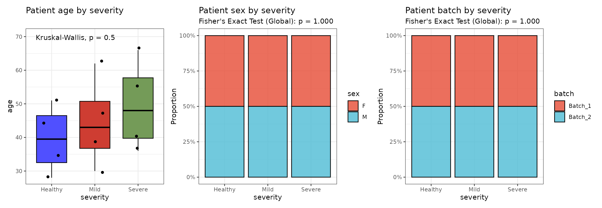
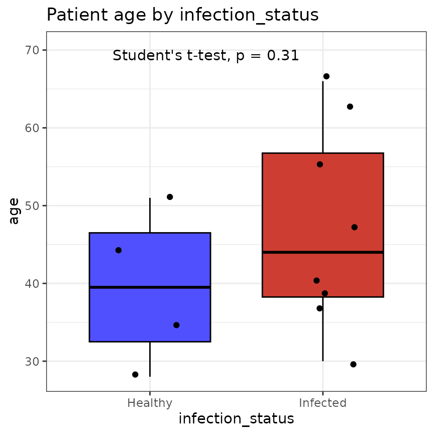
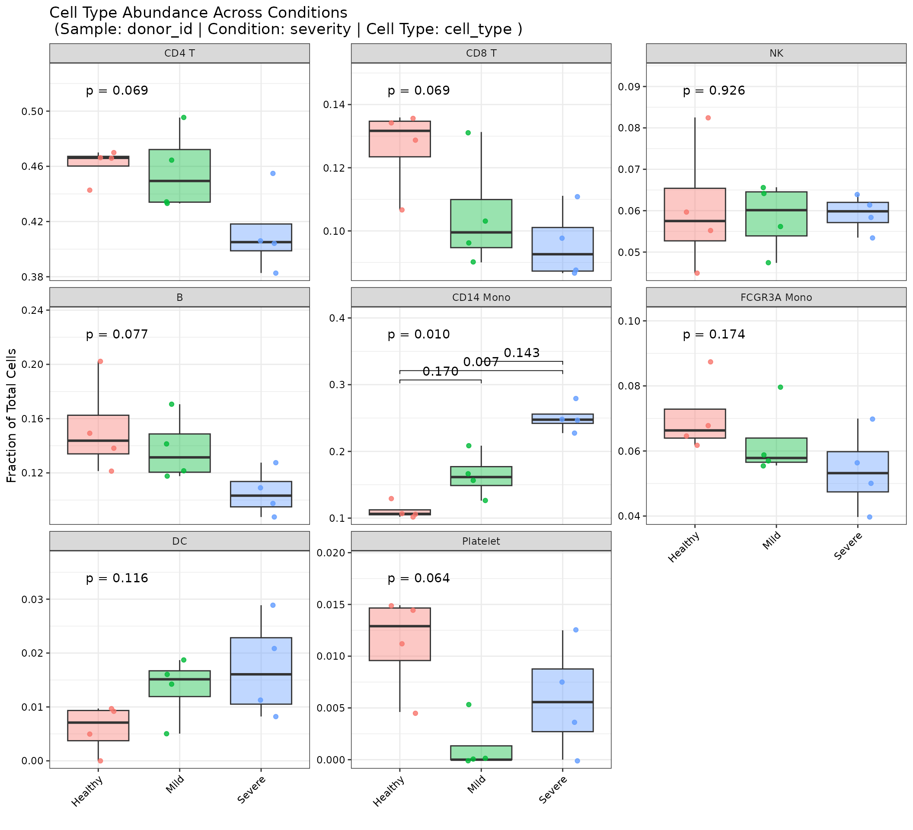
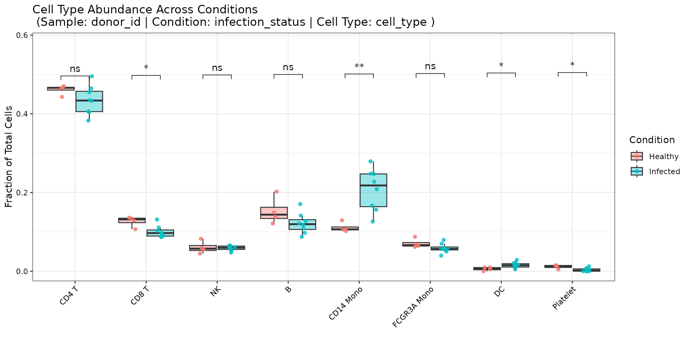
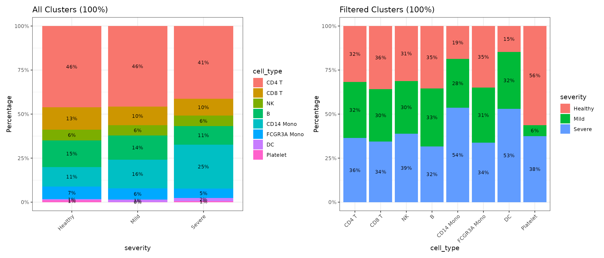
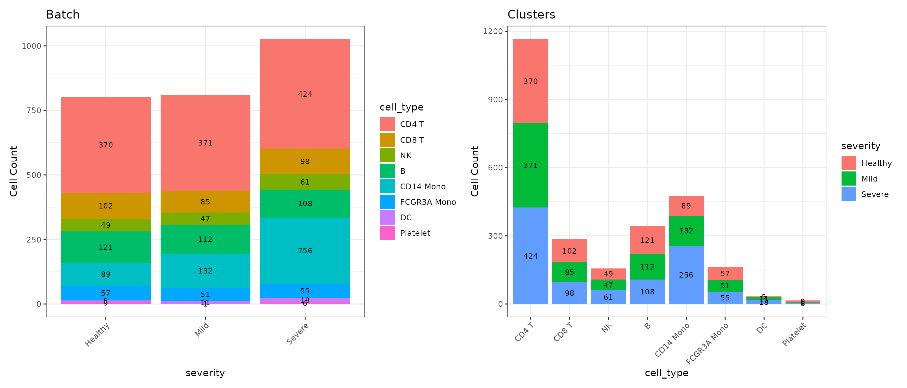
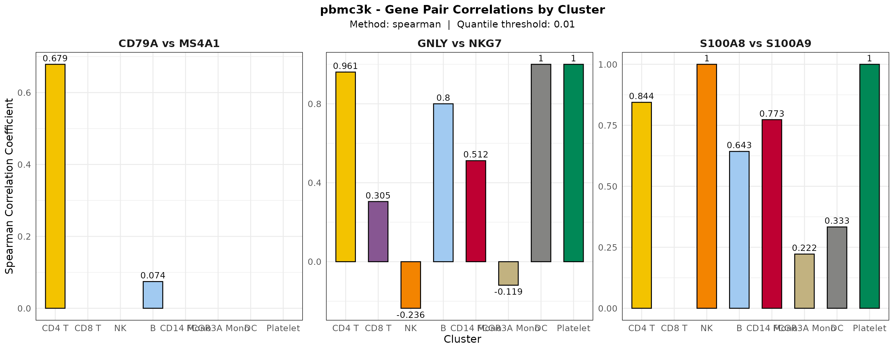

# Statistical Analysis: Abundance, Confounders, and Correlations

## Overview

Cohort-level questions, such as whether a population expands in disease,
must be tested with the **donor** as the unit of replication, not the
cell. Treating thousands of cells from a few donors as independent
observations (pseudoreplication) produces very small p-values with no
biological meaning. The OHMmy statistics functions aggregate to the
donor level before testing:

| Function | Purpose |
|----|----|
| [`plot_metadata_stats()`](https://chomchonu.github.io/OHMmy/reference/plot_metadata_stats.md) | Check that donor-level covariates (age, sex, batch, …) are balanced across conditions |
| [`plot_cell_abundance()`](https://chomchonu.github.io/OHMmy/reference/plot_cell_abundance.md) | Test per-donor cell-type proportions across conditions, with automatic test selection and brackets |
| [`plot_cluster_distributions()`](https://chomchonu.github.io/OHMmy/reference/plot_cluster_distributions.md) | Stacked bar charts of counts and proportions for any two metadata columns |
| [`plot_gene_pair_correlations()`](https://chomchonu.github.io/OHMmy/reference/plot_gene_pair_correlations.md) | Per-cluster correlation between gene pairs |

``` r

library(Seurat)
library(OHMmy)
library(patchwork)
source("ohmmy-vignette-helpers.R")

pbmc <- load_pbmc3k_ohmmy()   # built in "Data Processing, Integration, and Clustering"
out_dir <- file.path(tempdir(), "OHMmy-statistics")
dir.create(out_dir, recursive = TRUE, showWarnings = FALSE)
```

### The simulated cohort

The pbmc3k cells are spread across 12 simulated donors in three severity
groups. By construction, monocyte-like cells were over-assigned to Mild
and Severe donors (see `add_mock_cohort()` in
`ohmmy-vignette-helpers.R`), so a correct analysis should find **more
CD14 monocytes with increasing severity** and no other systematic
difference.

``` r

donors <- unique(pbmc@meta.data[, c("donor_id", "severity", "infection_status", "batch", "age", "sex")])
rownames(donors) <- NULL
donors[order(donors$donor_id), ]
#>    donor_id severity infection_status   batch age sex
#> 4       D01  Healthy          Healthy Batch_1  34   F
#> 2       D02  Healthy          Healthy Batch_2  51   M
#> 1       D03  Healthy          Healthy Batch_1  28   M
#> 6       D04  Healthy          Healthy Batch_2  45   F
#> 7       D05     Mild         Infected Batch_1  39   F
#> 8       D06     Mild         Infected Batch_2  62   M
#> 11      D07     Mild         Infected Batch_1  47   F
#> 5       D08     Mild         Infected Batch_2  30   M
#> 10      D09   Severe         Infected Batch_1  55   M
#> 3       D10   Severe         Infected Batch_2  41   F
#> 9       D11   Severe         Infected Batch_1  66   M
#> 12      D12   Severe         Infected Batch_2  36   F
```

## 1. Confounder checks with `plot_metadata_stats()`

Before comparing conditions, confirm that the groups do not differ in
covariates that could explain the result.
[`plot_metadata_stats()`](https://chomchonu.github.io/OHMmy/reference/plot_metadata_stats.md)
reduces the metadata to one row per `sample_col`, detects whether each
variable is continuous or categorical, and chooses the test:

- **continuous, 2 groups:** Mann-Whitney U (`"mann_whitney"`) or t-test
  (`"t_test"`)
- **continuous, 3 or more groups:** Kruskal-Wallis (`"kruskal.test"`) or
  ANOVA (`"anova"`), followed by Dunn’s or Tukey post-hoc tests. With
  `strict_posthoc = TRUE`, the post-hoc tests run only when the global
  test is significant.
- **categorical:** Chi-square (`"chisq"`) or Fisher’s exact test
  (`"fisher"`, recommended for small cohorts)

``` r

meta_res <- plot_metadata_stats(
  seurat_obj         = pbmc,
  sample_col         = "donor_id",
  condition_col      = "severity",
  metadata_vars      = c("age", "sex", "batch"),
  continuous_test_n3 = "kruskal.test",
  categorical_test   = "fisher",
  output_dir         = file.path(out_dir, "metadata"),
  dpi                = 100
)
```

``` r

wrap_plots(meta_res$plots, nrow = 1)
```



Every result is also returned as a table:

``` r

meta_res$stats$age$Global
#> # A tibble: 1 × 6
#>   .y.       n statistic    df     p method        
#> * <chr> <int>     <dbl> <int> <dbl> <chr>         
#> 1 age      12      1.38     2 0.500 Kruskal-Wallis
meta_res$stats$sex$Global
#>   Facet Method p
#> 1   All fisher 1
meta_res$stats$batch$Global
#>   Facet Method p
#> 1   All fisher 1
```

None of the covariates differ between severity groups, so they are
unlikely to confound the abundance analysis below. The same function
handles two-group designs. Here age is compared between healthy and
infected donors with a t-test:

``` r

meta_2grp <- plot_metadata_stats(
  seurat_obj         = pbmc,
  sample_col         = "donor_id",
  condition_col      = "infection_status",
  metadata_vars      = "age",
  continuous_test_n2 = "t_test",
  output_dir         = file.path(out_dir, "metadata"),
  dpi                = 100
)
```

``` r

meta_2grp$stats$age$Global
#> # A tibble: 1 × 9
#>   .y.   group1  group2      n1    n2 statistic    df     p p.signif
#>   <chr> <chr>   <chr>    <int> <int>     <dbl> <dbl> <dbl> <chr>   
#> 1 age   Healthy Infected     4     8     -1.08  7.47 0.312 ns
meta_2grp$plots$age
```



## 2. Differential abundance with `plot_cell_abundance()`

[`plot_cell_abundance()`](https://chomchonu.github.io/OHMmy/reference/plot_cell_abundance.md)
computes, for every donor, the fraction of its cells in each cell type.
Missing combinations are filled with zero. It then tests each cell type
across conditions:

- **3 or more conditions:** a global Kruskal-Wallis test (or ANOVA) per
  cell type, then Dunn’s (or Tukey’s) pairwise tests with `p_adjust`
  correction. With `strict_posthoc = TRUE`, only cell types with a
  significant global test get pairwise brackets.
- **2 conditions:** Mann-Whitney (`"mann_whitney"`), paired Wilcoxon
  (`"wilcoxon_paired"`) or t-test (`"t_test"`).

Brackets are positioned per facet so they never overlap the data.

### Three severity groups

``` r

p_abund <- plot_cell_abundance(
  seurat_obj       = pbmc,
  sample_col       = "donor_id",
  condition_col    = "severity",
  celltype_col     = "cell_type",
  global_test      = "kruskal.test",
  strict_posthoc   = TRUE,
  p_adjust         = "BH",
  facet_by_cluster = TRUE,
  pairwise_label   = "p.adj",
  y_expand         = 0.35,
  output_dir       = file.path(out_dir, "abundance")
)
```

``` r

p_abund
```



As designed, only **CD14 Mono** passes the global test (Kruskal-Wallis p
≈ 0.01). Because of `strict_posthoc = TRUE`, it is also the only panel
with pairwise Dunn brackets, and Severe vs Healthy is the significant
contrast. The weaker downward trends in CD4 T, CD8 T and B cells are not
an independent effect. Proportions are compositional, so when monocytes
take a larger share of each Severe donor’s cells, every other
population’s share has to shrink.

### Two conditions, all cell types on one axis

With `facet_by_cluster = FALSE`, all cell types share one panel, with
dodged boxes per condition:

``` r

p_abund2 <- plot_cell_abundance(
  seurat_obj       = pbmc,
  sample_col       = "donor_id",
  condition_col    = "infection_status",
  celltype_col     = "cell_type",
  pairwise_test    = "mann_whitney",
  facet_by_cluster = FALSE,
  pairwise_label   = "p.signif",
  output_dir       = file.path(out_dir, "abundance")
)
```

``` r

p_abund2
```



## 3. Composition overview with `plot_cluster_distributions()`

For a quick descriptive view,
[`plot_cluster_distributions()`](https://chomchonu.github.io/OHMmy/reference/plot_cluster_distributions.md)
cross-tabulates any two metadata columns and saves two figures. The
first shows proportions in both directions (cell types within each
group, and groups within each cell type). The second shows absolute
counts.

``` r

dist_plots <- plot_cluster_distributions(
  seurat_obj  = pbmc,
  cluster_col = "cell_type",
  batch_col   = "severity",
  output_dir  = file.path(out_dir, "distributions"),
  file_prefix = "pbmc3k"
)
```

``` r

dist_plots$proportions
```



``` r

dist_plots$counts
```



## 4. Gene-pair correlations with `plot_gene_pair_correlations()`

Blend plots show co-expression visually.
[`plot_gene_pair_correlations()`](https://chomchonu.github.io/OHMmy/reference/plot_gene_pair_correlations.md)
puts a number on it: for each pair and each cluster, it computes the
Pearson, Spearman or Kendall correlation. Before that, it drops cells
that do not express both genes above the `quantile_thresh` quantile,
which reduces the effect of dropout zeros.

``` r

cor_res <- plot_gene_pair_correlations(
  seurat_obj      = pbmc,
  cluster_col     = "cell_type",
  gene_pairs      = list(c("GNLY", "NKG7"), c("CD79A", "MS4A1"), c("S100A8", "S100A9")),
  sample_name     = "pbmc3k",
  cor_method      = "spearman",
  quantile_thresh = 0.01,
  fill_palette    = "kelly",
  output_dir      = file.path(out_dir, "gene_pairs"),
  dpi             = 100,
  verbose         = FALSE
)
```

``` r

cor_res$plot
```



The underlying table also reports how many cells entered each
correlation, so estimates based on only a few cells can be identified:

``` r

head(cor_res$data[order(-cor_res$data$N_Cells), ], 10)
#> # A tibble: 10 × 4
#>    Cluster     Correlation N_Cells Pair            
#>    <fct>             <dbl>   <int> <chr>           
#>  1 CD14 Mono        0.773      462 S100A8 vs S100A9
#>  2 B                0.0743     275 CD79A vs MS4A1  
#>  3 NK              -0.236      149 GNLY vs NKG7    
#>  4 CD8 T            0.305       87 GNLY vs NKG7    
#>  5 FCGR3A Mono      0.222       79 S100A8 vs S100A9
#>  6 CD4 T            0.844       21 S100A8 vs S100A9
#>  7 CD4 T            0.961       17 GNLY vs NKG7    
#>  8 CD14 Mono        0.512       16 GNLY vs NKG7    
#>  9 DC               0.333       10 S100A8 vs S100A9
#> 10 FCGR3A Mono     -0.119        8 GNLY vs NKG7
```

## Session information

``` r

sessionInfo()
#> R version 4.6.1 (2026-06-24)
#> Platform: x86_64-pc-linux-gnu
#> Running under: Ubuntu 22.04.5 LTS
#> 
#> Matrix products: default
#> BLAS:   /usr/lib/x86_64-linux-gnu/openblas-pthread/libblas.so.3 
#> LAPACK: /usr/lib/x86_64-linux-gnu/openblas-pthread/libopenblasp-r0.3.20.so;  LAPACK version 3.10.0
#> 
#> locale:
#>  [1] LC_CTYPE=C.UTF-8       LC_NUMERIC=C           LC_TIME=C.UTF-8       
#>  [4] LC_COLLATE=C.UTF-8     LC_MONETARY=C.UTF-8    LC_MESSAGES=C.UTF-8   
#>  [7] LC_PAPER=C.UTF-8       LC_NAME=C              LC_ADDRESS=C          
#> [10] LC_TELEPHONE=C         LC_MEASUREMENT=C.UTF-8 LC_IDENTIFICATION=C   
#> 
#> time zone: UTC
#> tzcode source: system (glibc)
#> 
#> attached base packages:
#> [1] stats     graphics  grDevices utils     datasets  methods   base     
#> 
#> other attached packages:
#> [1] patchwork_1.3.2    OHMmy_1.0.2.9000   Seurat_5.6.0       SeuratObject_5.4.0
#> [5] sp_2.2-3          
#> 
#> loaded via a namespace (and not attached):
#>   [1] RColorBrewer_1.1-3     jsonlite_2.0.0         magrittr_2.0.5        
#>   [4] spatstat.utils_3.2-5   farver_2.1.2           rmarkdown_2.32        
#>   [7] fs_2.1.0               ragg_1.5.2             vctrs_0.7.3           
#>  [10] ROCR_1.0-12            memoise_2.0.1          spatstat.explore_3.8-3
#>  [13] rstatix_1.1.0          htmltools_0.5.9        broom_1.0.13          
#>  [16] Formula_1.2-6          sass_0.4.10            sctransform_0.4.3     
#>  [19] parallelly_1.48.0      KernSmooth_2.23-26     bslib_0.12.0          
#>  [22] htmlwidgets_1.6.4      desc_1.4.3             ica_1.0-3             
#>  [25] plyr_1.8.9             plotly_4.12.1          zoo_1.9-1             
#>  [28] cachem_1.1.0           igraph_2.3.4           mime_0.13             
#>  [31] lifecycle_1.0.5        pkgconfig_2.0.3        Matrix_1.7-5          
#>  [34] R6_2.6.1               fastmap_1.2.0          fitdistrplus_1.2-6    
#>  [37] future_1.76.0          shiny_1.14.0           digest_0.6.39         
#>  [40] tensor_1.5.1           RSpectra_0.16-2        irlba_2.4.1           
#>  [43] textshaping_1.0.5      ggpubr_1.0.0           labeling_0.4.3        
#>  [46] progressr_1.0.0        spatstat.sparse_3.2-0  httr_1.4.9            
#>  [49] polyclip_1.10-7        abind_1.4-8            compiler_4.6.1        
#>  [52] withr_3.0.3            S7_0.2.2               backports_1.5.1       
#>  [55] viridis_0.6.5          carData_3.0-6          fastDummies_1.7.6     
#>  [58] ggforce_0.5.0          ggsignif_0.6.4         MASS_7.3-65           
#>  [61] ggsci_5.2.0            tools_4.6.1            lmtest_0.9-40         
#>  [64] otel_0.2.0             httpuv_1.6.17          future.apply_1.20.2   
#>  [67] goftest_1.2-3          glue_1.8.1             nlme_3.1-169          
#>  [70] promises_1.5.0         grid_4.6.1             Rtsne_0.17            
#>  [73] cluster_2.1.8.2        reshape2_1.4.5         generics_0.1.4        
#>  [76] gtable_0.3.6           spatstat.data_3.1-9    tidyr_1.3.2           
#>  [79] data.table_1.18.6.1    utf8_1.2.6             tidygraph_1.3.1       
#>  [82] car_3.1-5              spatstat.geom_3.8-3    RcppAnnoy_0.0.23      
#>  [85] ggrepel_0.9.8          RANN_2.6.3             pillar_1.11.1         
#>  [88] stringr_1.6.0          spam_2.11-4            RcppHNSW_0.7.0        
#>  [91] later_1.4.8            splines_4.6.1          tweenr_2.0.3          
#>  [94] dplyr_1.2.1            lattice_0.22-9         survival_3.8-6        
#>  [97] deldir_2.0-4           tidyselect_1.2.1       miniUI_0.1.2          
#> [100] pbapply_1.7-5          knitr_1.52             gridExtra_2.3.1       
#> [103] SoupX_1.6.2            scattermore_1.2        xfun_0.61             
#> [106] graphlayouts_1.2.5     matrixStats_1.5.0      leidenbase_0.1.37     
#> [109] stringi_1.8.9          yaml_2.3.12            evaluate_1.0.5        
#> [112] codetools_0.2-20       ggraph_2.2.2           tibble_3.3.1          
#> [115] cli_3.6.6              uwot_0.2.5             xtable_1.8-8          
#> [118] reticulate_1.47.0      systemfonts_1.3.2      jquerylib_0.1.4       
#> [121] Rcpp_1.1.2             globals_0.19.1         spatstat.random_3.5-2 
#> [124] png_0.1-9              spatstat.univar_3.2-0  parallel_4.6.1        
#> [127] pkgdown_2.2.1          ggplot2_4.0.3          dotCall64_1.2         
#> [130] listenv_1.1.0          viridisLite_0.4.3      scales_1.4.0          
#> [133] ggridges_0.5.7         purrr_1.2.2            rlang_1.3.0           
#> [136] cowplot_1.2.0
```
